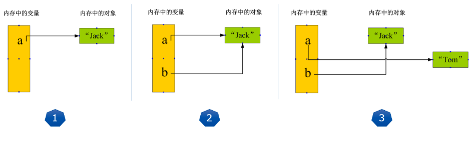
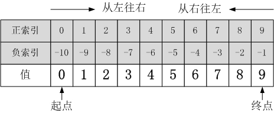
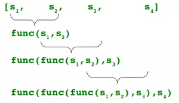
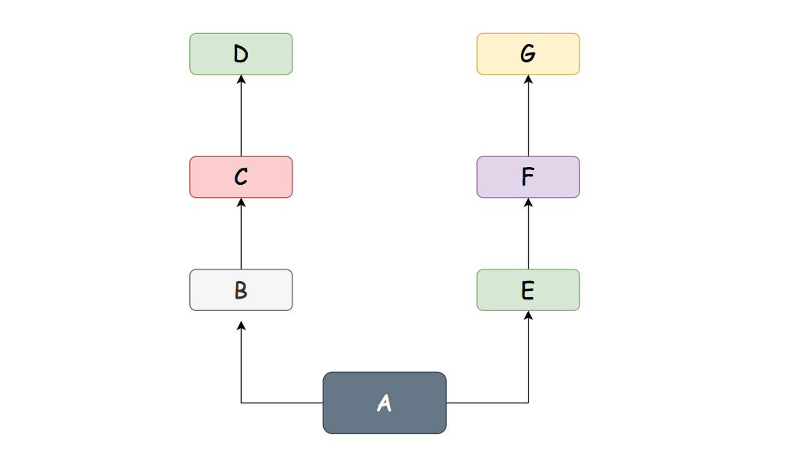
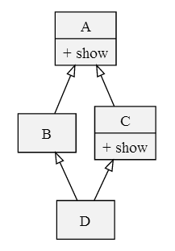
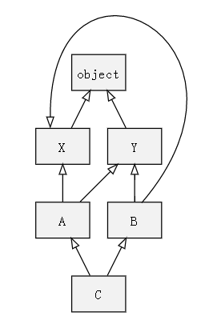

[TOC]


# python自查手册

## 前言

### Python 发展历史( 了解 )

- Python的意思是蟒蛇，源于作者喜欢的一部电视剧 (C呢？1970年，美国贝尔实验室以BCPL语言为基础，设计出了B语言 (取第一个字母)。 并在1972--1973年间，在B语言的基础上设计出了一种语言，并取BCPL的第二个字母为名，C语言因此而得名)
- Python的作者是Guido van Rossum（龟叔），荷兰人
- Python是龟叔在 1989 年圣诞节期间，为了打发无聊的圣诞节而用C编写的一个编程语言
- Python正式诞生于 1991 年
- Python的解释器如今有多个语言实现，我们常用的是CPython（官方版本的C语言实现），其他还有Jython（可以运行在Java平台）、IronPython（可以运行在.NET和Mono平台）、PyPy（Python实现的，支持JIT即时编译）

### Python 优缺点

优点

1. 简单————Python是一种代表简单主义思想的语言。阅读一个良好的Python程序就感觉像是在读英语一样，尽管这个英语的要求非常严格！Python的这种伪代码本质是它最大的优点之一。它使你能够专注于解决问题而不是去搞明白语言本身。
2. 易学————就如同你即将看到的一样，Python极其容易上手。前面已经提到了，Python有极其简单的语法。
3. 免费、开源————Python是FLOSS（自由/开放源码软件）之一。简单地说，你可以自由地发布这个软件的拷贝、阅读它的源代码、对它做改动、把它的一部分用于新的自由软件中。FLOSS是基于一个团体分享知识的概念。这是为什么Python如此优秀的原因之一——它是由一群希望看到一个更加优秀的Python的人创造并经常改进着的。
4. 高层语言————当你用Python语言编写程序的时候，你无需考虑诸如如何管理你的程序使用的内存一类的底层细节。
5. 可移植性————由于它的开源本质，Python已经被移植在许多平台上（经过改动使它能够工作在不同平台上）。如果你小心地避免使用依赖于系统的特性，那么你的所有Python程序无需修改就可以在下述任何平台上面运行。这些平台包括Linux、Windows、FreeBSD、Macintosh、Solaris、OS/2、Amiga、AROS、AS/400、BeOS、OS/390、z/OS、Palm OS、QNX、VMS、Psion、Acom RISC OS、VxWorks、PlayStation、Sharp Zaurus、Windows CE甚至还有PocketPC、Symbian以及Google基于linux开发的Android平台！
6. 解释性————这一点需要一些解释。一个用编译性语言比如C或C++写的程序可以从源文件（即C或C++语言）转换到一个你的计算机使用的语言（二进制代码，即 0 和 1 ）。这个过程通过编译器和不同的标记、选项完成。当你运行你的程序的时候，连接/转载器软件把你的程序从硬盘复制到内存中并且运行。而Python语言写的程序不需要编译成二进制代码。你可以直接从源代码运行程序。在计算机内部，Python解释器把源代码转换成称为字节码的中间形式，然后再把它翻译成计算机使用的机器语言并运行。事实上，由于你不再需要担心如何编译程序，如何确保连接转载正确的库等等，所有这一切使得使用Python更加简单。由于你只需要把你的Python程序拷贝到另外一台计算机上，它就可以工作了，这也使得你的Python程序更加易于移植。
7. 面向对象————Python既支持面向过程的编程也支持面向对象的编程。在“面向过程”的语言中，程序是由过程或仅仅是可重用代码的函数构建起来的。在“面向对象”的语言中，程序是由数据和功能组合而成的对象构建起来的。与其他主要的语言如C++和Java相比，Python以一种非常强大又简单的方式实现面向对象编程。
8. 可扩展性————如果你需要你的一段关键代码运行得更快或者希望某些算法不公开，你可以把你的部分程序用C或C++编写，然后在你的Python程序中使用它们。
9. 丰富的库————Python标准库确实很庞大。它可以帮助你处理各种工作，包括正则表达式、文档生成、单元测试、线程、数据库、网页浏览器、CGI、FTP、电子邮件、XML、XML-RPC、HTML、WAV文件、密码系统、GUI（图形用户界面）、Tk和其他与系统有关的操作。记住，只要安装了Python，所有这些功能都是可用的。这被称作Python的“功能齐全”理念。除了标准库以外，还有许多其他高质量的库，如wxPython、Twisted和Python图像库等等。
10. 规范的代码————Python采用强制缩进的方式使得代码具有极佳的可读性。
11. 动态类型语言，支持面向对象和函数式编程
12. 代码规范程度高，可读性强

缺点

1. 运行速度，有速度要求的话，用C++改写关键部分吧。

2. 国内市场较小

3. 中文资料匮乏（好的python中文资料屈指可数）。托社区的福，有几本优秀的教材已经被翻译了，但入门级教材多，高级内容还是只能看英语版。

4. 构架选择太多（没有像C#这样的官方.net构架，也没有像ruby由于历史较短，构架开发的相对集中。Ruby on Rails 构架开发中小型web程序天下无敌）。不过这也从另一个侧面说明，python比较优秀，吸引的人才多，项目也多。

### 应用场景

- 后端开发 - Python / Java / Go / PHP
- DevOps - Python / Shell / Ruby
- 数据采集 - Python / C++ / Java
- 量化交易 - Python / C++ / R
- 数据科学 - Python / R / Julia / Matlab
- 机器学习 - Python / R / C++ / Julia
- 自动化测试 - Python / Shell

### 可选职业

- Python后端开发工程师（服务器、云平台、数据接口）
- Python运维工程师（自动化运维、SRE、DevOps）
- Python数据分析师（数据分析、商业智能、数字化运营）
- Python数据挖掘工程师（机器学习、深度学习、算法专家）
- Python爬虫工程师
- Python测试工程师（自动化测试、测试开发）

## 学习前的基础知识

### 注释

井号`#`是单行注释的符号，Python 解释器遇到`#`时，会忽略它后面的整行内容语法格式为：

```
# 注释内容
```

单行注释一般放在代码的右侧。

Python 使用三个连续的单引号'''或者三个连续的双引号"""注释多行内容并保持结构不变，具体格式如下：

```python
'''
使用 3 个单引号分别作为注释的开头和结尾
'''

"""
使用 3 个双引号分别作为注释的开头和结尾
"""
```

**注释可以帮助调试程序**

给代码添加说明是注释的基本作用，除此以外它还有另外一个实用的功能，就是用来调试程序。

举个例子，如果你觉得某段代码可能有问题，可以先把这段代码注释起来（pycharm代码注释的快捷键是ctrl+左斜杠，取消也是)，让 Python 解释器忽略这段代码，然后再运行。如果程序可以正常执行，则可以说明错误就是由这段代码引起的；反之，如果依然出现相同的错误，则可以说明错误不是由这段代码引起的。

在调试程序的过程中使用注释可以缩小错误所在的范围，提高调试程序的效率。

### 输入

在Python中，获取键盘输入的数据的方法是采用 input 函数

```python
password = input("请输入密码:")
```

运行结果:

```
请输入密码:
```

此时你可以输入数字，而这个数字以字符串类型被赋值给password这一变量。

注意:

- input()的小括号中放入的是**提示信息**，用来在获取数据之前给用户的一个简单提示。
- input()在从键盘获取了数据以后，会存放到等号左边的变量中。
- input()会把用户输入的任何值都作为**字符串**来对待。


input函数有时可以巧妙地用于阻塞或暂停程序：

```
print("程序前面部分执行完毕......")

input("请按任意键继续......")       # 在这里程序会暂停，等待你按任意键的操作

print("继续执行程序的后面部分......")
```

### 输出

**print()** 方法用于打印输出，是python中最常见的一个函数。

该函数的语法如下：

```python
print(self, *args, sep=' ', end='\n', file=None)
```

参数的具体含义如下：

- objects --表示输出的对象。输出多个对象时，需要用 , （逗号）分隔。

- **sep -- 用来间隔多个对象，默认为一个空格** (有时候很有用)
- end -- 用来设定以什么结尾。默认值是换行符 \n，可以换成其他字符或者设置为不换行。

- file -- 要写入的文件对象。


print可以接受**一个或多个多个字符串，字符串类型的变量或者可print的对象**。每个字符串，字符串类型的变量或者可print的对象用逗号“,”隔开。print会依次打印每个字符串，字符串类型的变量或者可print的对象，同时，每遇到一个逗号“,”就输出一个空格。

```
>>> a = "i am"
>>> b = "student"
>>> print(a,"a" , b)
i am a student      # 自动以空格分隔
>>> print(a+"a"+b)
i amastudent        # 无分隔
```

对于形如`print(a+"a"+b)`的语句，其实是先计算`a+"a"+b`的值，然后再通过print打印它。print()会自动执行内部的语句，输出想要的结果。

```python
# 无论什么类型的数据，包括但不局限于：数值型，布尔型，列表变量，字典变量...都可以直接输出。
#例如：
num = 19
print(num)    #19  输出数值型变量
 
str = 'Hello World'
print(str)  #Hello World  输出字符串变量
 
list = [1,2,'a']
print(list)   #[1, 2, 'a']  输出列表变量
 
tuple = (1,2,'a')
print(tuple)    #(1, 2, 'a') 输出元组变量
 
dict = {'a':1, 'b':2}
print(dict)   # {'a': 1, 'b': 2} 输出字典变量


a=1
b="Hello World"
print(a, b)  #可以一次输出多个对象，对象之间用逗号分隔
'''
运行结果如下：
1 Hello World
'''
 
#如果直接输出字符串，而不是用对象表示的话，可以不使用逗号
print("hello""world")
print("hello","world")
 
'''
运行结果如下：
helloworld
hello world
可知，不添加逗号分隔符，字符串之间没有间隔
'''
 
print("www", "snh48", "com", sep=".")  # 设置间隔符
'''
运行结果如下：
www.snh48.com
'''
```

#### 防止转义

转义字符，即**反斜杠"\\"+ X **，X指字符数字或字母，在许多的编程语言中都被广泛使用。

有以下方法可以防止转义:

1. 对于字符串变量，使用repr

```
s = '\n是一个转义字符'
print(repr(s)) 
```

输出:

```
'\n是一个转义字符'
```

2. 对于字符串常量，有两种方法
   - 使用r
   - 再加一个反斜杠，**因为由上表知，两个反斜杠转义过后相当于一个反斜杠字符。**

举例：

```
print("hello\nworld") 
```

```
# 输出：
hello
world
```

```
print(r"hello\nworld") # 输出：hello\nworld
print("hello\\nworld") # 输出：hello\nworld
```

#### 换行与防止换行

在python中，输出函数总是默认换行，比如说：

```python
for x in range(0,5):
    print(x)
 
'''
0
1
2
3
4
'''
```

而显然，这种输出太占“空间”，我们可以进行如下改造：

参考文本第一部分对end参数的描述：*end -- 用来设定以什么结尾。默认值是换行符 \n，我们可以换成其他字符。*

```python
for x in range(0, 5):
    print(x, end=' ')
#0 1 2 3 4 
for x in range(0, 5):
    print(x, end=',')
#0,1,2,3,4,
```

### 标示符和关键字

标识符是用户编程时使用的名字，用于给变量、常量、函数、语句块等命名，以建立起名称与使用之间的关系。标识符通常由字母和数字以及其它字符构成。

- **标示符由字母、下划线和数字组成，且数字不能开头**
- python中的标识符是区分大小写的

起一个有意义的名字，尽量做到看一眼就知道是什么意思(提高代码可读性) 比如: 名字 就定义为 name, 定义学生用 student。

驼峰命名法：

- 小驼峰式命名法（lower camel case）： 第一个单词以小写字母开始；第二个单词的首字母大写，例如：myName、aDog
  
- 大驼峰式命名法（upper camel case）： 每一个单字的首字母都采用大写字母，例如：FirstName、LastName

- 下划线命名法：用下划线“_”来连接所有的单词，比如send_buf

python已经使用的了具有特殊功能的标示符，所以不允许开发者自己定义和关键字相同的名字的标示符。

查看关键字:
可以通过以下命令进行查看当前系统中python的关键字

```
import keyword
print(keyword.kwlist)
```

## 变量和常量

在Python中，变量是存放数据值的容器，如下示例:

```python
num1 = 100 # num1就是一个变量
num2 = 87 # num2也是一个变量
result = num1 + num2 # 把num1和num2中的数据进行累加，然后放到 result变量中
```

程序中为了更充分的利用内存空间以及更有效率的管理内存，变量是有不同的类型的，如下所示:

在这些类别中，Python 默认拥有以下内置数据类型：

| 文本类型：   | `str`                              |
| ------------ | ---------------------------------- |
| 数值类型：   | `int`, `float`, `complex`          |
| 序列类型：   | `list`, `tuple`, `range`           |
| 映射类型：   | `dict`                             |
| 集合类型：   | `set`, `frozenset`                 |
| 布尔类型：   | `bool`                             |
| 二进制类型： | `bytes`, `bytearray`, `memoryview` |

可以使用 type() 函数获取任何对象的数据类型：

```
x = 10
print(type(x))
```

输出：

```
<class 'int'>
```

### 变量的赋值

赋值有两种方式

第一种：单个赋值

```
>>> age = 18
>>> age
18
```

第二种：批量赋值

```
>>> a = b = c = 1
>>> a
1
>>> b
1
>>> c
1
```

第三种：先计算再赋值

```
# 先计算 17+1，再把结果赋值给age
>>> age = 17+1
>>> age
18
```

第四种：分别赋值

```
>>> a, b, c = 1, 2, 3
>>> a
1
>>> b
2
>>> c
3
```

### 理解赋值的背后

理解变量在计算机内存中的表示也非常重要。

当我们写：`a = "Jack"` 时，Python解释器干了两件事情：

1. 在内存中创建了一个`'Jack'`的字符串对象；
2. 在内存中创建了一个名为a的变量，并把它指向 `'Jack'`。

而当你把一个变量a赋值给另一个变量b，这个操作实际上是将变量b指向变量a所指向的数据，例如下面的代码：

```
>>> a = "Jack"
>>> a
'Jack'
>>> b = a
>>> b
'Jack'
>>> id(a)
4332916664
>>> id(b)
4332916664
```

通过`id()` 可以查看变量值的内存地址，打印出来的 a 和 b的内存地址是一样的，因此二者其实是一个数据。

但如果继续对 a 进行赋值其他值， 会发现 a 的内存地址变了，而 b 的并没有变

```
>>> a = "Tom"
>>> a
'Tom'
>>> id(a)
4332974128
>>> id(b)
4332916664
```

请牢记：**Python中的一切都是对象，变量是对象的引用！**：

- 执行a = ‘Jack’，解释器创建字符串‘Jack’对象和变量a，并把a指向‘Jack’对象；
- 执行b = a,解释器创建变量b，并且将其指向变量a指向的字符串‘Jack’对象；
- 执行a = ‘Tom’,解释器创建字符串‘Tom’对象，并把a改为指向‘Tom’对象，与b无关。




### 变量不需要声明类型

Python 的变量和常量不需要事先声明类型，这是根据Python的**动态语言特性**而来，而这在一些静态语言中，比如 JAVA 和 Golang 中是必须的。

在 Python 中，当您为变量赋值时，数据的类型就自动被确定了：

| 示例                                         | 数据类型   |
| :------------------------------------------- | :--------- |
| x = "Hello World"                            | str        |
| x = 29                                       | int        |
| x = 29.5                                     | float      |
| x = True                                     | bool       |
| x = {"name" : "Bill", "age" : 63}            | dict       |
| x = {"apple", "banana", "cherry"}            | set        |
| x = ["apple", "banana", "cherry"]            | list       |
| x = ("apple", "banana", "cherry")            | tuple      |
| x = range(6)                                 | range      |
| x = frozenset({"apple", "banana", "cherry"}) | frozenset  |
| x = 1j                                       | complex    |
| x = b"Hello"                                 | bytes      |
| x = bytearray(5)                             | bytearray  |
| x = memoryview(bytes(5))                     | memoryview |

### **设定特定的数据类型**

如果希望指定数据类型，则您可以使用以下构造函数：

| 示例                                         | 数据类型   |
| :------------------------------------------- | :--------- |
| x = str("Hello World")                       | str        |
| x = int(29)                                  | int        |
| x = float(29.5)                              | float      |
| x = complex(1j)                              | complex    |
| x = list(("apple", "banana", "cherry"))      | list       |
| x = tuple(("apple", "banana", "cherry"))     | tuple      |
| x = range(6)                                 | range      |
| x = dict(name="Bill", age=36)                | dict       |
| x = set(("apple", "banana", "cherry"))       | set        |
| x = frozenset(("apple", "banana", "cherry")) | frozenset  |
| x = bool(5)                                  | bool       |
| x = bytes(5)                                 | bytes      |
| x = bytearray(5)                             | bytearray  |
| x = memoryview(bytes(5))                     | memoryview |

### 常量

常量就是不变的变量，比如常用的数学常数圆周率就是一个常量。在Python中，通常用全部大写的变量名表示常量：

```
>>> PI = 3.14159265359
>>> PI
3.14159265359
```

但事实上，从Python语法角度看，PI仍然是一个变量，因为Python根本没有任何机制保证PI不会被改变。你完全可以给PI赋值为10，不会弹出任何错误。所以，用全部大写的变量名表示常量只是一个习惯上的用法。

常量通常放置在代码的最上部，并作为全局使用。

## 数据类型

上一章介绍了python的各种数据类型的对象可以赋值给变量，这一章详细介绍python的数据类型。

### 数字类型

#### 整数（Int）

通常被称为整型，是正或负整数，不带小数点。例如：1，100，-8080，0，等等。

```
>>> a = 100
>>> type(a)
<class 'int'>
>>>
>>> b = -100
>>> type(b)
<class 'int'>
```

表示数字的时候，有时我们还会用八进制或十六进制来表示：

- 十六进制：用0x前缀和0-9，a-f表示，例如：0xff00，0xa5b4c3d2。
- 八进制：用0o前缀和0-7表示，例如0o12

```
>>> a = 0x0001 # 十六进制
>>> a
1
>>> type(a)
<class 'int'>
>>>
>>> b = 0o01  # 八进制
>>> b
1
>>> type(b)
<class 'int'>
```

##### 求绝对值

绝对值或复数的模

```
In [1]: abs(-6)
Out[1]: 6
```

##### 进制转化

十进制转换为二进制：

```
In [2]: bin(10)
Out[2]: '0b1010'
```

十进制转换为八进制：

```
In [3]: oct(9)
Out[3]: '0o11'
```

十进制转换为十六进制：

```
In [4]: hex(15)
Out[4]: '0xf'
```

##### 整数和ASCII互转

十进制整数对应的`ASCII字符`

```
In [1]: chr(65)
Out[1]: 'A'
```

查看某个`ASCII字符`对应的十进制数

```
In [1]: ord('A')
Out[1]: 65
```

##### 转为整型

`int()` 函数用于将一个字符串或数字转换为整型。

**语法**

以下是 int() 方法的语法:

```
int(x, base=10)
```

**参数**

- x -- 字符串或数字。
- base -- 进制数，默认十进制。

**返回值**

返回整型数据。

**实例**

以下展示了使用 int() 方法的实例：

```
>>>int()               # 不传入参数时，得到结果0

0

>>> int(3)

3

>>> int(3.6)

3

>>> int('12',16)        # 如果是带参数base的话，12要以字符串的形式进行输入，此时的12 为 16进制的12

18

>>> int('0xa',16)  

10  

>>> int('10',8)  

8
```

#### 浮点数(Float)

浮点数也就是小数，如1.23，3.14，-9.01，等等。

```
>>> a = 1.23
>>> a
1.23
>>> type(a)
<class 'float'>
```

之所以称为浮点数，是因为按照科学记数法表示时，一个浮点数的小数点位置是可变的，比如，`1.23x10^9`和`12.3x10^8`是完全相等的。浮点数可以用数学写法，如`1.23`，`3.14`，`-9.01`，等等。但是对于很大或很小的浮点数，就必须用科学计数法表示，把10用e替代，1.23x109就是`1.23e9`，或者`12.3e8`，0.000012可以写成`1.2e-5`，等等。

```
>>> 1.23e9
1230000000.0
>>> 12.3e8
1230000000.0
```

##### 四舍五入

**round()** 方法返回浮点数x的四舍五入值。

------

语法

以下是 round() 方法的语法:

```
round( x [, n]  )
```

------

参数

- x -- 数值表达式。
- n -- 数值表达式，表示从小数点位数。

------

返回值

返回浮点数x的四舍五入值。

------

实例

以下展示了使用 round() 方法的实例：

```
print("round(80.23456, 2) : ", round(80.23456, 2)) 
print("round(100.000056, 3) : ", round(100.000056, 3)) 
print("round(-100.000056, 3) : ", round(-100.000056, 3)) 
```

以上实例运行后输出结果为：

```
round(80.23456, 2) :  80.23
round(100.000056, 3) :  100.0
round(-100.000056, 3) :  -100.0
```

#### 复数(Complex)

复数由实数部分和虚数部分构成，可以用`a + bj`，或者 `complex(a,b)` 表示，复数的实部a和虚部b都是浮点型。

```
>>> a = 10 + 0.2j
>>> a
(10+0.2j)
>>> type(a)
<class 'complex'>
>>>
>>> b = complex(10, 0.2)
>>> b
(10+0.2j)
>>> type(b)
<class 'complex'>
```

#### 常用方法

具体查看  [运算符章节的算术运算符](#算术运算符)

**两数运算**

```
# 两数相加减
>>> a = 10
>>> b = 20
>>> a + b
30
>>> b - a
10
# 两数相乘除
>>> a = 10
>>> b = 20
>>> a * b
200
>>> b / a
2.0
# 取模取余
>>> a = 10
>>> b = 3
>>> a // b
3
>>> a % b
1
# 计算绝对值
>>> a = -10
>>> abs(a)
10
# 数值直接取整
>>> a = 3.14
>>> int(a)
3
>>> b = 3.78
>>> int(b)
3
# 数值四舍五入
>>> a = 3.14
>>> round(a)
3
>>> b = 3.78
>>> round(b)
4
```

### 布尔值

#### 什么是布尔值

但在Python语言中，布尔类型只有两个值

- `True`：表示真值
- `False`：表示假值

请注意，首字母要大写。

所有的计算结果，表达式返回值是True或者False的运算都可以称为布尔运算，常用[比较运算符](#比较运算符)进行布尔运算。

布尔值通常用来判断条件是否成立。

```
age = 16
if age >= 18:
    print("你是个成年人")
else:
    print("你还未成年")
```

#### 布尔类型的转换

Python内置的 `bool()` 函数可以用来测试一个表达式的布尔值结果。

```
>>> bool(1)
True
>>> bool(0)
False
>>> bool([])
False
>>> bool(())
False
>>> bool({})
False
>>> bool(-1)
True
>>> bool('')
False
>>> bool(None)
False
>>> bool("False")
True
>>> bool("True")
True
>>> bool(0.0)
False
>>> bool(1.0)
True
>>> bool(-0.0)
False
```

看完上面的例子，可以总结出

**下面这些值经过 bool 转换后是假值：**

- **0、0.0、-0.0**
- **None：这个后面会讲到**
- **空字符串、空列表、空元组、空字典**

**而这些会转换成真值**

- **-1、1或者其他非0数值**
- **所有非空字符串，包括 `"False"`**
- **所有非空字典、非空列表、非空集合，非空元组**

#### 布尔运算

布尔类型可以进行 and、or和 not运算。

and 运算是与运算，只有所有都为True，and运算的结果才是True：

```
>>> True and True
True
>>> True and False
False
>>> False and False
False
>>> 5 > 3 and 3 > 1
True
```

or运算是或运算，只要其中有一个为True，or运算结果就是True：

```
>>> True or True
True
>>> True or False
True
>>> False or False
False
>>> 5 > 3 or 1 > 3
True
```

not运算是非运算，它是单目运算符，把True变成False，False变成True：

```
>>> not True
False
>>> not False
True
>>> not 1 > 2
True
```

再开下脑洞，布尔类型还能做别的运算吗？试试就知道了！

```
>>> True > False
True
>>> True < False
False
>>> True >=False
True
>>> True -1
0
>>> True + 1
2
>>> True *3
3
>>> False -1
-1
```

真的可以！比较运算，四则运算都没有问题。并且在做四则运算的时候，把True看做1，False看做0。

#### 空值：None

空值不是布尔类型，严格的来说放在这里是不合适的，只不过和布尔关系比较紧密。

空值是Python里一个特殊的值，用None表示（首字母大写）。None不能理解为 0，因为0是整数类型，而None是一个特殊的值。

**None也不是布尔类型，而是NoneType**。

```
>>> bool(None)
False
>>> type(None)
<class 'NoneType'>
```

### 字符串

#### 如何定义字符串？

字符串是Python中最常用的数据类型之一。

**使用单引号或双引号来创建字符串，使用三引号创建多行字符串。**字符串要么使用两个单引号，要么两个双引号，不能一单一双！Python不支持单字符类型，单字符在Python中也是作为一个字符串使用。

以下四种写法是等价的

```
>>> name_1 = 'Jack'  # 单引号
>>> name_2 = "Jack"  # 双引号
>>> name_3 =  '''Jack''' # 三个单引号
>>> name_4 = """Jack"""  # 三个双引号
>>> name_1 == name_2 == name_3 == name_4
True
```

如果一个字符串里，要有引号，那么最好和外部包裹的引号类型不同，比如

- 外层使用单引号，那么里层使用双引号

```
>>> msg = "my name is 'Jack'"
>>> msg
"my name is 'Jack'"
```

- 外层使用双引号，那么里层使用单引号

```
>>> msg = 'my name is "Jack"'
>>> msg
'my name is "Jack"'
```

若想使用一样的符号呢？那字符串里的引号前记得加转义符号：`\`，因为`\'`转义的结果是`'`

```
>>> msg = 'what\'s you name?'
>>> msg
"what's you name?"
```

#### 常见操作

##### **==join==**

**将一个包含多个字符串的==可迭代对象==，转为用分隔符s连接的字符串**

**s.join（可迭代对象）**

mystr 中每个字符后面插入str,构造出一个新的字符串

mystr.join(str)

**对元组里的字符串进行拼接**

```
>>> myTuple = ("Bill", "Steve", "Elon")
>>> x = "#".join(myTuple)
>>> x
'Bill#Steve#Elon'
```

**对列表里的字符串进行拼接**

```
>>> myTuple = ["Bill", "Steve", "Elon"]
>>> x = "#".join(myTuple)
>>> x
'Bill#Steve#Elon'
```

##### eval()

计算表达式

将字符串str 当成有效的表达式来求值并返回计算结果

```
s = "1 + 3 +5"
print(eval(s))
print(type(eval(s)))
```

输出：

```
9
<class 'int'>
```

##### find()

检测子字符串str 是否包含在字符串mystr中，如果是返回首次出现该字符串时的索引，否则返回-1

mystr.find(str, start=0, end=len(mystr))

```
mystr = 'hello world itcast and itcastcpp'
str = "itcast"
print(mystr.find(str,  0, len(mystr)))
```

输出：

```
12
```


```
mystr = 'hello world itcait and itcastcpp'
str = "A"
print(mystr.find(str,  0, len(mystr)))
```

输出：

```
-1
```

##### index()

跟find()方法一样，只不过如果str不在 mystr中会报一个异常。

```
mystr = 'hello world itcast and itcastcpp'
str = "itcast"
print(mystr.index(str,  0, len(mystr)))
```

输出：

```
12
```


```
mystr = 'hello world itcait and itcastcpp'
str = "A"
print(mystr.index(str,  0, len(mystr)))
```

输出：

```
Traceback (most recent call last):
  File "C:/Users/aa/AppData/Roaming/JetBrains/PyCharm2022.1/scratches/hello.py", line 3, in <module>
    print(mystr.index(str, 0, len(mystr)))
ValueError: substring not found
```

##### count()

返回 str在start和end之间 在 mystr里面出现的次数

```
mystr = 'hello world itcast and itcastcpp'
str = "itcast"
print(mystr.count(str))
```

输出：

##### replace

把 mystr 中的 str1 替换成 str2,如果 count 指定，则替换不超过 count 次.

mystr.replace(str1, str2, mystr.count(str1))

##### **==split==**

以 str 为分隔符切片 mystr，如果 maxsplit有指定值，则切割 maxsplit 次

my_str.split(str1, maxsplit)

##### capitalize

把字符串的第一个字符大写

mystr.capitalize()

##### title

把字符串的每个单词首字母大写

```
a = "hello itcast"
a.title() # 输出为 'Hello Itcast'
```

##### startswith

检查字符串是否是以 obj 开头, 是则返回 True，否则返回 False

mystr.startswith(obj)

##### endswith

检查字符串是否以obj结束，如果是返回True,否则返回 False.

mystr.endswith(obj)

##### lower

转换 mystr 中所有大写字符为小写

mystr.lower()

##### upper

转换 mystr 中的小写字母为大写

mystr.upper()

##### ljust

返回一个原字符串左对齐,并使用空格填充至长度 width 的新字符串

mystr.ljust(width)

##### rjust

返回一个原字符串右对齐,并使用空格填充至长度 width 的新字符串

mystr.rjust(width)

##### center

返回一个原字符串居中,并使用空格填充至长度 width 的新字符串

mystr.center(width)

##### lstrip

删除 mystr 左边的空白字符

mystr.lstrip()

##### rstrip

删除 mystr 字符串末尾的空白字符

mystr.rstrip()

##### strip

删除mystr字符串两端的空白字符

```
a = "\n\t itcast \t\n"
a.strip() # 输出为：'itcast'
```

##### rfind

类似于 find()函数，不过是从右边开始查找.

mystr.rfind(str, start=0,end=len(mystr) )

##### rindex

类似于 index()，不过是从右边开始.

mystr.rindex( str, start=0,end=len(mystr))

##### partition

把mystr以str分割成三部分,str前，str和str后

mystr.partition(str)

##### rpartition

类似于 partition()函数,不过是从右边开始.

mystr.rpartition(str)

##### splitlines

按照行分隔，返回一个包含各行作为元素的列表

mystr.splitlines()

#####  isalpha

如果 mystr 所有字符都是字母 则返回 True,否则返回 False

mystr.isalpha()

##### isdigit

如果 mystr 只包含数字则返回 True 否则返回 False.

mystr.isdigit()

##### isalnum

如果 mystr 所有字符都是字母或数字则返回 True,否则返回 False

mystr.isalnum()

##### isspace

如果 mystr 中只包含空格，则返回 True，否则返回 False.

mystr.isspace()

#### 字符串的格式化输出

目的是使**内容按照一定格式要求进行输出。**

##### **使用占位符%输出**

python2.6版本之前，使用%格式化字符串沿用的是C语言的输出格式。

**使用说明：**

print("格式化字符串" % 变量)
\#变量超过2个使用元组格式：
print("格式化字符串" % （变量1,变量2）)
使用%占位符表示字符串中变量位置。
传入的值要与%占位符的变量一一对应。
其中，%s表示字符串，%d表示整数，%f表示小数（默认保留小数点后6位，%.2f保留两位小数），存在格式化标志时，需要用 %%表示一个百分号。

```text
name='xiaoming'
age=12
print("My name is %s,My age is %d" %(name,age))
#输出：My name is xiaoming,My age is 12
```

#####  **format格式化**

format是python2.6新增的一个格式化字符串的方法,相比%格式化方法有如下优点：

- 单个参数可以多次输出，参数顺序可以不相同
- 填充方式十分灵活，对齐方式十分强大
- 官方推荐用的方式

**使用说明：**

```text
print("...{索引}, ... , {索引}, ...".format(值1, 值2))
#索引{}为空，默认按照顺序取值
print("...{key1}, ... , {key2}, ...".format(key1=value,key2=value))
name='xiaoming'
age=12
print('My name is {}, My age is {}'.format(name,age))
print('My name is {0}, My age is {1}'.format(name,age))
print('My name is {name}, My age is {age}'.format(name='xiaoming',age=12))
#输出：My name is xiaoming,My age is 12
```

 **format进阶**

**1.填充对齐**

```python
# 先取到值,然后在冒号后设定填充格式：{索引:[填充字符][对齐方式][宽度]}

# *<20：左对齐，总共20个字符，不够的用*号填充

print('{0:*<20}'.format('hellopython'))

# *>20：右对齐，总共20个字符，不够的用*号填充

print('{0:*>20}'.format('hellopython'))

# *^20：居中显示，总共20个字符，不够的用*号填充

print('{0:*^20}'.format('hellopython'))

输出：

hellopython*********

*********hellopython

****hellopython*****
```

**2.位数与进制转换**

```python
#保留2位有效数字

print("{:.2f}".format(3.1415926))

#转成二进制

print('{0:b}'.format(16))

#转成八进制

print('{0:o}'.format(10))

#转成十六进制

print('{0:x}'.format(15)) 

# 输出

3.14

10000

12

f
```

##### f-strings

在Python 3.6中引入 了f-strings，不仅比str.format使用简单，而且效率也更高。

**使用说明**

f-string是字符串前面加上 "f"，{}直接使用变量、表达式等。

```text
name='xiaoming'

age=12

#{}中直接使用变量

print(f'My name is {name},My age is {age}')

#{}中运行表达式

print(f'{1+2+3}')

#调用Python内置函数

print(f'{name.upper()}')

#用lambda匿名函数：可以做复杂的数值计算

fun = lambda x : x+1

print(f'{fun(age)}')

#输出

My name is xiaoming,My age is 12

6

XIAOMING

13
```

f-string采用 `{content:format}` 设置字符串格式，其中 `content` 是替换并填入字符串的内容，可以是变量、表达式或函数等，`format` 是格式描述符。采用默认格式时不必指定 `{:format}`

**对齐**相关格式描述符

| 格式描述符 | 含义与作用                   |
| ---------- | ---------------------------- |
| `<`        | 左对齐（字符串默认对齐方式） |
| `>`        | 右对齐（数值默认对齐方式）   |
| `^`        | 居中                         |

**数字符号**相关格式描述符

| 格式描述符                                         | 含义与作用                                      |
| -------------------------------------------------- | ----------------------------------------------- |
| `+`                                                | 负数前加负号（`-`），正数前加正号（`+`）        |
| `-`                                                | 负数前加负号（`-`），正数前不加任何符号（默认） |
| ``（空格） | 负数前加负号（`-`），正数前加一个空格 |                                                 |

注：仅适用于数值类型。

**数字显示方式**相关格式描述符

| 格式描述符 | 含义与作用       |
| ---------- | ---------------- |
| `#`        | 切换数字显示方式 |

注1：仅适用于数值类型。
注2：`#` 对不同数值类型的作用效果不同，详见下表：

| 数值类型                 | 不加`#`（默认） | 加`#`         | 区别              |
| ------------------------ | --------------- | ------------- | ----------------- |
| 二进制整数               | `'1111011'`     | `'0b1111011'` | 开头是否显示 `0b` |
| 八进制整数               | `'173'`         | `'0o173'`     | 开头是否显示 `0o` |
| 十进制整数               | `'123'`         | `'123'`       | 无区别            |
| 十六进制整数（小写字母） | `'7b'`          | `'0x7b'`      | 开头是否显示 `0x` |
| 十六进制整数（大写字母） | `'7B'`          | `'0X7B'`      | 开头是否显示 `0X` |

**宽度与精度**相关格式描述符

| 格式描述符        | 含义与作用                                                |
| ----------------- | --------------------------------------------------------- |
| `width`           | 整数 `width` 指定宽度                                     |
| `0width`          | 整数 `width` 指定宽度，开头的 `0` 指定高位用 `0` 补足宽度 |
| `width.precision` | 整数 `width` 指定宽度，整数 `precision` 指定显示精度      |

注1：`0width` 不可用于复数类型和非数值类型，`width.precision` 不可用于整数类型。
注2：`width.precision` 用于不同格式类型的浮点数、复数时的含义也不同：用于 `f`、`F`、`e`、`E` 和 `%` 时 `precision` 指定的是小数点后的位数，用于 `g` 和 `G` 时 `precision` 指定的是有效数字位数（小数点前位数+小数点后位数）。
注3：`width.precision` 除浮点数、复数外还可用于字符串，此时 `precision` 含义是只使用字符串中前 `precision` 位字符。

示例：

```python
>>> a = 123.456
>>> f'a is {a:8.2f}'
'a is   123.46'
>>> f'a is {a:08.2f}'
'a is 00123.46'
>>> f'a is {a:8.2e}'
'a is 1.23e+02'
>>> f'a is {a:8.2%}'
'a is 12345.60%'
>>> f'a is {a:8.2g}'
'a is  1.2e+02'

>>> s = 'hello'
>>> f's is {s:8s}'
's is hello   '
>>> f's is {s:8.3s}'
's is hel     '
1234567891011121314151617
```

**千位分隔符**相关格式描述符

| 格式描述符 | 含义与作用            |
| ---------- | --------------------- |
| `,`        | 使用`,`作为千位分隔符 |
| `_`        | 使用`_`作为千位分隔符 |

注1：若不指定 `,` 或 `_`，则f-string不使用任何千位分隔符，此为默认设置。
注2：`,` 仅适用于浮点数、复数与十进制整数：对于浮点数和复数，`,` 只分隔小数点前的数位。
注3：`_` 适用于浮点数、复数与二、八、十、十六进制整数：对于浮点数和复数，`_` 只分隔小数点前的数位；对于二、八、十六进制整数，固定从低位到高位每隔四位插入一个 `_`（十进制整数是每隔三位插入一个 `_`）。

示例：

```python
>>> a = 1234567890.098765
>>> f'a is {a:f}'
'a is 1234567890.098765'
>>> f'a is {a:,f}'
'a is 1,234,567,890.098765'
>>> f'a is {a:_f}'
'a is 1_234_567_890.098765'

>>> b = 1234567890
>>> f'b is {b:_b}'
'b is 100_1001_1001_0110_0000_0010_1101_0010'
>>> f'b is {b:_o}'
'b is 111_4540_1322'
>>> f'b is {b:_d}'
'b is 1_234_567_890'
>>> f'b is {b:_x}'
'b is 4996_02d2'
1234567891011121314151617
```

**格式类型**相关格式描述符

基本格式类型

| 格式描述符 | 含义与作用                                                  | 适用变量类型                           |
| ---------- | ----------------------------------------------------------- | -------------------------------------- |
| `s`        | 普通字符串格式                                              | 字符串                                 |
| `b`        | 二进制整数格式                                              | 整数                                   |
| `c`        | 字符格式，按unicode编码将整数转换为对应字符                 | 整数                                   |
| `d`        | 十进制整数格式                                              | 整数                                   |
| `o`        | 八进制整数格式                                              | 整数                                   |
| `x`        | 十六进制整数格式（小写字母）                                | 整数                                   |
| `X`        | 十六进制整数格式（大写字母）                                | 整数                                   |
| `e`        | 科学计数格式，以 `e` 表示 `×10^`                            | 浮点数、复数、整数（自动转换为浮点数） |
| `E`        | 与 `e` 等价，但以 `E` 表示 `×10^`                           | 浮点数、复数、整数（自动转换为浮点数） |
| `f`        | 定点数格式，默认精度（`precision`）是6                      | 浮点数、复数、整数（自动转换为浮点数） |
| `F`        | 与 `f` 等价，但将 `nan` 和 `inf` 换成 `NAN` 和 `INF`        | 浮点数、复数、整数（自动转换为浮点数） |
| `g`        | 通用格式，小数用 `f`，大数用 `e`                            | 浮点数、复数、整数（自动转换为浮点数） |
| `G`        | 与 `G` 等价，但小数用 `F`，大数用 `E`                       | 浮点数、复数、整数（自动转换为浮点数） |
| `%`        | 百分比格式，数字自动乘上100后按 `f` 格式排版，并加 `%` 后缀 | 浮点数、整数（自动转换为浮点数）       |

常用的特殊格式类型：[标准库 `datetime`](https://docs.python.org/3/library/datetime.html#strftime-and-strptime-behavior) 给定的用于排版时间信息的格式类型，适用于 [`date`](https://docs.python.org/3/library/datetime.html#date-objects)、[`datetime`](https://docs.python.org/3/library/datetime.html#datetime-objects) 和 [`time`](https://docs.python.org/3/library/datetime.html#time-objects) 对象

| 格式描述符 | 含义                                                         | 显示样例   |
| ---------- | ------------------------------------------------------------ | ---------- |
| `%a`       | 星期几（缩写）                                               | `'Sun'`    |
| `%A`       | 星期几（全名）                                               | `'Sunday'` |
| `%w`       | 星期几（数字，`0` 是周日，`6` 是周六）                       | `'0'`      |
| `%u`       | 星期几（数字，`1` 是周一，`7` 是周日）                       | `'7'`      |
| `%d`       | 日（数字，以 `0` 补足两位）                                  | `'07'`     |
| `%b`       | 月（缩写）                                                   | `'Aug'`    |
| `%B`       | 月（全名）                                                   | `'August'` |
| `%m`       | 月（数字，以 `0` 补足两位）                                  | `'08'`     |
| `%y`       | 年（后两位数字，以 `0` 补足两位）                            | `'14'`     |
| `%Y`       | 年（完整数字，不补零）                                       | `'2014'`   |
| `%H`       | 小时（24小时制，以 `0` 补足两位）                            | `'23'`     |
| `%I`       | 小时（12小时制，以 `0` 补足两位）                            | `'11'`     |
| `%p`       | 上午/下午                                                    | `'PM'`     |
| `%M`       | 分钟（以 `0` 补足两位）                                      | `'23'`     |
| `%S`       | 秒钟（以 `0` 补足两位）                                      | `'56'`     |
| `%f`       | 微秒（以 `0` 补足六位）                                      | `'553777'` |
| `%z`       | UTC偏移量（格式是 `±HHMM[SS]`，未指定时区则返回空字符串）    | `'+1030'`  |
| `%Z`       | 时区名（未指定时区则返回空字符串）                           | `'EST'`    |
| `%j`       | 一年中的第几天（以 `0` 补足三位）                            | `'195'`    |
| `%U`       | 一年中的第几周（以全年首个周日后的星期为第0周，以 `0` 补足两位） | `'27'`     |
| `%w`       | 一年中的第几周（以全年首个周一后的星期为第0周，以 `0` 补足两位） | `'28'`     |
| `%V`       | 一年中的第几周（以全年首个包含1月4日的星期为第1周，以 `0` 补足两位） | `'28'`     |

综合示例

```python
>>> a = 1234
>>> f'a is {a:^#10X}'      # 居中，宽度10位，十六进制整数（大写字母），显示0X前缀
'a is   0X4D2   '

>>> b = 1234.5678
>>> f'b is {b:<+10.2f}'    # 左对齐，宽度10位，显示正号（+），定点数格式，2位小数
'b is +1234.57  '

>>> c = 12345678
>>> f'c is {c:015,d}'      # 高位补零，宽度15位，十进制整数，使用,作为千分分割位
'c is 000,012,345,678'

>>> d = 0.5 + 2.5j
>>> f'd is {d:30.3e}'      # 宽度30位，科学计数法，3位小数
'd is           5.000e-01+2.500e+00j'

>>> import datetime
>>> e = datetime.datetime.today()
>>> f'the time is {e:%Y-%m-%d (%a) %H:%M:%S}'   # datetime时间格式
'the time is 2018-07-14 (Sat) 20:46:02'
```

### 常用的数据类型转换

## 运算符

python支持以下几种运算符：

### 算术运算符

算术运算符也即数学运算符，用来对数字进行数学运算，比如加减乘除。下表列出了python支持所有基本算术运算符。

| 运算符 | 说明                                | 实例        | 结果      |
| ------ | ----------------------------------- | ----------- | --------- |
| +      | 加                                  | 12.45 + 15  | 27.45     |
| -      | 减                                  | 4.56 - 0.26 | 4.3       |
| *      | 乘                                  | 5 * 3.6     | 18.0      |
| /      | 除法（和数学中的规则一样）          | 7 / 2       | 3.5       |
| //     | 整除（只保留商的整数部分）          | 7 // 2      | 3         |
| %      | 取余，即返回除法的余数              | 7 % 2       | 1         |
| **     | 幂运算/次方运算，即返回 x 的 y 次方 | 2 ** 4      | 16，即 24 |

当`+`用于数字时表示加法，但是当`+`用于字符串时，它还有拼接字符串（将两个字符串连接为一个）的作用

```
name = "小明"
age = 8
info = name + "是一名小学生"  + "，它已经" + str(age) + "岁了。"
print(info)
```

运行结果：

小明是一名小学生，它已经8岁了。

`-`除了可以用作减法运算之外，还可以用作求负运算（正数变负数，负数变正数），请看下面的代码：

```
n = 45
n_neg = -n
f = -83.5
f_neg = -f
print(n_neg, ",", f_neg)
```

运行结果：
-45 , 83.5

`*`除了可以用作乘法运算，还可以用来重复字符串，也即将 n 个同样的字符串连接起来，请看代码：

```
str1 = "hello "print(str1 * 4)
```

运行结果：
hello hello hello hello 

### 赋值运算符

`=`是 Python 中最常见、最基本的赋值运算符，用来将一个表达式的值赋给另一个变量，请看下面的例子：

```
#将字面量（直接量）赋值给变量
n1 = 100
f1 = 47.5
s1 = "java"
#将一个变量的值赋给另一个变量
n2 = n1
f2 = f1
#将某些运算的值赋给变量
sum1 = 25 + 46 
sum2 = n1 % 6
s2 = str(1234)  #将数字转换成字符串
s3 = str(100) + "abc"
```

#### 连续赋值

Python 中的赋值表达式也是有值的，它的值就是被赋的那个值，或者说是左侧变量的值；如果将赋值表达式的值再赋值给另外一个变量，这就构成了连续赋值。请看下面的例子：

```
a = b = c = 100
```

`=`具有右结合性，我们从右到左分析这个表达式：

- c = 100 表示将 100 赋值给 c，所以 c 的值是 100；同时，c = 100 这个子表达式的值也是 100。
- b = c = 100 表示将 c = 100 的值赋给 b，因此 b 的值也是 100。
- 以此类推，a 的值也是 100。


最终结果就是，a、b、c 三个变量的值都是 100。

#### = 和 ==

= 和 == 是两个不同的运算符，= 用来赋值，而 == 用来判断两边的值是否相等，千万不要混淆。

#### 扩展后的赋值运算符

`=`还可与其他运算符（包括算术运算符、位运算符和逻辑运算符）相结合，扩展成为功能更加强大的赋值运算符，如表 1 所示。扩展后的赋值运算符将使得赋值表达式的书写更加优雅和方便。


| 运算符 | 说 明            | 用法举例 | 等价形式                              |
| ------ | ---------------- | -------- | ------------------------------------- |
| =      | 最基本的赋值运算 | x = y    | x = y                                 |
| +=     | 加赋值           | x += y   | x = x + y                             |
| -=     | 减赋值           | x -= y   | x = x - y                             |
| *=     | 乘赋值           | x *= y   | x = x * y                             |
| /=     | 除赋值           | x /= y   | x = x / y                             |
| %=     | 取余数赋值       | x %= y   | x = x % y                             |
| **=    | 幂赋值           | x **= y  | x = x ** y                            |
| //=    | 取整数赋值       | x //= y  | x = x // y                            |
| &=     | 按位与赋值       | x &= y   | x = x & y                             |
| \|=    | 按位或赋值       | x \|= y  | x = x \| y                            |
| ^=     | 按位异或赋值     | x ^= y   | x = x ^ y                             |
| <<=    | 左移赋值         | x <<= y  | x = x << y，这里的 y 指的是左移的位数 |
| >>=    | 右移赋值         | x >>= y  | x = x >> y，这里的 y 指的是右移的位数 |


这里举个简单的例子：

```
n1 = 100
f1 = 25.5
n1 -= 80  #等价于 n1=n1-80
f1 *= n1 - 10 #等价于 f1=f1*( n1 - 10 )
print(f"n1={n1}")
print(f"f1={f1:.2f}")
```

运行结果为：

```
n1=20
f1=255.00
```

通常情况下，只要能使用扩展后的赋值运算符，都推荐使用这种赋值运算符。

但是请注意，这种赋值运算符只能针对已经存在的变量赋值，因为赋值过程中需要变量本身参与运算，如果变量没有提前定义，它的值就是未知的，无法参与运算。例如，下面的写法就是错误的：

n += 10

该表达式等价于 n = n + 10，n 没有提前定义，所以它不能参与加法运算。  

#### 将序列赋值为单独的变量

任何的序列（或者是可迭代对象）可以通过一个简单的赋值操作来分解为单独的变量。 唯一的要求就是变量的总数和结构必须与序列相吻合。

代码示例：

```
>>> p = (4, 5)
>>> x, y = p
>>> x
4
>>> y
5
>>>
>>> data = [ 'ACME', 50, 91.1, (2012, 12, 21) ]
>>> name, shares, price, date = data
>>> name
'ACME'
>>> date
(2012, 12, 21)
>>> name, shares, price, (year, mon, day) = data
>>> name
'ACME'
>>> year
2012
>>> mon
12
>>> day
21
>>>
```

如果元素的数量不匹配，会得到一个错误提示。

代码示例：

```
>>> p = (4, 5)
>>> x, y, z = p
Traceback (most recent call last):
File "<stdin>", line 1, in <module>
ValueError: need more than 2 values to unpack
>>>
```

不仅仅只是元组或列表，只要对象是可迭代的，就可以执行分解操作。 包括字符串，文件对象，迭代器和生成器。

代码示例：

```
>>> s = 'Hello'
>>> a, b, c, d, e = s
>>> a
'H'
>>> b
'e'
>>> e
'o'
>>>
```

有时候，你可能只想解压一部分，丢弃其他的值。对于这种情况 Python 并没有提供特殊的语法。 但是你可以使用任意变量名去占位，到时候丢掉这些变量就行了。

代码示例：

```
>>> data = [ 'ACME', 50, 91.1, (2012, 12, 21) ]
>>> _, shares, price, _ = data
>>> shares
50
>>> price
91.1
>>>
```

你必须保证你选用的那些占位变量名在其他地方没被使用到。

如果一个可迭代对象的元素个数超过变量个数时，会抛出一个 `ValueError` 。 那么怎样才能从这个可迭代对象中解压出 N 个元素出来？

另外一种情况，假设你现在有一些用户的记录列表，每条记录包含一个名字、邮件，接着就是不确定数量的电话号码。 你可以像下面这样分解这些记录：

```
>>> record = ('Dave', 'dave@example.com', '773-555-1212', '847-555-1212')
>>> name, email, *phone_numbers = record
>>> name
'Dave'
>>> email
'dave@example.com'
>>> phone_numbers
['773-555-1212', '847-555-1212']
>>>
```

值得注意的是上面解压出的 `phone_numbers` 变量永远都是==列表类型==，不管解压的电话号码数量是多少（包括 0 个）。 

星号表达式也能用在列表的开始部分。比如，你有一个公司前 8 个月销售数据的序列， 但是你想看下最近一个月数据和前面 7 个月的平均值的对比。你可以这样做：

```
*trailing_qtrs, current_qtr = sales_record
trailing_avg = sum(trailing_qtrs) / len(trailing_qtrs)
return avg_comparison(trailing_avg, current_qtr)
```

下面是在 Python 解释器中执行的结果：

```
>>> *trailing, current = [10, 8, 7, 1, 9, 5, 10, 3]
>>> trailing
[10, 8, 7, 1, 9, 5, 10]
>>> current
3
```

有时候，你想解压一些元素后丢弃它们，你可以使用 `*` 加上 `_` 或者 `ign` （ignore）。

代码示例：

```
>>> record = ('ACME', 50, 123.45, (12, 18, 2012))
>>> name, *_, (*_, year) = record
>>> name
'ACME'
>>> year
2012
>>>
```

### 逻辑运算符

在讲解运算符之前，先说一个概念，在python当中对于FALSE的概念跟其他语言可能不太一样。**需要记住的非常重要的一点，在python当中，以下变量都会被当成FALSE：任何数值类型的0、“”或''空字符串、空元组()、空列表[]、空字典{}等。**

例如：

```
print( 0 and 1 ) 
```

输出结果是0，因为python中0为false，所以直接将左边表达式输出了，不需要考虑右边的表达式。

在 Python 中，逻辑运算符一般来说都是搭配关系运算符一起使用的，例如说：`20>5 and 30.4 > 90` 

| 逻辑运算符 | 功能   |
| ---------- | ------ |
| and        | 与运算 |
| or         | 或运算 |
| not        | 非运算 |

#### **逻辑运算符的理解和用法**

**首先Python 逻辑运算符用于操作 bool 类型的表达式，执行结果也是 bool 类型，这两点其实都是错误的！**

Python 逻辑运算符可以用来操作任何类型的表达式，不管表达式是不是 bool 类型；同时，逻辑运算的结果也不一定是 bool 类型，它也可以是任意类型。

例如：

```
print(100 and 200)
print(45 and 0)
print("" or "java")
print(18.5 or "java")
```

运行结果：

```
200
0
java
18.5
```

你看，本例中 and 和 or 运算符操作的都不是 bool 类型表达式，操作的结果也不是 bool 值。

#### 逻辑运算符的本质

**==在 Python 中，and 和 or 不一定会计算右边表达式的值，有时候只计算左边表达式的值就能得到最终结果。==**

**==另外，and 和 or 运算符会将其中一个表达式的值作为最终结果，而不是将 True 或者 False 作为最终结果。==**

以上两点极其重要，了解这两点不会让你在使用逻辑运算的过程中产生疑惑。

对于 and 运算符，两边的值都为真时最终结果才为真，但是只要其中有一个值为假，那么最终结果就是假，所以 Python 按照下面的规则执行 and 运算：

- 如果左边表达式的值为假，那么就不用计算右边表达式的值了，因为不管右边表达式的值是什么，都不会影响最终结果，最终结果都是假，此时 and 会把左边表达式的值作为最终结果。
- 如果左边表达式的值为真，那么最终值是不能确定的，and 会继续计算右边表达式的值，并将右边表达式的值作为最终结果。


对于 or 运算符，情况是类似的，两边的值都为假时最终结果才为假，只要其中有一个值为真，那么最终结果就是真，所以 Python 按照下面的规则执行 or 运算：

- 如果左边表达式的值为真，那么就不用计算右边表达式的值了，因为不管右边表达式的值是什么，都不会影响最终结果，最终结果都是真，此时 or 会把左边表达式的值作为最终结果。
- 如果左边表达式的值为假，那么最终值是不能确定的，or 会继续计算右边表达式的值，并将右边表达式的值作为最终结果。


使用代码验证上面的结论：

```
print("----False and xxx-----")
print( False and 1 )
print("----True and xxx-----")
print( True and 1 )
print("----False or xxx-----")
print( False or 1 )
print("----True or xxx-----")
print( True or 1 )
```

运行结果：

```
----False and xxx-----
False
----True and xxx-----
1
----False or xxx-----
1
----True or xxx-----
True
```

第 1 行代码中，and 左边的值为假，不需要再执行右边的表达式了

第 3 行代码中，and 左边的值为真，还需要执行右边的表达式才能得到最终的结果，所以 输出了1。

**1、and运算符**

**and运算符的功能：**假设x,y为两个表达式，x and y表示当x,y两个表达式都为真是，运算的结果为真，**and可以直观的理解成并且的意思**。

**①两边都是表达式的情况：**

print(30>20 and 40>30),运行结果为TRUE

print(30>20 and 4>30),运行结果为FALSE

当and两边均为表达式的时候，这个很好理解。

**②一边是变量，另一边是表达式的情况：**

print(20 and (30>20))，运行结果是TRUE,因为20是true，and返回右边的表达式

print((30>20) and 20) ，运行结果是20，因为左边的表达式是true，and返回右边的表达式

print(20 and (20>30))，运行结果为FALSE，因为左边的表达式是true，and返回右边的表达式

**③两边都是变量的情况：**

a=20,b=30,那么print(a and b) 运行结果为 30

a=20,b=30,那么print(b and a) 运行结果为 20

这个情况其实是最难以理解的，顺着下面的思路来。

首先，and运算符的左边是a，这是个变量如果不是**任何数值类型的0、“”或''空字符串、空元组()、空列表[]、空字典{}等**，则就是TRUE，而右边情况也是一样的，那么这两边的运算结果都是TRUE。而python当中对于这种情况是有定义的，**当and 从左到右，若所有值均为真，则返回后一个值，只要有一个假的值，则返回第一个假的值。**

**2、or运算符**

**or运算符的功能：**假设x,y为两个表达式，x and y表示当x,y两个表达式只要一个为真，运算的结果就为真，当两个都为假时，则运算结果为假。**or可以直观的理解成或者的意思**。

**①两边都是表达式的情况：**

print(30>20 or 40>30),运行结果为TRUE

print(30>20 or 4>30),运行结果为TRUE

print(3>20 or 4>30),运行结果为FALSE

**②一边是变量，另一边是表达式的情况：**

print(20 or (30>20)，运行结果是20

print(20 or (20>30)，运行结果为20

**③两边都是变量的情况：**

例子：print(20 or 30)，运行结果是20

print(30 or 20)，运行结果为30

**3、not运算符**

**not运算符的功能：**假设x为表达式，当x为真时，运算的结果就为假，当x为假时，运算结果为真。**not可以直观的理解不是或者不对的意思**。

例子：print(not(20>10))，运行结果为FALSE

print(not(10>20)),运行结果为TRUE

#### 逻辑运算符的优先级

python当中逻辑运算符是有优先级的，**优先级规则not>and>or**，当遇到一个语句当中有多个逻辑运算符时，就得按照这个优先级来运算。

例子：print(not(20 or 30) and 30>20)，运算结果是FALSE。

####  元素都为真检查

所有元素都为真，返回 `True`，否则为`False`

```
In [5]: all([1,0,3,6])
Out[5]: False
In [6]: all([1,2,3])
Out[6]: True
```

#### 元素至少一个为真检查　

至少有一个元素为真返回`True`，否则`False`

```
In [7]: any([0,0,0,[]])
Out[7]: False
In [8]: any([0,0,1])
Out[8]: True
```

### Python身份运算符

身份运算符用于比较两个对象的存储单元

| 运算符    | 实例                                     |                                                          |
| --------- | ---------------------------------------- | -------------------------------------------------------- |
| i s       | is是判断两个变量是不是引用自一个对象     | x is y, 如果 id(x) 等于 id(y) , **is** 返回True          |
| i s   not | is not是判断两个变量是不是引用自不同对象 | x is not y, 如果 id(x) 不等于 id(y). **is not** 返回True |

以下实例演示了Python所有身份运算符的操作：

```
>>> a = 1000
>>> b = 1000
>>> id(a)
4532310864
>>> id(b)
4532311632
>>> a is b
False
```

### 比较运算符

比较运算符，也称关系运算符，用于对常量、变量或表达式的结果进行大小比较。如果这种比较是成立的，则返回 True（真），反之则返回 False（假）。

| 比较运算符 | 说明                                                         |
| ---------- | ------------------------------------------------------------ |
| >          | 大于，如果`>`前面的值大于后面的值，则返回 True，否则返回 False。 |
| <          | 小于，如果`<`前面的值小于后面的值，则返回 True，否则返回 False。 |
| ==         | 等于，如果`==`两边的值相等，则返回 True，否则返回 False。    |
| >=         | 大于等于（等价于数学中的 ≥），如果`>=`前面的值大于或者等于后面的值，则返回 True，否则返回 False。 |
| <=         | 小于等于（等价于数学中的 ≤），如果`<=`前面的值小于或者等于后面的值，则返回 True，否则返回 False。 |
| !=         | 不等于（等价于数学中的 ≠），如果`!=`两边的值不相等，则返回 True，否则返回 False。 |
| is         | 判断两个变量所引用的对象是否相同，如果相同则返回 True，否则返回 False。 |
| is not     | 判断两个变量所引用的对象是否不相同，如果不相同则返回 True，否则返回 False。 |


Python 比较运算符的使用举例：

```
print("89是否大于100：", 89 > 100)
print("24*5是否大于等于76：", 24*5 >= 76)
print("86.5是否等于86.5：", 86.5 == 86.5)
print("34是否等于34.0：", 34 == 34.0)
print("False是否小于True：", False < True)
print("True是否等于True：", True < True)
```

运行结果：

89是否大于100： False
24*5是否大于等于76： True
86.5是否等于86.5： True
34是否等于34.0： True
False是否小于True： True
True是否等于True： False

#### == 和 is 的区别

初学 Python，大家可能对 is 比较陌生，很多人会误将它和 == 的功能混为一谈，但其实 is 与 == 有本质上的区别，完全不是一码事儿。

== 用来比较两个变量的值是否相等，而 is 则用来比对两个变量引用的是否是同一个对象，例如：

```
import time  #引入time模块
t1 = time.gmtime() # gmtime()用来获取当前时间
t2 =  time.gmtime()
print(t1 == t2) #输出True
print(t1 is t2) #输出False
```

运行结果：

True
False

time 模块的 gmtime() 方法用来获取当前的系统时间，精确到秒级，因为程序运行非常快，所以 t1 和 t2 得到的时间是一样的。== 用来判断 t1 和 t2 的值是否相等，所以返回 True。

虽然 t1 和 t2 的值相等，但它们是两个不同的对象（每次调用 gmtime() 都返回不同的对象），所以`t1 is t2`返回 False。这就好像两个双胞胎姐妹，虽然她们的外貌是一样的，但它们是两个人。

那么，如何判断两个对象是否相同呢？答案是判断两个对象的内存地址。如果内存地址相同，说明两个对象使用的是同一块内存，当然就是同一个对象了；这就像两个名字使用了同一个身体，当然就是同一个人了。

### 成员运算符

| 运算符 | 描述                                                    | 实例                                 |
| ------ | ------------------------------------------------------- | ------------------------------------ |
| in     | 如果在指定的序列中找到值返回 True，否则返回 False。     | 3 in [1, 2, 3] 表达式结果为True      |
| not in | 如果在指定的序列中没有找到值返回 True，否则返回 False。 | 3 not in [1, 2, 3] 表达式结果为False |

python的成员运算符用于判断一个对象是否是另一个对象的成员，成员运算符只两个：in 和 not in。成员运算符in 后面的对象必须是可迭代对象，例如列表，元组，字典，集合，字符串。

```python
>>> 'a' in 'abc'
True
>>> 1 in [1, 2, 3]
True
>>> 2 in (1, 2, 3)
True
>>> 3 in {1, 2, 3}
True
>>> 'key' in {'key': 'value'}
True
```

如果你掌握了in 这个运算符，那么not in 也就顺带手的理解了，not in 就是对in 的一个否定判断。

### Python位运算符

按位运算符是把数字看作二进制来进行计算的。Python中的按位运算法则如下：


| 运算符 | 描述           | 实例 (a为10，变量b为20)                                      |
| ------ | -------------- | ------------------------------------------------------------ |
| &      | 按位与运算符   | (a & b) 输出结果 12 ，二进制解释： 0000 1100                 |
| \|     | 按位或运算符   | (a \| b) 输出结果 61 ，二进制解释： 0011 1101                |
| ^      | 按位异或运算符 | (a ^ b) 输出结果 49 ，二进制解释： 0011 0001                 |
| ~      | 按位取反运算符 | (~a ) 输出结果 -61 ，二进制解释： 1100 0011， 在一个有符号二进制数的补码形式。 |
| <<     | 左移动运算符   | a << 2 输出结果 240 ，二进制解释： 1111 0000                 |
| >>     | 右移动运算符   | a >> 2 输出结果 15 ，二进制解释： 0000 1111                  |

以下实例演示了Python所有位运算符的操作：

与运算

```
>>> a = 60  # 60 = 0011 1100
>>> b = 13  # 13 = 0000 1101
>>> c = 0
>>>  a & b  # 12 = 0000 1100
12
```

或运算

```
>>> a | b  #  61 = 0011 1101
61
```

异或运算

```
>>> a ^ b  # 49 = 0011 0001
49
```

取反运算

```
>>> a = 60  # 60 = 0011 1100
>>> ~a        # -61 = 1100 0011
-61
```

左移动运算符

```
>>> a = 60  # 60 = 0011 1100
>>> a << 2  # 240 = 1111 0000
240
```

右移动运算符

```
>>> a = 60  # 60 = 0011 1100
>>> a >> 2  # 15 = 0000 1111
15
```

### 三元运算符

我们从一个具体的例子切入本节内容。假设现在有两个数字，我们希望获得其中较大的一个，那么可以使用 if else 语句，例如：

```
if a>b:   
	max = a
else:    
	max = b
```

但是 Python提供了一种更加简洁的写法，如下所示：

max = a if a>b else b

使用 if else 实现三元运算符（条件运算符）的格式如下：

```
exp1 if contion else exp2
```

condition 是判断条件，exp1 和 exp2 是两个表达式。如果 condition 成立（结果为真），就执行 exp1，并把 exp1 的结果作为整个表达式的结果；如果 condition 不成立（结果为假），就执行 exp2，并把 exp2 的结果作为整个表达式的结果。

前面的语句`max = a if a>b else b`的含义是：

- 如果 a>b 成立，就把 a 作为整个表达式的值，并赋给变量 max；
- 如果 a> b 不成立，就把 b 作为整个表达式的值，并赋给变量 max。

另⼀个晦涩⼀点的⽤法⽐较少见，它使⽤了元组，请继续看：

```
#(返回假，返回真)[真或假]
(if_test_is_false, if_test_is_true)[test]
```

例⼦:

```
fat = True
fitness = ("skinny", "fat")[fat]
print("Ali is ", fitness)
#输出: Ali is fat
```

这之所以能正常⼯作，是因为在Python中，True等于1，而False等于0，这就相当于在元组中使⽤0和1来选取数据。
上⾯的例⼦没有被⼴泛使⽤，⽽且Python玩家⼀般不喜欢那样，因为没有Python味 (Pythonic)。这样的⽤法很容易把真正的数据与true/false弄混。

另外⼀个不使⽤元组条件表达式的缘故是因为在元组中会把两个条件都执⾏，而 if else的条件表达式不会这样。
例如:

```
condition = True
print(2 if condition else 1/0)
#输出: 2
Python进阶
三元运算符 30
print((1/0, 2)[condition])
#输出ZeroDivisionError异常
```

这是因为在元组中是先建数据，然后⽤True(1)/False(0)来索引到数据。 ⽽if-else条件表达式遵循普通的if-else逻辑树， 因此，如果逻辑中的条件异常，或者是重计算型（计算较久）的情况下，最好尽量避免使⽤元组条件表达式。

#### 三元运算符的嵌套

Python 三元运算符支持嵌套，如此可以构成更加复杂的表达式。在嵌套时需要注意 if 和 else 的配对，例如：

```
a if a>b else c if c>d else d
```

应该理解为：

```
a if a>b else ( c if c>d else d )
```


【实例】使用 Python 三目运算符判断两个数字的关系：

```
a = int( input("Input a: ") )
b = int( input("Input b: ") )
print("a大于b") if a>b else ( print("a小于b") if a<b else print("a等于b") )
```

可能的运行结果：

```
Input a: 45
Input b: 100
a小于b
```

该程序是一个嵌套的三目运算符。程序先对 a>b 求值，如果该表达式为 True，程序就返回执行第一个表达式 print("a大于b")，否则将继续执行 else 后面的内容，也就是：

```
( print("a小于b") if a<b else print("a等于b") )
```

进入该表达式后，先判断 a<b 是否成立，如果 a<b 的结果为 True，将执行 print("a小于b")，否则执行 print("a等于b")。

### Python 运算符优先级

所谓优先级，就是当多个运算符同时出现在一个表达式中时，先执行哪个运算符。

例如对于表达式`a + b * c`，Python 会先计算乘法再计算加法；`b * c`的结果为 8，`a + 8`的结果为 24，所以最终的值也是 24。先计算`*`再计算`+`，说明`*`的优先级高于`+`。

Python 支持几十种运算符，被划分成将近二十个优先级，有的运算符优先级不同，有的运算符优先级相同，请看下表。

| 运算符说明 | Python运算符            | 优先级 | 结合性 | 优先级顺序 |
| ---------- | ----------------------- | ------ | ------ | ---------- |
| 小括号     | ( )                     | 19     | 无     | 高         |
| 索引运算符 | x[i] 或 x[i1: i2 [:i3]] | 18     | 左     |            |
| 属性访问   | x.attribute             | 17     | 左     |            |
| 乘方       | **                      | 16     | 右     |            |
| 按位取反   | ~                       | 15     | 右     |            |
| 符号运算符 | +（正号）、-（负号）    | 14     | 右     |            |
| 乘除       | *、/、//、%             | 13     | 左     |            |
| 加减       | +、-                    | 12     | 左     |            |
| 位移       | >>、<<                  | 11     | 左     |            |
| 按位与     | &                       | 10     | 右     |            |
| 按位异或   | ^                       | 9      | 左     |            |
| 按位或     | \|                      | 8      | 左     |            |
| 比较运算符 | ==、!=、>、>=、<、<=    | 7      | 左     |            |
| is 运算符  | is、is not              | 6      | 左     |            |
| in 运算符  | in、not in              | 5      | 左     |            |
| 逻辑非     | not                     | 4      | 右     |            |
| 逻辑与     | and                     | 3      | 左     |            |
| 逻辑或     | or                      | 2      | 左     |            |
| 逗号运算符 | exp1, exp2              | 1      | 左     | 低         |


结果表1中的运算符优先级，我们尝试分析下面表达式的结果：

```
4+4<<2
```

`+`的优先级是 12，`<<`的优先级是 11，`+`的优先级高于`<<`，所以先执行 4+4，得到结果 8，再执行 8<<2，得到结果 32，这也是整个表达式的最终结果。

像这种不好确定优先级的表达式，我们可以给子表达式加上`( )`，也就是写成下面的样子：

(4+4) << 2

这样看起来就一目了然了，不容易引起误解。

当然，我们也可以使用`( )`改变程序的执行顺序，比如：

4+(4<<2)

则先执行 4<<2，得到结果 16，再执行 4+16，得到结果20。

虽然 Python 运算符存在优先级的关系，但我不推荐过度依赖运算符的优先级，这会导致程序的可读性降低。因此，我建议读者：

- 不要把一个表达式写得过于复杂，如果一个表达式过于复杂，可以尝试把它拆分来书写。
- 不要过多地依赖运算符的优先级来控制表达式的执行顺序，这样可读性太差，应尽量使用`( )`来控制表达式的执行顺序。

**Python 运算符结合性**

所谓结合性，就是当一个表达式中出现多个优先级相同的运算符时，先执行哪个运算符：先执行左边的叫左结合性，先执行右边的叫右结合性。

例如对于表达式对于`100 / 25 * 16`，`/`和`*`的优先级相同，应该先执行哪一个呢？这个时候就不能只依赖运算符优先级决定了，还要参考运算符的结合性。`/`和`*`都具有左结合性，因此先执行左边的除法，再执行右边的乘法，最终结果是 64。

Python 中大部分运算符都具有左结合性，也就是从左到右执行；只有 ** 乘方运算符、单目运算符（例如 not 逻辑非运算符）、赋值运算符和三目运算符例外，它们具有右结合性，也就是从右向左执行。表 1 中列出了所有 Python 运算符的结合性。

### 总结

当一个表达式中出现多个运算符时，Python 会先比较各个运算符的优先级，按照优先级从高到低的顺序依次执行；当遇到优先级相同的运算符时，再根据结合性决定先执行哪个运算符：如果是左结合性就先执行左边的运算符，如果是右结合性就先执行右边的运算符。

## 分支结构

### if 条件语句

#### 基本的if判断语句

如果满足条件 A，则执行代码块 a，否则执行代码块 b。类似这样的控制流程语句，称之为条件语句。

它的基本形式是

```
if 判断条件：
    执行语句……
else：
    执行语句……
```

举个最简单的例子

```
>>> age = 20
>>> if age >=18:
...     print("已经是成年人")
... else:
...     print("还是未成年人")
...
已经是成年人
```

#### 多条件语句

如果需要多次判断可以利用 `elif`，它的基本形式是

```
if 判断条件1：
    执行语句……
elif 判断条件2：
    执行语句……
elif 判断条件3：
    执行语句……
else:
    执行语句……
```

例子

```
score = 75

if score >= 90:
    print("优秀")
elif score >= 80:
    print("良好")
elif score >= 70:
    print("一般")
elif score >= 60:
    print("合格")
else:
    print("不合格")

# 输出：一般
```

#### 多个条件组合

- 如果一个 if 条件需要同时满足多个条件，那么可以使用 `and` 或者 `&`
- 如果一个 if 条件只需要满足多个条件的其中一个，那么可以使用 `or` 或者 `|`
- 如果一个 if 要求不满足某个条件，那么可以使用 `not` 或者 `!`

```
# 需要同时满足条件 A 和条件 B
if 条件A and 条件B:
    ...

# 只需要满足条件A或者条件B即可
if 条件A or 条件B:
    ...

# 要求不满足条件A
if not 条件A:
    ...
```

如果需要在if中将某对象与多个其他对象进行对比判断，你可能会进行如下定义

```python
data = "a"
if data == "a" or data == "b" or data == "c":
    print("HHH")

>>> HHH
12345
```

但是当对比对象增加时，很不方便，且可能存在拼写错误，所以通常会使用如下方式，也是我个人喜欢用的方法

```python
datas = ["a", "b", "c"]
data = "a"
if data in datas:
    print("HHH")

>>> HHH
```

## 循环结构

### for 循环

在Python中 for循环可以**任何可迭代对象**，如一个列表或者一个字符串等。

for 循环的格式（else可加可不加，加的情况比较少）

```
for 临时变量 in 可迭代对象:
	循环满足条件时执行的代码
else:
	循环结束后执行的代码
```

```
name = 'dongGe'
for x in name:  # 字符串是可迭代对象，for循环从可迭代对象中每次取一个出来
    print(x)
```

输出：

```
d
o
n
g
G
e
```

#### 遍历

通过for ... in ...:的语法结构，我们可以遍历字符串、列表、元组、字典等数据结构。

注意 python 语法的缩进

字符串遍历

```
>>> str1 = "hello world"
>>> for char in str1:
...     print(char,end = ' ') 
... 
h e l l o   w o r l d
```

列表遍历

```
>>> list1 = [1,2,3,4,5]
>>> for num in list1:
...     print(num,end=' ')
... 
1 2 3 4 5 
```

元组遍历

```
>>> tulpe1 = (1,2,3,4)           
>>> for num in tulpe1:
...     print(num,end= ' ' )  
... 
1 2 3 4 

```

字典遍历

遍历字典的key

```
>>> dict = {"name":"xiaogang","age":"18","gender":"man"}
>>> for key in dict.keys():                              
...     print(key)                                       
... 
name
age
gender
```

 遍历字典的项（元素）

```
>>> dict = {"name":"xiaogang","age":"18","gender":"man"}
>>> for value in dict.values():                          
...     print(value)                                     
... 
xiaogang
18
man
```

遍历字典的key-value（键值对）

```
>>> dict = {"name":"xiaogang","age":"18","gender":"man"}
>>> for key,value in dict.items():
...     print(f"key={key},value={value}")
... 
key=name,value=xiaogang
key=age,value=18
key=gender,value=man
```

#### enumerate() 枚举

enumerate() 函数用于将一个可遍历的数据对象(如列表、元组或字符串)组合为一个索引序列，同时列出数据和索引，一般用在 for 循环当中。

以下是 enumerate() 方法的语法:

```
enumerate(sequence, start=0)
```

##### 参数

- sequence -- 一个序列、迭代器或其他支持迭代对象。
- start -- 下标起始位置的值。

##### 返回值

返回 enumerate(枚举) 对象。

------

##### 实例

以下展示了使用 enumerate() 方法的实例：

```
>>> seasons = ['Spring', 'Summer', 'Fall', 'Winter']
>>> type(enumerate(seasons))
<class 'enumerate'>
>>> list(enumerate(seasons))
[(0, 'Spring'), (1, 'Summer'), (2, 'Fall'), (3, 'Winter')]
>>> list(enumerate(seasons, start=1))    # 下标从 1 开始
[(1, 'Spring'), (2, 'Summer'), (3, 'Fall'), (4, 'Winter')]
```

##### for 循环使用 enumerate

```
seq = ['one', 'two', 'three']
for i, element in enumerate(seq):
    print(i, element)
```

输出：

```
0 one
1 two
2 three
```

####  zip 函数

------

##### 描述

**zip()** 函数用于将可迭代的对象作为参数，将对象中对应的元素打包成一个个元组，然后返回由这些元组组成的对象，这样做的好处是节约了不少的内存。

我们可以使用 list() 转换来输出列表。

如果各个迭代器的元素个数不一致，则返回列表长度与最短的对象相同。

##### 语法

zip 语法：

```
zip([iterable, ...])
```

参数说明：

- iterabl -- 一个或多个迭代器;

##### 返回值

返回一个对象。

##### 实例

```
>>> a = [1,2,3]
>>> b = [4,5,6]
>>> c = [4,5,6,7,8]
>>> zipped = zip(a,b)   # 返回一个对象
>>> zipped
<zip object at 0x103abc288>
>>> list(zipped) # list() 转换为列表
[(1, 4), (2, 5), (3, 6)]
>>> list(zip(a,c))        # 元素个数与最短的列表一致
[(1, 4), (2, 5), (3, 6)]
```

##### for xxx in zip

```
list_1 = [1, 2, 3, 4]
list_2 = ['a', 'b', 'c']

for a in zip(list_1, list_2):
    print(a)
    print(type(a))
```

输出为：

```
(1, 'a')
<class 'tuple'>
(2, 'b')
<class 'tuple'>
(3, 'c')
<class 'tuple'>
```

可以用x,y分别接元祖的第一和第二个元素

```
list_1 = [1, 2, 3, 4]
list_2 = ['a', 'b', 'c']

for x, y in zip(list_1, list_2):
    print(x, y)
```

输出为：

```
1 a
2 b
3 c
```

### break 中断

正常情况下，我们都需要 for 循环能够全部循环完，但在某些情况下，需要中断循环的执行，中断循环使用的是 `break` 关键字。

  带有break的循环示例如下:

  ```
name = 'dongGe'
for x in name:
    print('----')
    if x == 'g':
        break
    print(x)
  ```

  运行结果:

```
----
d
----
o
----
n
----
```

**break的作用：用来结束整个循环**

### **continue** 下一循环

在有些循环中，不需要把 for 的循环体内的代码全部执行完毕，这种情况下，可以使用 `continue` 关键字，直接进入下一循环。

  ```
name = 'dongGe'
for x in name:
    print('----')
    if x == 'g':
        continue
    print(x)
  ```

  运行结果:

```
----
d
----
o
----
n
----
----
G
----
e
```

**continue的作用：用来结束本次循环，紧接着执行下一次的循环**

**==注意点==**

- break/continue只能用在循环中，除此以外不能单独使用
- break/continue在嵌套循环中，只对最近的一层循环起作用

**for- else：**

其实在 for 循环语句的后面，可以加一个 else 分支，当代码在 for 循环体中**正常执行完**，自然就会走到 else 分支中。

那么什么叫做 **正常执行完** 呢？就是只要不通过 break 语句中断的，都算正常执行完。

先以 continue 为例，所有的循环都非常正常，会走到 else 分支

```
>>> for i in [0, 1, 2]:
...     if i == 1:
...         continue
...     print("当前的数是 " + str(i))
... else:
...     print("循环非常正常")
...
当前的数是 0
当前的数是 2
循环非常正常
```

再把 `continue` 改成 `break` 后，发现不会走到 else 分支

```
>>> for i in [0, 1, 2]:
...     if i == 1:
...         break
...     print("当前的数是 " + str(i))
... else:
...     print("循环非常正常")
...
当前的数是 0
```

for-else 案例之判断2-10内为质数的数：

```
for n in range(2, 11):
    for x in range(2, n):
        if n % x == 0:
            print(n, 'equals', x, '*', n / x)
            break
    else:
        # loop fell through without finding a factor
        print(n, 'is a prime number')
```

输出：

```
2 is a prime number
3 is a prime number
4 equals 2 * 2.0
5 is a prime number
6 equals 2 * 3.0
7 is a prime number
8 equals 2 * 4.0
9 equals 3 * 3.0
10 equals 2 * 5.0
```

### while循环

while 语句用于循环执行程序，即在某条件下，循环执行某段程序，以处理需要重复处理的相同任务。

**与for循环的区别：while可用于不知道循环具体次数的情况**

其基本形式为：

```
while 判断条件：
    执行语句
```

#### 普通的循环

```
age = 1
while age <= 3:
    print(f"孩子当前 {age} 岁，还不能上幼儿园")
    age += 1

print("年龄够了，可以上幼儿园了")
```

运行后，输出结果

```
孩子当前 1 岁，还不能上幼儿园
孩子当前 2 岁，还不能上幼儿园
孩子当前 3 岁，还不能上幼儿园
年龄够了，可以上幼儿园了
```

#### 无限的循环

当 while 后面的条件一直满足且循环体内一直没有 break ，此时 while 就会变成死循环，就是写 while 循环时千万要注意的。

会造成死循环，无非两种情况：

1、 使用 while True，而且循环体内又没有 break 或者 走不到 break

```
age = 1
while True:
    age += 1
```

2、 使用一个永远都会成立的判断条件，而且循环体内又没有 break 或者 走不到 break

```
age = 1
while age > 0:
    age += 1
```

#### while - else 语句

和 for 循环一样， while 循环同样可以加一个 else 分支，当代码在 while 循环体中**正常执行完**，就会走到 else 分支中。

那么什么叫做 **正常执行完** 呢？就是只要不通过 break 语句中断的，都算正常执行完。

```
>>> age = 1
>>> while age <= 3:
...     print(f"我已经 {age} 岁了")
...     age += 1
... else:
...     print("可以上幼儿园了")
...
我已经 1 岁了
我已经 2 岁了
我已经 3 岁了
可以上幼儿园了
```

如果在循环体内加 break ，就算是异常退出

```
>>> age = 1
>>> while age <= 3:
...     if age == 2:
...         break
...     print(f"我已经 {age} 岁了")
...     age += 1
... else:
...     print("可以上幼儿园了")
...
我已经 1 岁了
```

## 数据结构

### 列表(list)

列表（英文名 list），是由一系列元素按顺序进行排列而成的容器。

- **元素**：可以是任意类型。
- **顺序**：按顺序排列而成，说明列表是**有序的**。

从形式上看，列表会将所有元素都放在一对中括号`[ ]`里面，相邻元素之间用逗号`,`分隔，如下所示：

[element1, element2, element3, ..., elementn]

从内容上看，**列表可以存储整数、小数、字符串、列表、元组等任何类型的数据**，并且同一个列表中元素的类型也可以不同。比如说：

```
["java", 1, [2,3,4] , 3.0]
```

注意，在使用列表时，虽然可以将不同类型的数据放入到同一个列表中，但通常情况下不这么做，同一列表中只放入同一类型的数据，这样可以提高程序的可读性。

#### Python创建列表

##### 创建一个空列表

```
num = []
value = list()
print(type(num))
print(type(value))
```

输出：

```
<class 'list'>
<class 'list'>
```

方式二的本质是实例化list这个类。

##### 使用 [ ] 直接创建列表

使用`[ ]`创建列表后，一般使用`=`将它赋值给某个变量，具体格式如下：

listname = [element1 , element2 , element3 , ... , elementn]

其中，listname 表示变量名，element1 ~ elementn 表示列表元素。

例如，下面定义的列表都是合法的：

```
num = [1, 2, 3, 4, 5, 6, 7]
program = ["C语言", "Python", "Java"]
```

##### 实例化 list() 类创建列表

除了使用`[ ]`创建列表外，还可以通过实例化list这个类创建列表。

其中list类中这样写道：

```
    def __init__(self, seq=()): # known special case of list.__init__
        """
        Built-in mutable sequence.
        
        If no argument is given, the constructor creates a new empty list.
        The argument must be an iterable if specified.
        # (copied from class doc)
        """
        pass
```

意思就是： **如果没有给出参数，构造函数将创建一个新的空列表。如果指定了，参数必须是一个可迭代对象。**

例如：

```
# 创建空列表
print(list())  # []

# 因为字符串是可迭代对象，所以将将字符串的每一个元素转换成列表的一个元素了
list1 = list("hello")
print(list1)  # ['h', 'e', 'l', 'l', 'o']

# 将元组转换成列表
tuple1 = ('Python', 'Java', 'C++', 'JavaScript')
list2 = list(tuple1)
print(list2)  # ['Python', 'Java', 'C++', 'JavaScript']

# 将字典转换成列表
dict1 = {'a': 100, 'b': 42, 'c': 9}
list3 = list(dict1)
print(list3)  # ['a', 'b', 'c']

# 将区间转换成列表
range1 = range(1, 6)
list4 = list(range1) 
print(list4)  # [1, 2, 3, 4, 5]
```

#### 访问列表元素

索引和切片详见[下标和切片](#下标和切片)

列表是 Python 序列的一种，我们可以使用索引（Index）访问列表中的某个元素（得到的是一个元素的值），也可以使用切片访问列表中的一组元素（得到的是一个新的子列表）。

使用索引访问列表元素的格式为：

listname[i]

其中，listname 表示列表名字，i 表示索引值。列表的索引可以是正数，也可以是负数。

使用切片访问列表元素的格式为：

listname[start : end : step]

其中，listname 表示列表名字，start 表示起始索引，end 表示结束索引，step 表示步长。

```
list1 = list("hello world, hello python")

# 使用索引访问列表中的某个元素
# 使用正数索引
print(list1[3])  # l
# 使用负数索引
print(list1[-4])  # t

# 使用切片访问列表中的一组元素
# 使用正数切片
print(list1[9: 18])  # ['l', 'd', ',', ' ', 'h', 'e', 'l', 'l', 'o']
# 指定步长
print(list1[9: 18: 3])  # ['l', ' ', 'l']
# 使用负数切片
print(list1[-6: -1])  # ['p', 'y', 't', 'h', 'o']
```

使用 index 方法，查看第一个元素为 x 的索引。

```
>>> phones = ["Apple", "Huawei", "Xiaomi", "Huawei"]
>>> phones.index("Huawei")
1
```

使用 count 方法，查看该列表中有几个元素为 x

```
>>> phones = ["Apple", "Huawei", "Xiaomi", "Huawei"]
>>> phones.count("Huawei")
2
```

使用内置函数`len()`，可以查看该列表中有几个元素

```
>>> phones = ["Apple", "Huawei", "Xiaomi"]
>>> len(phones)
3
```

#### 列表的"增"、"删"、"改" 、“查”

##### 添加元素(append, extend, insert)

**append**

通过append可以向列表添加元素

```
# 定义变量A，默认有 3 个元素
A = ['xiaoWang', 'xiaoZhang', 'xiaoHua']
print("-----添加之前，列表A的数据-----")
for tempName in A:
    print(tempName)
# 提示、并添加元素
temp = input('请输入要添加的学生姓名:')
A.append(temp)
print("-----添加之后，列表A的数据-----")
for tempName in A:
    print(tempName)
```

结果:

```
-----添加之前，列表A的数据-----
xiaoWang
xiaoZhang
xiaoHua
请输入要添加的学生姓名:xiaogang
-----添加之后，列表A的数据-----
xiaoWang
xiaoZhang
xiaoHua
xiaogang
```

**extend**

通过extend可以将另一个集合中的元素**逐一**添加到列表中

```
>>> a = [1, 2] 
>>> b = [3, 4] 
>>> a.append(b) 
>>> a 
[1, 2, [3, 4]] 
>>> a.extend(b) 
>>> a [1, 2, [3, 4], 3, 4]
```

**insert**

insert(index, object) 在指定位置index前插入元素object

```
>>> a = [0, 1, 2] 
>>> a.insert(1, 3)
>>> a [0, 3, 1, 2]
```

##### 删除元素(del, pop, remove)

列表元素的常用删除方法有：

- **del：根据下标进行删除**
- **pop：删除最后一个元素**
- **remove：根据元素的值进行删除**
- **clear ：把所有的元素清空**

demo:(del)

```
>>> phones = ["Apple", "Huawei", "Xiaomi", "OPPO", "VIVO"]
>>> del phones[0]  # 删除索引为0的元素
>>> phones
['Huawei', 'Xiaomi', 'OPPO', 'VIVO']
>>>
>>> del phones[1:3]  # 删除索引在 [1:3) 区间内元素，注意是左闭右开区间
>>> phones
['Huawei', 'VIVO']
>>> phones = ["Apple", "Huawei", "Xiaomi"]
>>> del phones[:] # 清空列表
>>> phones
[]
```

结果:

```
------删除之前------
加勒比海盗
骇客帝国
第一滴血
指环王
霍比特人
速度与激情
------删除之后------
加勒比海盗
骇客帝国
指环王
霍比特人
速度与激情
```

demo:(pop)

```
movieName = ['加勒比海盗','骇客帝国','第一滴血','指环王','霍比特人','速度与激情']
print('------删除之前------')
for tempName in movieName:
print(tempName)
movieName.pop()
print('------删除之后------')
for tempName in movieName:
print(tempName)
```

结果:

```
------删除之前------
加勒比海盗
骇客帝国
第一滴血
指环王
霍比特人
速度与激情
------删除之后------
加勒比海盗
骇客帝国
第一滴血
指环王
霍比特人
```


demo:(remove)

```
movieName = ['加勒比海盗','骇客帝国','第一滴血','指环王','霍比特人','速度与激情']
print('------删除之前------')
for tempName in movieName:
	print(tempName)
movieName.remove('指环王')
print('------删除之后------')
for tempName in movieName:
	print(tempName)
```

结果:

```
------删除之前------
加勒比海盗
骇客帝国
第一滴血
指环王
霍比特人
速度与激情
------删除之后------
加勒比海盗
骇客帝国
第一滴血
霍比特人
速度与激情
```

demo:(clear)

```
>>> phones = ["Apple", "Huawei", "Xiaomi"]
>>> phones.clear()
>>> phones
[]
>>>
```

##### 修改元素

修改元素的时候，要通过下标来确定要修改的是哪个元素，然后才能进行修改

```
# 定义变量A，默认有 3 个元素
A = ['xiaoWang', 'xiaoZhang', 'xiaoHua']
print("-----修改之前，列表A的数据-----")
for tempName in A:
    print(tempName)
# 修改元素
A[1] = 'xiaoLu'
print("-----修改之后，列表A的数据-----")
for tempName in A:
    print(tempName)
```

结果:

```
-----修改之前，列表A的数据-----
xiaoWang
xiaoZhang
xiaoHua
-----修改之后，列表A的数据-----
xiaoWang
xiaoLu
xiaoHua
```

##### 查找元素("查"in, not in, index, count)

所谓的查找，就是看看指定的元素是否存在

python中查找的常用方法为：

in（存在）,如果存在那么结果为true，否则为false
not in（不存在），如果不存在那么结果为true，否则false

```
#待查找的列表
nameList = ['xiaoWang','xiaoZhang','xiaoHua']
#获取用户要查找的名字
findName = input('请输入要查找的姓名:')
#查找是否存在
if findName in nameList:
	print('在字典中找到了相同的名字')
else:
	print('没有找到')
```

说明：

in的方法只要会用了，那么not in也是同样的用法，只不过not in判断的是不存在

**index, count**

index和count与字符串中的用法相同

```
>>> a = ['a', 'b', 'c', 'a', 'b']
>>> a.index('a', 1, 3) # 注意是左闭右开区间
Traceback (most recent call last):
	File "<stdin>", line 1, in <module>
ValueError: 'a' is not in list
>>> a.index('a', 1, 4)
3
>>> a.count('b')
2
>>> a.count('d')
0
```

如果需要对列表进行增删改操作，比如这个例子

```python
case2 = [9, 8, 8, 3, 3, 1]

for i in case2:
    if i % 2 == 0:
        case2.remove(i)
print(case2)

>>> [9,8,3,3,1]
12345678
```

这样的操作是错误的，因为列表是可变对象，直接对列表操作会出问题，但还是喜欢写成如下形式

```python
case2 = [9, 8, 8, 3, 3, 1]
out = []

for i in case2:
    if i % 2 != 0:
        out.append(i)
print(out) # 输出[9,3,3,1]
```

但通常列表推导式是更简单更快的方式

```python
case2 = [9, 8, 8, 3, 3, 1]
out = [x for x in case2 if x % 2 != 0]
print(out) # 输出[9,3,3,1]
```

#### 列表反转

列表反转有两种方法

**第一种方法**：使用自带的 reverse 方法

```
>>> nums = [1,2,3,4,5]
>>> nums.reverse()
>>> nums
[5, 4, 3, 2, 1]
```

**第二种方法**：使用切片的方法

```
>>> nums = [1,2,3,4,5]
>>> nums[::-1]
[5, 4, 3, 2, 1]
```

这两种方法，区别在于：

- reverse 方法是原地反转，作用在原对象上
- 切片反转是返回一个新对象，原对象不改变

#### 列表排序

列表的排序同样有两种方法：

**第一种方法**：列表对象内置了 sort 方法，可方便我们对元素进行排序。

```
>>> alist = [4,8,1,7,2]
>>> alist.sort()
>>> alist
[1, 2, 4, 7, 8]
>>>
```

**第二种方法**：Python 有个内置的 sorted 函数，它不仅可用作列表的排序，后面我们还会学到 字典 等其他数据结构的排序也会用到它。

```
>>> alist = [4,8,1,7,2]
>>> sorted(alist)
[1, 2, 4, 7, 8]
>>>
```

不管用哪种方法，都要保证列表内的元素俩俩是可比较的。

比如，数值和数值是可比较的，字符串和字符串之间是可比较的。

但是数值和字符串是不可比较的，示例如下

```
>>> alist = [9,3,1,"d","k","a"]
>>> alist.sort()
Traceback (most recent call last):
  File "<stdin>", line 1, in <module>
TypeError: '<' not supported between instances of 'str' and 'int'
```

#### 列表的嵌套

类似while循环的嵌套，列表也是支持嵌套的，一个列表中的元素又是一个列表，那么这就是列表的嵌套

schoolNames = [['北京大学','清华大学'],['南开大学','天津大学','天津师范大学'],['山东大学','中国海洋大学']]

2. 应用
   一个学校，有 3 个办公室，现在有 8 位老师等待工位的分配，请编写程序，完成随机的分配

  ```
import random

# 定义一个列表用来保存 3个办公室
offices = [[], [], []]
# 定义一个列表用来存储 8位老师的名字
names = ['A', 'B', 'C', 'D', 'E', 'F', 'G', 'H']
for name in names:
    index = random.randint(0, 2)
    offices[index].append(name)
i = 1
for tempNames in offices:
    print(f'办公室{i}的人数为 {tempNames}')
    i += 1
    for name in tempNames:
        print("%s" % name, end='')
        print("-" * 20)
  ```

输出：

```
办公室1的人数为 ['A', 'B', 'C']
A--------------------
B--------------------
C--------------------
办公室2的人数为 ['D', 'G', 'H']
D--------------------
G--------------------
H--------------------
办公室3的人数为 ['E', 'F']
E--------------------
F--------------------
```

#### 列表的遍历

使用 for 循环进行遍历，while循环同理，不再赘述。

```
namesList = ['xiaoWang','xiaoZhang','xiaoHua']
for name in namesList:
	print(name)
```

结果:

```
xiaoWang
xiaoZhang
xiaoHua
```

假设现在需要遍历列表，且要用到其位置索引进行相应数据操作，通常会习惯写成如下形式

```python
data = [1, 4, 5, 7, 9]
for i in range(len(data)):
    if data[i] % 2:
        data[i] = 0
print(data) # 输出 [0, 4, 0, 0, 0]
```

但更好的方式是**使用Python的内置枚举函数enumerate**，可以直接获取到相应值及其索引

```python
data = [1, 4, 5, 7, 9]
for idx, num in enumerate(data):
    if num % 2:
        data[idx] = 0
print(data) # 输出 [0, 4, 0, 0, 0]
```

### 元组（tuple）

元组（tuple）是 python 中另一个重要的序列结构，和列表类似，元组也是由一系列按特定顺序排序的元素组成。

元组和列表（list）的不同之处在于：

- **列表的元素是可以更改的，包括修改元素值，删除和插入元素，所以列表是可变序列。**
- **而元组一旦被创建，它的元素就不可更改了，所以元组是不可变序列。**

元组也可以看做是不可变的列表，通常情况下，元组用于保存无需修改的内容。

从形式上看，元组的所有元素都放在一对小括号`( )`中，相邻元素之间用逗号`,`分隔，如下所示：

(element1, element2, ... , elementn)

其中 element1~elementn 表示元组中的各个元素，个数没有限制，只要是 Python 支持的数据类型就可以。

从存储内容上看，元组可以存储整数、实数、字符串、列表、元组等任何类型的数据，并且在同一个元组中，元素的类型可以不同，例如：

("小刚", 1, [2,'a'], ("abc",3.0))

#### 创建元组

Python 提供了两种创建元组的方法，下面一一进行介绍。

##### 创建一个空元组

创建一个空元组是常用的，首先演示创建空元组的方式

```
num = tuple()
value = ()
print(num)
print(value)
print(type(num))
print(type(value))
```

输出：

```
()
()
<class 'tuple'>
<class 'tuple'>
```

可见，以上两种方式都可以创建空元组。

##### 使用 ( ) 直接创建

通过`( )`创建元组后，一般使用`=`将它赋值给某个变量，具体格式为：

tuplename = (element1, element2, ..., elementn)

其中，tuplename 表示变量名，element1 ~ elementn 表示元组的元素。

例如，下面的元组都是合法的：

```
num = (7, 14, 21, 28, 35)
course = ("python", "java")
abc = ("Python", 19, [1,2], ('c',2.0))
```

在 Python 中，元组通常都是使用一对小括号将所有元素包围起来的，但小括号不是必须的，只要将各元素用逗号隔开，Python 就会将其视为元组，请看下面的例子：

```
course = "python", "java"
print(course)
```

运行结果为：

```
('python', 'java')
```

**需要注意的一点是，当创建的元组中只有一个字符串类型的元素时，该元素后面必须要加一个逗号`,`，否则 Python 解释器会将它视为字符串（因为解释器把括号当成了数学上的运算符）。请看下面的代码：**

```
#最后加上逗号
a =("小刚",)
print(type(a))
print(a)
#最后不加逗号
b = ("小明")
print(type(b))
print(b)
```

运行结果为：

```
<class 'tuple'>
('小刚',)
<class 'str'>
小明
```

只有变量 a 才是元组，后面的变量 b 是一个字符串。

##### 使用tuple()函数创建元组

除了使用`( )`创建元组外，Python 还提供了一个内置的函数 tuple()，用来将其它数据类型转换为元组类型。

tuple() 的语法格式如下：

tuple(data)

其中，data 表示可以转化为元组的数据，包括字符串、元组、range 对象等。

tuple() 使用示例：

```
# 将字符串转换成元组
tup1 = tuple("hello")
print(tup1)
# 将列表转换成元组
list1 = ['Python', 'Java', 'C++', 'JavaScript']
tup2 = tuple(list1)
print(tup2)

# 将字典转换成元组
dict1 = {'a': 100, 'b': 42, 'c': 9}
tup3 = tuple(dict1)
print(tup3)

# 将区间转换成元组
range1 = range(1, 6)
tup4 = tuple(range1)
print(tup4)

# 创建空元组
print(tuple())
```

运行结果为：

```
('h', 'e', 'l', 'l', 'o')
('Python', 'Java', 'C++', 'JavaScript')
('a', 'b', 'c')
(1, 2, 3, 4, 5)
()
```

使用元组推导式，由于元组是不可变的，所以生成一个生成器对象。

```
>>> ctuple = (i for i in range(1,6))
>>> ctuple
<generator object <genexpr> at 0x10a288f90>
```

#### 访问元组元素

和列表一样，我们可以使用索引（Index）访问元组中的某个元素（得到的是一个元素的值），也可以使用切片访问元组中的一组元素（得到的是一个新的子元组）。

使用索引访问元组元素的格式为：

tuplename[i]

其中，tuplename 表示元组名字，i 表示索引值。元组的索引可以是正数，也可以是负数。

使用切片访问元组元素的格式为：

tuplename[start : end : step]

其中，start 表示起始索引，end 表示结束索引，step 表示步长。

```
url = tuple("python")
#使用索引访问元组中的某个元素
print(url[3])  #使用正数索引
print(url[-4])  #使用负数索引
#使用切片访问元组中的一组元素
print(url[9: 18])  #使用正数切片
print(url[9: 18: 3])  #指定步长
print(url[-6: -1])  #使用负数切片
```

运行结果：

```
p
e
('b', 'i', 'a', 'n', 'c', 'h', 'e', 'n', 'g')
('b', 'n', 'e')
('s', 'h', 'e', 'l', 'l')
```

#### 元组增删改查

##### 修改元组

前面我们已经说过，**元组是不可变序列，元组中的元素不能被修改。**

```
tup = (100, 0.5, -36, 73)
print(tup)
tup[0] = 1
```

运行结果为：

```
(100, 0.5, -36, 73)
Traceback (most recent call last):
  File "C:/Users/aa/AppData/Roaming/JetBrains/PyCharm2022.1/scratches/hello.py", line 3, in <module>
    tup[0] =  1
TypeError: 'tuple' object does not support item assignment
```

可以通过连接多个元组（使用`+`可以拼接元组）的方式向元组中添加新元素，例如：

```
tup1 = (100, 0.5, -36, 73)
tup2 = (3+12j, -54.6, 99)
print(tup1+tup2)
print(tup1)
print(tup2)
```

运行结果为：

```
(100, 0.5, -36, 73, (3+12j), -54.6, 99)
(100, 0.5, -36, 73)
((3+12j), -54.6, 99)
```

##### 删除元组

当创建的元组不再使用时，可以通过 del 关键字将其删除，**只能把元组整个删除，不能删除里边的某些元素**，例如：

删除元组的某个元素：

```
tup = (100, 0.5, -36, 73)
print(tup)
del tup[0]
print(tup)
```

运行结果为：

```
TypeError: 'tuple' object doesn't support item deletion
(100, 0.5, -36, 73)
```

删除整个元组：

```
tup = (100, 0.5, -36, 73)
print(tup)
del tup
print(tup)
```

运行结果为：

```
(100, 0.5, -36, 73)
Traceback (most recent call last):
  File "C:/Users/aa/AppData/Roaming/JetBrains/PyCharm2022.1/scratches/hello.py", line 4, in <module>
    print(tup)
NameError: name 'tup' is not defined
```

Python 自带垃圾回收功能，会自动销毁不用的元组，所以一般不需要通过 del 来手动删除。

#### 元组的拆包

```
traveler_ids = [('USA', '31195855'), ('BRA', 'CE342567'), ('ESP', 'XDA205856')]
for passport in sorted(traveler_ids):
    print('%s/%s' % passport)
```

输出：

```
BRA/CE342567
ESP/XDA205856
USA/31195855
```

示例中，一个 % 运算符就把 passport 元组里的元素对应到了 print 函数的格式字符串空档中。这是对元组拆包的应用。

### 字典(dict)

字典（英文名 dict），它是由一系列的键值（key-value）对组合而成的数据结构。

字典中的每个键都与一个值相关联，其中

1. 键，必须是可 hash 的值，如字符串，数值等
2. 值，则可以是任意对象

####  创建字典

创建一个字典有很多种方法，介绍常用的几种。

**第一种方法**：先使用 `dict()` 创建空字典实例，再往实例中添加元素

```
>>> profile = dict()
>>> profile['name'] = '小刚'
>>> profile
{'name': '小刚'}
```

**第二种方法**：直接使用 `{}` 定义字典，并填充元素。

```
>>> profile = {}
>>> profile['name'] = '小刚'
>>> profile
{'name': '小刚'}
```

**第三种方法**：使用 `dict()` 构造函数可以直接从键值对序列里创建字典。

```
>>> info = [('name', '小刚 '), ('age', 27), ('爱好', '编程')]
>>> dict(info)
{'name': '小刚 ', 'age': 27, '爱好': '编程'}
```

**第四种方法**：使用字典推导式。

```
>>> adict = {x: x**2 for x in (2, 4, 6)}
>>> adict
{2: 4, 4: 16, 6: 36}
```

#### 增删改查

##### 查看元素

查看或者访问元素，直接使用 `dict[key]` 的方式就可以

```
>>> profile = {"name": "小刚", "age": 27, "爱好": "编程"}
>>> profile["name"]
'小刚'
```

但这种方法，在 key 不存在时会报 KeyValue 的异常

```
>>> profile = {"name": "小刚", "age": 27, "爱好": "编程"}
>>> profile["gender"]
Traceback (most recent call last):
  File "<stdin>", line 1, in <module>
KeyError: 'gender'
```

所以更好的查看获取值的方法是使用 `get()` 函数，若索引不到，将返回在第二个位置定义的参数，避免因键不存在而引起的程序崩溃。

```
>>> profile = {"name": "小刚", "age": 27, "爱好": "编程"}
>>> profile.get("gender","male")                         
'male'
```

**类似的还有setdefault**，如果键不存在于字典中，将会添加键并将值设为默认值。

```python
data = {"name" : "sds", "age" : "18"}
uid = data.setdefault("uid", "6688")
print(uid)
print(data)

>>> 6688
>>> {'name': 'sds', 'age': '18', 'uid': '6688'}
```

##### 新增元素

新增元素，直接使用 `dict[key] = value` 就可以

```
>>> profile = dict()
>>> profile
{}
>>> profile["name"] = "小刚"
>>> profile["age"] = 27
>>> profile["爱好"] = "编程"
>>> profile
{'name': '小刚','age': 27,'爱好': '编程'}
```

##### 修改元素

修改元素，直接使用 `dict[key] = new_value` 就可以

```
>>> profile = {"name": "小刚", "age": 27, "爱好": "编程"}
>>>
>>> profile["age"] = 28
>>> profile
{'name': '小刚', 'age': 28, '爱好': '编程'}
```

##### 删除元素

删除元素，有三种方法

**第一种方法**：使用 pop 函数

```
>>> profile = {"name": "小刚", "age": 27, "爱好": "编程"}
>>> profile.pop("age")
27
>>> profile
{'name': '小刚', '爱好': '编程'}
```

**第二种方法**：使用 del 函数

```
>>> profile = {"name": "小刚", "age": 27, "爱好": "编程"}
>>> del profile["age"]
>>> profile
{'name': '小刚', '爱好': '编程'}
```

#### 判断key是否存在

在 Python 2 中的字典对象有一个 has_key 函数，可以用来判断一个 key 是否在该字典中

```
>>> profile = {"name": "小刚", "age": 27, "爱好": "编程"}
>>> profile.has_key("name")
True
>>>
>>> profile.has_key("gender")
True
```

但是这个方法在 Python 3 中已经取消了，原因是有一种更简单直观的方法，那就是使用 `in` 和 `not in` 来判断。

```
>>> profile = {"name": "小刚", "age": 27, "爱好": "编程"}
>>> "name" in profile
True
>>>
>>> "gender" in profile
False
```

#### 字典的遍历

遍历字典：最简单的遍历、keys() 、values() 、items()

1. 最简单的遍历：

代码：

```
d = {'name': '孙悟空', 'age': 18, 'gender': '男'}

# for循环获取字典的键
for k in d:
    print(k)
```

结果：

```
name
age
gender
```

2. **xxx.keys**()：返回字典的所有的key，返回一个序列，序列中保存有字典的所有的键。

代码：

```php
# keys() 该方法会返回字典的所有的key
#   该方法会返回一个序列，序列中保存有字典的所有的键
d = {'name': '孙悟空', 'age': 18, 'gender': '男'}
print(d.keys())
print(type(d.keys()))
print("-" * 20)
# 通过遍历keys()来获取所有的键
for k in d.keys():
    print(k, d[k])
```

结果：

```
dict_keys(['name', 'age', 'gender'])
<class 'dict_keys'>
--------------------
name 孙悟空
age 18
gender 男

```

3. **xxx.values**()：返回字典所有的值。

代码：

```php
# values()
# 该方法会返回一个序列，序列中保存有字典的所有的值
d = {'name': '孙悟空', 'age': 18, 'gender': '男'}
print(d.values())
print(type(d.values()))
for v in d.values():
    print(v)
```

结果：

```
dict_values(['孙悟空', 18, '男'])
<class 'dict_values'>
孙悟空
18
男
```

4. **xxx.items()**：返回字典中的所有key=values，返回一个包含双值子序列的序列。

代码：

```php
# items()
# 该方法会返回字典中所有的项
# 它会返回一个序列，序列中包含有双值子序列
# 双值分别是，字典中的key和value
d = {'name':'孙悟空','age':18,'gender':'男'}
print(d.items())
print()
for k,v in d.items():
    print(k, '=', v)
```

结果：

```
dict_items([('name', '孙悟空'), ('age', 18), ('gender', '男')])
<class 'dict_items'>
name = 孙悟空
age = 18
gender = 男
```

#### 合并两个字典

如果想合并两个字典，无需遍历对比判断键，只需使用如下语法即可达到目的

```python
data_1 = {"name" : "sds", "age" : "18"}
data_2 = {"name" : "sds", "uid" : "6688"}
out_data = {**data_1, **data_2}
print(out_data)

>>> {'name': 'sds', 'age': '18', 'uid': '6688'}
```


### 集合(set)

集合（set）：存储元素**不重复、无序数据类型**，只支持成员操作符、for循环迭代、枚举。

无序的数据类型，添加顺序和在集合中的存储顺序不一样

！！不支持索引，重复，连接，切片

#### **定义：**

==可以使用大括号 **{ }** 或者 **set()** 函数创建集合，注意：创建一个空集合必须用 **set()** 而不是 **{ }**，因为 **{ }** 是用来创建一个空字典。==

```
s = {1, 2, 4, 5}
print(type(s))
s1 = {}  # 空字典定义
print(type(s1))
s1 = set()  # 空集合定义
print(type(s1))
```

输出：

```
<class 'set'>
<class 'dict'>
<class 'set'>
```

#### **去重：**

当集合内有重复元素时，输出集合会自动将重复元素去掉

```
li = [1,2,3,1,1,2,3]
print(list(set(li)))    #去重,将列表转化为集合类型去重，然后再转为列表类型输出
```

输出为：

```
[1, 2, 3]
```

#### **成员操作符：**

```
i = 6
s = {6, 7, 8, 9}
print(i in s)  # 返回True
```

#### **迭代：**

```
x  = {6,7,8,9}
for i in s:
	print(i)  #迭代输出其内容
```

**输出**：

```
8
9
6
7
```

#### **枚举： 返回对应元素与其索引值**

```
s = {6, 7, 8, 9}
for i, v in enumerate(s):
    print(f'index: {i},value: {v}')
```

输出：

```
index: 0,value: 8
index: 1,value: 9
index: 2,value: 6
index: 3,value: 7
```

输出虽然跟原本的顺序不一样，但是每次运行的输出都是这样。

#### 增、删

文章开头处，已经说明了集合是 `无序` 的，因此集合是没有索引的。

**既然没有索引，修改和查询也无从谈起。**

**记住**：集合只有添加元素、删除元素。

**增加元素** add 和 updata

add

```
s = {6, 7, 8, 9}
s.add(1)  # 增加一个元素
print(s)

s.add(2)  # 增加一个元素
print(s)
```

输出：

```
{1, 6, 7, 8, 9}
{1, 2, 6, 7, 8, 9}
```

update

```
aset = set()

# 接集合
aset.update({"Apple"})
print(aset)

# 接列表
aset.update(["Huawei"])
print(aset)

# 接元组
aset.update(("Xiaomi",))
print(aset)

# 接字典
aset.update({"VIVO": "xxxx"})
print(aset)
```

输出：

```
{'Apple'}
{'Huawei', 'Apple'}
{'Huawei', 'Xiaomi', 'Apple'}
{'Huawei', 'VIVO', 'Xiaomi', 'Apple'}
```

**删除元素**

pop() **用于从集合中随机删除元素**

```
s = {6, 7, 8, 9}
s.pop()
print(s)
s.pop()
print(s)
```

输出：

```
{9, 6, 7}
{6, 7}
```

#### **两个集合之间的关系：**

```
s1 = {1,2,3}
s2 = {2,3,4}
```

##### 交集

```
print('交集:',s1.intersection(s2))
print('交集:',s1 & s2)   
```

输出：

```
交集: {2, 3}
交集: {2, 3}
```

##### 并集

```
print('并集',s1.union(s2))
print('并集',s1 | s2)
```

输出：

```
并集 {1, 2, 3, 4}
并集 {1, 2, 3, 4}
```

##### **差集**

```
print('差集',s1.difference(s2))   #等价于 s1 - (s1&s2)
print('差集',s2.difference(s1))  #等价于 s2 - (s1&s2)
```

输出：

```
差集 {1}
差集 {4}
```

##### **超集：**

```
s3 = {1,2}
s4 = {1,2,3}
```

**s4是s3的超集【包含s3的全部】 ，当两个集合相同时，互为超集**

```
print(s3.issuperset(s4))   ###超集
print(s3.issubset(s4))     ###子集
print(s3.isdisjoint(s4))   ###两个集合不相交返回True，本例中相交返回false
```

输出：

```
False
True
False
```

### 公共方法

运算符

```
>>> 'ab'*4
'abababab'
>>> [1,2]*4
[1, 2, 1, 2, 1, 2, 1, 2]
>>> ('a','b')*4
('a', 'b', 'a', 'b', 'a', 'b', 'a', 'b')
```

如果你需要对可迭代对象进行排序，比如列表、元组、字典，首先以列表为例子，可以**直接使用内置函数sorted**完成任务

```python
data = [-1, -10, 0, 9, 5]
new_data = sorted(data)
print(new_data)
>>> [-10, -1, 0, 5, 9]
```

**如果想使用降序，可以将参数reverse设置为True**

```python
data = [-1, -10, 0, 9, 5]
new_data = sorted(data, reverse=True)
print(new_data)
>>> [9, 5, 0, -1, -10]
```

同样的适用于**元组**，但注意此时**输出类型变成了列表**

```python
data = (-1, -10, 0, 9, 5)
new_data = sorted(data, reverse=True)
print(new_data)
>>> [9, 5, 0, -1, -10]
```

如果需要对复杂的可迭代对象进行排序，比如列表中的元素为字典类型，在这个例子中，**需要按age大小对列表进行排序，那么可以在参数key这使用匿名函数lambda**

```python
data = [
    {"name" : "jia", "age" : 18},
    {"name" : "yi", "age" : 60},
    {"name" : "bing", "age" : 20}
]
new_data = sorted(data, key=lambda x: x["age"])
print(new_data)
>>> [{'name': 'jia', 'age': 18}, {'name': 'bing', 'age': 20}, {'name': 'yi', 'age': 60}]
```

### 推导式

推导式（英文名：comprehensions），也叫解析式，是Python的一种独有特性。

推导式是可以从一个数据序列构建另一个新的数据序列的结构体。

总共有四种推导式：

1. 列表(list)推导式
2. 字典(dict)推导式
3. 集合(set)推导式
4. 生成器推导式

#### 列表推导式

列表推导式的基本格式

```
new_list = [expression for_loop_expression if condition]
```

举个例子。

我想找出一个数值列表中为偶数的元素，并组成新列表，通常不用列表推导式，可以这么写

```
old_list = [0,1,2,3,4,5]

new_list = []
for item in old_list:
    if item % 2 == 0:
        new_list.append(item)

print(new_list) # output: [0, 2, 4]
```

如果使用了列表推导式，那就简洁多了，而且代码还变得更加易读了。

```
>>> old_list = [0,1,2,3,4,5]
>>>
>>> new_list = [item for item in old_list if item % 2 == 0]
>>> print(new_list) # output: [0, 2, 4]
[0, 2, 4]
```

笛卡尔积：用列表推导可以生成两个或以上的可迭代类型的笛卡儿积。笛卡儿积是一个列表，列表里的元素是由输入的可迭代类型的元素对构成的元组，因此笛卡儿积列表的长度等于输入变量的长度的乘积。

如果你需要一个列表，列表里是 3 种不同尺寸的 T 恤衫，每个尺寸都有2 个颜色，示例 2-4 用列表推导算出了这个列表，列表里有 6 种组合。
示例 2-4　使用列表推导计算笛卡儿积

```
>>>colors = ['black', 'white']
>>>sizes = ['S', 'M', 'L']
>>>tshirts = [(color, size) for color in colors for size in sizes]
>>>tshirts
[('black', 'S'), ('black', 'M'), ('black', 'L'), ('white', 'S'),
('white', 'M'), ('white', 'L')]
# tshirts = [(color, size) for color in colors 
							for size in sizes] # 插入了一个换行符，这样顺序安排就更明显了
```


#### 字典推导式

字典推导式的基本格式，和 列表推导式相似，只是把 `[]` 改成了 `{}`，并且组成元素有两个：key 和 value，要用 `key_expr: value_expr` 表示。

```
new_dict ={ key_expr: value_expr for_loop_expression if condition }
```

举个例子。

我想从一个包含所有学生成绩信息的字典中，找出数学考满分的同学。

```
old_student_score_info = {
    "Jack": {
        "chinese": 87,
        "math": 92,
        "english": 78
    },
    "Tom": {
        "chinese": 92,
        "math": 100,
        "english": 89
    }
}

new_student_score_info = {name: scores for name, scores in old_student_score_info.items() if scores["math"] == 100}
print(new_student_score_info)
# output: {'Tom': {'chinese': 92, 'math': 100, 'english': 89}}
```

把同⼀个字母但不同⼤⼩写的值合并

[字典的get方法](#查看元素)

```
mcase = {'a': 10, 'b': 34, 'A': 7, 'Z': 3}
mcase_frequency = {k.lower(): mcase.get(k.lower(), 0) + mcase.get(k.upper(), 0)for k in mcase.keys()}
# mcase_frequency == {'a': 17, 'z': 3, 'b': 34}
```


你还可以快速对换⼀个字典的键和值：

```
{v: k for k, v in some_dict.items()}
```

#### 集合推导式

集合推导式跟列表推导式也是类似的。 唯一的区别在于它使用大括号`{}`，组成元素也只要一个。

基本格式

```
new_set = { expr for_loop_expression if condition }
```

举个例子

我想把一个数值列表里的数进行去重处理

```
>>> old_list = [0,0,0,1,2,3]
>>> new_set = {item for item in old_list}
>>> print(new_set)
{0, 1, 2, 3}
```

#### 生成器推导式

虽然也可以用列表推导来初始化元组、数组或其他序列类型，但是生成器表达式是更好的选择。这是因为生成器表达式背后遵守了迭代器协议，可以逐个地产出元素，而不是先建立一个完整的列表，然后再把这个列表传递到某个构造函数里。前面那种方式显然能够节省内存。

生成器推导式跟列表推导式，非常的像，只是把 `[]` 换成了 `()`

- 列表推导式：生成的是新的列表
- 生成器推导式：生成的是一个生成器

找出一个数值列表中所有的偶数

```
>>> old_list = [0,1,2,3,4,5]
>>> new_list = (item for item in old_list if item % 2 == 0)
>>> new_list
<generator object <genexpr> at 0x10292df10>
>>> next(new_list)
0
>>> next(new_list)
2
```

#### 嵌套推导式

推导式建议最多嵌套两层，太多的话，代码就会变得非常难以理解。

举个例子。

我想打印一个乘法表，使用两个for可以这样写

```
for i in range(1, 10):
    for j in range(1, i + 1):
        print(f'{j}x{i}={i * j}\t', end='')
    print("")
```

输出如下

```
1x1=1
1x2=2   2x2=4
1x3=3   2x3=6   3x3=9
1x4=4   2x4=8   3x4=12  4x4=16
1x5=5   2x5=10  3x5=15  4x5=20  5x5=25
1x6=6   2x6=12  3x6=18  4x6=24  5x6=30  6x6=36
1x7=7   2x7=14  3x7=21  4x7=28  5x7=35  6x7=42  7x7=49
1x8=8   2x8=16  3x8=24  4x8=32  5x8=40  6x8=48  7x8=56  8x8=64
1x9=9   2x9=18  3x9=27  4x9=36  5x9=45  6x9=54  7x9=63  8x9=72  9x9=81
```

如果使用嵌套的列表推导式，可以这么写

```
>>> print('\n'.join(['\t'.join([f'{col}x{row} = {col * row}'  for col in range(1, row + 1)]) for row in range(1, 10)]))
1 x 1 = 1
1 x 2 = 2  2 x 2 = 4
1 x 3 = 3  2 x 3 = 6  3 x 3 = 9
1 x 4 = 4  2 x 4 = 8  3 x 4 = 12  4 x 4 = 16
1 x 5 = 5  2 x 5 = 10  3 x 5 = 15  4 x 5 = 20  5 x 5 = 25
1 x 6 = 6  2 x 6 = 12  3 x 6 = 18  4 x 6 = 24  5 x 6 = 30  6 x 6 = 36
1 x 7 = 7  2 x 7 = 14  3 x 7 = 21  4 x 7 = 28  5 x 7 = 35  6 x 7 = 42  7 x 7 = 49
1 x 8 = 8  2 x 8 = 16  3 x 8 = 24  4 x 8 = 32  5 x 8 = 40  6 x 8 = 48  7 x 8 = 56  8 x 8 = 64
1 x 9 = 9  2 x 9 = 18  3 x 9 = 27  4 x 9 = 36  5 x 9 = 45  6 x 9 = 54  7 x 9 = 63  8 x 9 = 72  9 x 9 = 81
```

### 下标和切片

#### 下标索引

  所谓 “下标” ，就是编号，就好比超市中的存储柜的编号，通过这个编号就能找到相应的存储空间

字符串中"下标"的使用

列表与元组支持下标索引好理解，字符串实际上就是字符的数组，所以也支持下标索引。

如果有字符串: name = 'abcdef' ，在内存中的实际存储如下:

如果想取出部分字符，那么可以通过 下标 的方法（**注意python中下标从 0 开始**）

```
name = 'abcdef'
print(name[0])
print(name[1])
print(name[2])
```

运行结果:

```
a
b
c
```

#### 切片

切片是指对操作的对象截取其中一部分的操作。**字符串、列表、元组**都支持切片操作。



**注意：选取的区间属于左闭右开型，即从 " 起始 " 位开始，到 " 结束 " 位的前一位结束（不包含结束位本身 ) 。**

一个完整的切片表达式包含两个“:”，用于分隔三个参数(start_index、end_index、step)。当只有一个“:”时，默认第三个参数step=1；当一个“:”也没有时，start_index=end_index，表示切取start_index指定的那个元素。

```csharp
切片操作基本表达式：object[start_index:end_index:step]
```

step：正负数均可，**其绝对值大小决定了切取数据时的‘‘步长”，而正负号决定了“切取方向”**，正表示“从左往右”取值，负表示“从右往左”取值。当step省略时，默认为1，即从左往右以步长1取值。**“切取方向非常重要！”“切取方向非常重要！”“切取方向非常重要！”，重要的事情说三遍！**

start_index：表示起始索引（包含该索引对应值）；该参数省略时，表示从对象“端点”开始取值，至于是从“起点”还是从“终点”开始，则由step参数的正负决定，step为正从“起点”开始，为负从“终点”开始。

end_index：表示终止索引（不包含该索引对应值）；该参数省略时，表示一直取到数据“端点”，至于是到“起点”还是到“终点”，同样由step参数的正负决定，step为正时直到“终点”，为负时直到“起点”。

 **Python切片操作详细例子**

以下示例均以list对象a = [0, 1, 2, 3, 4, 5, 6, 7, 8, 9]为例：

```ruby
>>>a = [0, 1, 2, 3, 4, 5, 6, 7, 8, 9]
```

#### 切取单个元素

```ruby
>>>a[0]
>>>0
>>>a[-4]
>>>6
当索引只有一个数时，表示切取某一个元素。
```

#### 切取完整对象

```ruby
>>>a[:] #从左往右
>>> [0, 1, 2, 3, 4, 5, 6, 7, 8, 9]
>>>a[::]#从左往右
>>> [0, 1, 2, 3, 4, 5, 6, 7, 8, 9]
>>>a[::-1]#从右往左
>>> [9, 8, 7, 6, 5, 4, 3, 2, 1, 0]
```

#### start_index和end_index全为正（+）索引的情况

```ruby
>>>a[1:6]
>>> [1, 2, 3, 4, 5]
step=1，从左往右取值，start_index=1到end_index=6同样表示从左往右取值。
```


```ruby
>>>a[1:6:-1]
>>> []
输出为空列表，说明没取到数据。
step=-1，决定了从右往左取值，而start_index=1到end_index=6决定了从左往右取值，两者矛盾，所以为空。
```


```ruby
>>>a[6:2]
>>> []
同样输出为空列表。
step=1，决定了从左往右取值，而start_index=6到end_index=2决定了从右往左取值，两者矛盾，所以为空。
```


```ruby
>>>a[:6]
>>> [0, 1, 2, 3, 4, 5]
step=1，表示从左往右取值，而start_index省略时，表示从端点开始，因此这里的端点是“起点”，即从“起点”值0开始一直取到end_index=6（该点不包括）。
```


```ruby
>>>a[:6:-1]
>>> [9, 8, 7]
step=-1，从右往左取值，而start_index省略时，表示从端点开始，因此这里的端点是“终点”，即从“终点”值9开始一直取到end_index=6（该点不包括）。
```


```ruby
>>>a[6:]
>>> [6, 7, 8, 9]
step=1，从左往右取值，从start_index=6开始，一直取到“终点”值9。
```


```ruby
>>>a[6::-1]
>>> [6, 5, 4, 3, 2, 1, 0]
step=-1，从右往左取值，从start_index=6开始，一直取到“起点”0。
```

#### start_index和end_index全为负（-）索引的情况

```ruby
>>>a[-1:-6]
>>> []
step=1，从左往右取值，而start_index=-1到end_index=-6决定了从右往左取值，两者矛盾，所以为空。
索引-1在-6的右边（如上图）
```


```ruby
>>>a[-1:-6:-1]
>>> [9, 8, 7, 6, 5]
step=-1，从右往左取值，start_index=-1到end_index=-6同样是从右往左取值。
索引-1在6的右边（如上图）
```


```ruby
>>>a[-6:-1]
>>> [4, 5, 6, 7, 8]
step=1，从左往右取值，而start_index=-6到end_index=-1同样是从左往右取值。
索引-6在-1的左边（如上图）
```


```ruby
>>>a[:-6]
>>> [0, 1, 2, 3]
step=1，从左往右取值，从“起点”开始一直取到end_index=-6（该点不包括）。
```


```ruby
>>>a[:-6:-1]
>>> [9, 8, 7, 6, 5]
step=-1，从右往左取值，从“终点”开始一直取到end_index=-6（该点不包括）。
```


```ruby
>>>a[-6:]
>>> [4, 5, 6, 7, 8, 9]
step=1，从左往右取值，从start_index=-6开始，一直取到“终点”。
```


```ruby
>>>a[-6::-1]
>>> [4, 3, 2, 1, 0]
step=-1，从右往左取值，从start_index=-6开始，一直取到“起点”。
```

#### start_index和end_index正（+）负（-）混合索引的情况

```ruby
>>>a[1:-6]
>>> [1, 2, 3]
start_index=1在end_index=-6的左边，因此从左往右取值，而step=1同样决定了从左往右取值，因此结果正确
```


```ruby
>>>a[1:-6:-1]
>>> []
start_index=1在end_index=-6的左边，因此从左往右取值，但step=-则决定了从右往左取值，两者矛盾，因此为空。
```


```ruby
>>>a[-1:6]
>>> []
start_index=-1在end_index=6的右边，因此从右往左取值，但step=1则决定了从左往右取值，两者矛盾，因此为空。
```


```ruby
>>>a[-1:6:-1]
>>> [9, 8, 7]
start_index=-1在end_index=6的右边，因此从右往左取值，而step=-1同样决定了从右往左取值，因此结果正确。
```

#### 多层切片操作

```ruby
>>>a[:8][2:5][-1:]
>>> [4]
相当于：
a[:8]=[0, 1, 2, 3, 4, 5, 6, 7]
a[:8][2:5]= [2, 3, 4]
a[:8][2:5][-1:] = [4]
理论上可无限次多层切片操作，只要上一次返回的是非空可切片对象即可。
```

#### 切片操作的三个参数可以用表达式

```ruby
>>>a[2+1:3*2:7%3]
>>> [3, 4, 5]
即：a[2+1:3*2:7%3] = a[3:6:1]
```

#### 其他对象的切片操作

前面的切片操作以list对象为例进行说明，但实际上可进行切片操作的数据类型还有很多，包括元组、字符串等等。

```ruby
>>> (0, 1, 2, 3, 4, 5)[:3]
>>> (0, 1, 2)
元组的切片操作
```


```ruby
>>>'ABCDEFG'[::2]
>>>'ACEG'
字符串的切片操作
```


```ruby
>>>for i in range(1,100)[2::3][-5:]: 
       print(i)
>>>87
90
93
96
99
就是利用range()函数生成1-99的整数，然后从start_index=2（即3）开始以step=3取值，直到终点，再在新序列中取最后五个数。
```

#### 常用切片操作

##### 取偶数位置

```ruby
>>>b = a[::2]
[0, 2, 4, 6, 8]
```

##### 取奇数位置

```ruby
>>>b = a[1::2]
[1, 3, 5, 7, 9]
```

##### 拷贝整个对象

```ruby
>>>b = a[:] #
>>>print(b) #[0, 1, 2, 3, 4, 5, 6, 7, 8, 9]
>>>print(id(a)) #41946376
>>>print(id(b)) #41921864
或
>>>b = a.copy()
>>>print(b) #[0, 1, 2, 3, 4, 5, 6, 7, 8, 9]
>>>print(id(a)) #39783752
>>>print(id(b)) #39759176
```

需要注意的是：**[:]和.copy()都属于“浅拷贝”，只拷贝最外层元素，内层嵌套元素则通过引用方式共享，而非独立分配内存**，如果需要彻底拷贝则需采用“深拷贝”方式，如下例所示：

```ruby
>>>a = [1,2,['A','B']]
>>>print('a={}'.format(a))
>>>b = a[:]
>>>b[0] = 9 #修改b的最外层元素，将1变成9
>>>b[2][0] = 'D' #修改b的内嵌层元素
>>>print('a={}'.format(a))
>>>print('b={}'.format(b))
>>>print('id(a)={}'.format(id(a)))
>>>print('id(b)={}'.format(id(b)))
a=[1, 2, ['A', 'B']] #原始a
a=[1, 2, ['D', 'B']] #b修改内部元素A为D后，a中的A也变成了D，说明共享内部嵌套元素，但外部元素1没变。
b=[9, 2, ['D', 'B']] #修改后的b
id(a)=38669128
id(b)=38669192
```

##### 修改单个元素

```ruby
>>>a[3] = ['A','B']
[0, 1, 2, ['A', 'B'], 4, 5, 6, 7, 8, 9]
```

##### 5.在某个位置插入元素

```ruby
>>>a[3:3] = ['A','B','C']
[0, 1, 2, 'A', 'B', 'C', 3, 4, 5, 6, 7, 8, 9]
>>>a[0:0] = ['A','B']
['A', 'B', 0, 1, 2, 3, 4, 5, 6, 7, 8, 9]
```

##### 替换一部分元素

```ruby
>>>a[3:6] = ['A','B']
[0, 1, 2, 'A', 'B', 6, 7, 8, 9]
```

##### 总结

（一）start_index、end_index、step三者可同为正、同为负，或正负混合。但必须遵循一个原则，即：当start_index表示的实际位置在end_index的左边时，从左往右取值，此时step必须是正数（同样表示从左往右）；当start_index表示的实际位置在end_index的右边时，表示从右往左取值，此时step必须是负数（同样表示从右往左），即两者的取值顺序必须相同。

（二）当start_index或end_index省略时，取值的起始索引和终止索引由step的正负来决定，这种情况不会有取值方向矛盾（即不会返回空列表[]），但正和负取到的结果顺序是相反的，因为一个向左一个向右。

（三）step的正负是必须要考虑的，尤其是当step省略时。比如a[-1:]，很容易就误认为是从“终点”开始一直取到“起点”，即a[-1:]= [9, 8, 7, 6, 5, 4, 3, 2, 1, 0]，但实际上a[-1:]=[9]（注意不是9），原因在于step省略时step=1表示从左往右取值，而起始索引start_index=-1本身就是对象的最右边元素了，再往右已经没数据了，因此结果只含有9一个元素。

（四）需要注意：“取单个元素（不带“:”）”时，返回的是对象的某个元素，其类型由元素本身的类型决定，而与母对象无关，如上面的a[0]=0、a[-4]=6，元素0和6都是“数值型”，而母对象a却是“list”型；“取连续切片（带“:”）”时，返回结果的类型与母对象相同，哪怕切取的连续切片只包含一个元素，如上面的a[-1:]=[9]，返回的是一个只包含元素“9”的list，而非数值型“9”。

### 数据结构表格小结

| 操作     | 列表                                                         | 元组        | 字典                                       | 集合                                 |
| -------- | ------------------------------------------------------------ | ----------- | ------------------------------------------ | ------------------------------------ |
| 创建     | []或list()                                                   | ()或tuple() | {key:value}或dict()                        | {,}或者set()                         |
| 读取     | 切片l[m:n:s],l[index],l.index(obj)                           | t[index]    | d[key],d.get(key),d.keys,d.values,d.items, |                                      |
| 更新     | l[index]=new_value,l.append(obj),l.extend(seq),l.insert(index, obj) | 不允许修改  | d[key]=news_value,d.update(dict)           | s.add(obj),s.update(obj),-,&,l,^     |
| 删除     | l.pop(),l.remove(index),del l[index]                         | 不允许删除  | del d[key],d.pop(key)                      | s.pop(),s.remove(obj),s.discard(obj) |
| 是否有序 | 是                                                           | 是          | 是 (python3.6以后)                         | 否                                   |

## 函数

函数是一种仅在调用时运行的代码块，如果在开发程序时，需要某块代码多次，但是为了提高编写的效率以及代码的重用，所以把具有独立功能的代码块组织为一个小模块，这就是函数。您可以将数据（称为参数）传递到函数中，然后函数可以把计算结果返回。

### 函数定义和调用

定义函数的格式如下：

```
def 函数名(形参列表):
	'''函数说明''' 
	code
	[return [返回值]]
```

其中，用 [] 括起来的为可选择部分，即可以使用，也可以省略。

此格式中，各部分参数的含义如下：

- 函数名：其实就是一个符合 Python 语法的标识符，但不建议读者使用 a、b、c 这类简单的标识符作为函数名，函数名最好能够体现出该函数的功能。
- 形参列表：设置该函数可以接收多少个参数，多个参数之间用逗号（ , ）分隔。
- **[return [返回值] ]：整体作为函数的可选参参数，用于设置该函数的返回值，默认返回None。**

注意，在创建函数时，即使函数不需要参数，也必须保留一对空的“()”，否则 Python 解释器将提示“invaild syntax”错误。另外，如果在创建函数时没有想好函数的内容，可以使用 pass 语句作为占位符。

函数根据有没有参数，有没有返回值，可以相互组合，一共有 4 种

- 无参数，无返回值
- 无参数，有返回值
- 有参数，无返回值
- 有参数，有返回值

```
#定义一个返回两个字符串较大字符串的函数
def str_max(str1,str2):
    str = str1 if str1 > str2 else str2
    return str
```

### 调用函数

函数调用的基本语法格式如下所示：

[返回值] = 函数名([形参值])

其中，函数名即指的是要调用的函数的名称；形参值指的是当初创建函数时要求传入的各个形参的值。如果该函数有返回值，我们可以通过一个变量来接收该值，当然也可以不接受。

> 需要注意的是，创建函数有多少个形参，那么调用时就需要传入多少个值，且顺序必须和创建函数时一致。即便该函数没有参数，函数名后的小括号也不能省略。

例如，我们可以调用上面创建的 str_max() 函数：

```
max = str_max("abcd","abce")
print(max)
```

对于上面程序中调用 str_max() 函数，由于当初定义该函数为其设置了 2 个参数，因此这里在调用该参数，就必须传入 2 个参数。同时，由于该函数内部还使用了 return 语句，因此我们可以使用 strmax 变量来接收该函数的返回值。

因此，程序执行结果为：

```
abce
```

### 函数返回

一个函数，可以有返回值，也可以没有返回值。如果需要用函数的返回值，则可以用一个变量承接。而且函数中可以同时包含多个 return 语句，**但需要注意的是，最终真正执行的做多只有 1 个，且一旦执行，函数运行会立即结束。**

函数的返回值，可以是多种多样的，非常灵活：

- 可以是任意类型的对象，比如字符串，数值，列表，字典等等

```
def demo_func():
    return 10
```

- 可以是一个表达式，函数会直接运行表达式，然后返回

```
def get_average(a, b):
    return (a + b)/2
```

- 可以是函数本身，利用这点可以实现递归调用。

```
def fact(n):
    if n==1:
        return 1
    return n * fact(n - 1)
```

- 另外还可以返回多个值

```
def demo_func():
    return 1,2.3
```

- 可以是其他函数，利用这点可以实现[装饰器](#装饰器)。

### 函数参数

函数，在定义的时候，可以有参数的，也可以没有参数。

从函数定义的角度来看，参数可以分为两种：

1. `必选参数`：调用函数时必须要指定的参数，在定义时没有等号
2. `可选参数`：也叫`默认参数`，调用函数时可以指定也可以不指定，不指定就默认的参数值来。

例如下面的代码中，a 和 b 属于必选参数， c 和 d 属于可选参数

```
def func(a,b,c=0, d=1):
    pass
```

**==注意：定义函数时带有默认值的参数一定要位于参数列表的最后面。==**

```
>>> def func(c=0,a,b, d=1):
...     pass
... 
  File "<stdin>", line 1
SyntaxError: non-default argument follows default argument
```

从函数调用的角度来看，参数可以分为两种：

1. `关键字参数`：调用时，使用 key=value 形式传参的，这样传递参数就可以不按定义顺序来。
2. `位置参数`：调用时，不使用关键字参数的 key-value 形式传参，这样传参要注意按照函数定义时参数的顺序来。

```
def func(a,b,c=0, d=1):
    pass

  # 关键字参数传参方法
func(a=10, c=30, b=20, d=40)

  # 位置参数传参方法
func(10, 20, 30, 40)
```

最后还有一种非常特殊的参数，叫做`可变参数`。

意思是参数个数可变，可以是 0 个或者任意个，但是传参时不能指定参数名，通常使用 `*args` 和 `**kw` 来表示：

- `*args`：接收到的所有按照位置参数方式传递进来的参数，是一个元组类型
- `**kw` ：接收到的所有按照关键字参数方式传递进来的参数，是一个字典类型

#### 位置参数：

**位置参数，有时也称必备参数，指的是必须按照正确的顺序将实际参数传到函数中，换句话说，调用函数时传入实际参数的数量和位置都必须和定义函数时保持一致。**

例如，设计一个求梯形面积的函数，并利用此函数求上底为 4cm，下底为 3cm，高为 5cm 的梯形的面积。但如果交互高和下低参数的传入位置，计算结果将导致错误：

```
def area(upper_base,lower_bottom,height):    
	return (upper_base+lower_bottom)*height/2
print("正确结果为：",area(4,3,5))
print("错误结果为：",area(4,5,3))
```

运行结果为:

```
正确结果为： 17.5
错误结果为： 13.5
```

因此，在调用函数时，一定要**确定好位置**，否则很有可能产生类似示例中的这类错误，还不容易发现。

#### 关键字参数

关键字参数是指使用形式参数的名字来确定输入的参数值。通过此方式指定函数实参时，不再需要与形参的位置完全一致，只要将参数名写正确即可。

例如，在下面的程序中就使用到了关键字参数的形式给函数传参：

```python
def dis_str(str1,str2):    
    print("str1:",str1)    
    print("str2:",str2)
#位置参数
dis_str("java","python")
#关键字参数
dis_str("java",str2="python")
dis_str(str2="python",str1="java")
```

程序执行结果为：

```
str1: java
str2: python
str1: java
str2: python
str1: java
str2: python
```

可以看到，在调用有参函数时，既可以根据位置参数来调用，也可以使用关键字参数（程序中第 8 行）来调用，结果是相同的。**在使用关键字参数调用时，可以任意调换参数传参的位置。**

当然，还可以像第 7 行代码这样，使用位置参数和关键字参数混合传参的方式。但需要注意，**混合传参时关键字参数必须位于所有的位置参数之后**。也就是说，如下代码是错误的：

```python
# 位置参数必须放在关键字参数之前，下面代码错误
dis_str(str1="java","python")
```

Python 解释器会报如下错误：

```python
SyntaxError: positional argument follows keyword argument
```

#### 不定长参数*args和**kwargs

在Python中的代码中经常会见到这两个词 args 和 kwargs，前面通常还会加上一个或者两个星号。其实这只是编程人员约定的变量名字，args 是 arguments 的缩写，表示位置参数；kwargs 是 keyword arguments 的缩写，表示关键字参数。这其实就是 Python 中可变参数的两种形式，并且 *args 必须放在 **kwargs 的前面，因为位置参数在关键字参数的前面。

1. *args的用法

*args就是就是传递一个可变参数列表给函数实参，这个参数列表的数目未知，甚至长度可以为0。下面这段代码演示了如何使用args

```python
def test_args(first, *args):
    print('Required argument: ', first)
    print(type(args))
    for v in args:
        print('Optional argument: ', v)


test_args(1, 2, 3, 4)
```

第一个参数是必须要传入的参数，所以第一个实参对应形参first，而后面三个实参则对应args (元组类型)。代码的运行结果如下

```
Required argument:  1
<class 'tuple'>
Optional argument:  2
Optional argument:  3
Optional argument:  4
```

2. **kwargs

而**kwargs则是将一个数量可变的关键字参数的字典传给函数形参kwargs，参数列表长度可以为0或为其他值。下面这段代码演示了如何使用kwargs

```python
def test_kwargs(first, *args, **kwargs):
    print('Required argument: ', first)
    print(type(kwargs))
    for v in args:
        print('Optional argument (args): ', v)
    for k, v in kwargs.items():
        print(f'Optional argument {k} (kwargs): {v}')


test_kwargs(1, 2, 3, 4, k1=5, k2=6)
```

正如前面所说的，args类型是一个tuple，而kwargs则是一个字典dict，并且args只能位于kwargs的前面。代码的运行结果如下

```text
Required argument:  1
<class 'dict'>
Optional argument (args):  2
Optional argument (args):  3
Optional argument (args):  4
Optional argument k1 (kwargs): 5
Optional argument k2 (kwargs): 6
```

3. 调用函数

args和kwargs不仅可以在函数定义中使用，还可以在函数调用中使用。在调用时使用就相当于pack（打包）和unpack（解包），类似于元组的打包和解包。

首先来看一下使用args来解包调用函数的代码，

```python
def test_args_kwargs(arg1, arg2, arg3):
    print("arg1:", arg1)
    print("arg2:", arg2)
    print("arg3:", arg3)

args = ("two", 3, 5)
test_args_kwargs(*args)

#result:
arg1: two
arg2: 3
arg3: 5
```

将元组解包后传给对应的实参，kwargs的用法与其类似。

```bash
kwargs = {"arg3": 3, "arg2": "two", "arg1": 5}
test_args_kwargs(**kwargs)

#result
arg1: 5
arg2: two
arg3: 3
```

args和kwargs组合起来可以传入任意的参数，这在参数未知的情况下是很有效的，同时加强了函数的可拓展性。

args和kwargs基本语法如下：

```
def functionname([formal_args,] *args, **kwargs):
	"函数_文档字符串"
	function_suite
	return [expression]
```

**注意传参方式，加了*和不加的区别。**

```
def fun(a, b, *args, **kwargs):
    """可变参数演示示例"""
    print("a =", a)
    print("b =", b)
    print("args =", args)
    print("kwargs: ", kwargs)
    for key, value in kwargs.items():
        print(key, "=", value)


fun(1, 2, 3, 4, 5, m=6, n=7, p=8)  # 注意传递的参数对应
print("--" * 20)
c = (3, 4, 5)
d = {"m": 6, "n": 7, "p": 8}
fun(1, 2, *c, **d)  # 注意元组与字典的传参方式
print("--" * 20)
fun(1, 2, c, d)  # 不加星号的话，意味着没解包，c和d都是元素，被放到位置参数args里
```

输出：

```
a = 1
b = 2
args = (3, 4, 5)
kwargs:  {'m': 6, 'n': 7, 'p': 8}
m = 6
n = 7
p = 8
----------------------------------------
a = 1
b = 2
args = (3, 4, 5)
kwargs:  {'m': 6, 'n': 7, 'p': 8}
m = 6
n = 7
p = 8
----------------------------------------
a = 1
b = 2
args = ((3, 4, 5), {'m': 6, 'n': 7, 'p': 8})
kwargs:  {}
```

#### 传参的坑

函数参数传递的是实际对象的内存地址。如果参数是引用类型的数据类型（列表、字典等），在函数内部修改后，就算没有把修改后的值返回回去，外面的值其实也已经发生了变化。

```
>>> def add_item(item, source_list):
...     source_list.append(item)
...
>>> alist = [0,1]
>>> add_item(2, alist)
>>> alist
[0, 1, 2]
```

#### 形参列表中`*`符号的作用

比如以下的函数定义：

```python
max(iterable,*[, key, default])    
```

这个max函数的几个形参中，为什么既有*符号，又有[]？

> 函数形参列表中符号 * 表示，后面的形参只能为关键字参数 (keyword argument)，不能为位置参数(positional argument)。

也就是说，max 函数要这么用：

```python
In [5]: a = [1,2,3,4,2,2,3]

In [6]: max(a,key=lambda x: a.count(x), default=1)
Out[6]: 2
```

定义函数 f , 参数 b 位于 * 后面，只能为关键字参数

```python
In [116]: def f(a,*,b):
     ...:     pass

In [117]: f(a,b=1)

In [118]: f(a,1) # 这种调用是错误的
TypeError: f() takes 1 positional argument but 2 were given
```

#### 形参列表中`/`符号的作用

同样的，我们还经常会看到`/`，这样的斜杠符号，我们再看一个内置函数sum：

```python
sum(iterable, /, start=0)
```

看到形参列表中有一个`/`，它表示`/`前的参数只能是位置参数，不能是关键字参数。因此，以下调用是合法的：

```python
In [18]: a = [1,3,2,1,4,2]

In [19]: sum(a,2) # start=2表示求和的初始值为2
Out[19]: 15    
1234
```

以下调用是非法的，iterable参数不能被赋值为关键字实参：

```python
In [23]: sum(iterable=a,start=2)

TypeError: sum() takes no keyword arguments   
```

### 函数说明文档的编写与查询

函数说明文档查询的两种方式：

- help(str_max)
- `print(str_max.__doc__)`

通过调用 Python 的 help() 内置函数或者` __doc__ `属性，我们可以查看某个函数的使用说明文档。

其实，函数的说明文档，本质就是一段字符串，只不过作为说明文档，字符串的放置位置是有讲究的，**函数的说明文档通常位于函数内部、所有代码的最前面。**

以上面程序中的 str_max() 函数为例，下面演示了如何为其设置说明文档：

```
#定义一个比较字符串大小的函数
def str_max(str1,str2):
    '''
    比较 2 个字符串的大小
    '''
    str = str1 if str1 > str2 else str2
    return str
help(str_max)
#print(str_max.__doc__)
```

程序执行结果为：

```
Help on function str_max in module __main__:

str_max(str1, str2)
  比较 2 个字符串的大小
```

上面程序中，还可以使用` __doc__ `属性来获取 str_max() 函数的说明文档，即使用最后一行的输出语句，其输出结果为：

```
 比较 2 个字符串的大小
```

### lambda 匿名函数

匿名函数（英语：anonymous function）是指一类无需定义标识符（函数名）的函数。通俗来说呢，就是它可以让我们的函数，可以不需要函数名。

正常情况下，我们定义一个函数，使用的是 `def` 关键字，而当你学会使用匿名函数后，替代 `def` 的是 `lambda`。

**语法：**

```
lambda [arg1 [,arg2,.....argn]]:expression
```

冒号前是参数，可以有多个，用逗号隔开，冒号右边的为表达式（只能为一个）。其实lambda返回值是一个函数的地址，也就是函数对象。

这边使用`def` 和 `lambda` 分别举个例子，你很快就能理解。

```
def mySum(x, y):
    return x+y
mySum(2, 3)
# 5

(lambda x, y: x+y)(2, 4)
# 6
```

从上面的示例，我们可以看到匿名函数直接运行，省下了很多行的代码，有没有？

虽然我们的 lambda 函数的参数没有用括号括起来，但当我们调用它时，我们会在 lambda 函数的整个构造以及我们传递给它的参数周围添加括号。

接下来，我们的仔细看一下它的用法

带 if/else

```
>>>( lambda x, y: x if x < y else y )( 1, 2 )
1
```

嵌套函数

```
>>>( lambda x: ( lambda y: ( lambda z: x + y + z  )( 1 ) )( 2 ) )( 3 )
6
```

递归函数

```
>>> func = lambda n:1 if n == 0 else n * func(n-1)
>>> func(5)
120
```

或者

```
>>> f = lambda func, n: 1 if n == 0 else n * func( func, n - 1 )
>>> f(f,4)
24
```

### 高阶函数

#### map 函数

map 函数，它接收两个参数，第一个参数是一个函数对象（当然也可以是一个lambda表达式），第二个参数是一个序列。

它可以实现怎样的功能呢，我举个例子你就明白了。

```
>>> list(map(lambda x: x*2, [1,2,3,4,5])) # 把迭代器转为列表
[2, 4, 6, 8, 10]
```

可以很清楚地看到，它可以将后面序列中的每一个元素做为参数传入lambda中。

当我们不使用 map 函数时，你也许会这样子写。

```
mylist=[]
for i in [1,2,3,4,5]:
    mylist.append(i*2)
```

#### filter 函数

filter 函数，和 map 函数相似。同样也是接收两个参数，一个lambda 表达式，一个序列。它会遍历后面序列中每一个元素，并将其做为参数传入lambda表达式中，当表达式返回 True，则元素会被保留下来，当表达式返回 False ，则元素会被丢弃。

下面这个例子，将过滤出一个列表中小于0的元素。

```
>>>list(filter(lambda x: x < 0, range(-5, 5))) # 把迭代器转为列表
[-5, -4, -3, -2, -1]
```

#### reduce 函数

reduce 函数，也是类似的。它的作用是先对序列中的第 1、2 个元素进行操作，得到的结果再与第三个数据用 lambda 函数运算，将其得到的结果再与第四个元素进行运算，以此类推下去直到后面没有元素了。



这边举个例子你也就明白了。

```
>>>reduce(lambda x,y: x+y, [1,2,3,4,5])
15
```

它的运算过程分解一下是这样的。

```
1+2=3
3+3=6
6+4+10
10+5=15
```

#### 注意点

以上几个函数，熟练的掌握它们的写法，可以让我们的代码看起来更加的 Pythonic ，在某一程度上代码看起来更加的简洁。

这里总结一下：

第一点，map 和 filter 函数返回的都不再是一个列表，而是一个迭代器对象。这里以map为例

```
>>> map_obj = map(lambda x: x*2, [1,2,3,4,5])
>>> from collections.abc import Iterator
>>> isinstance(map_obj, Iterator)
True
>>> next(map_obj)
2
>>> list(map_obj)
[4, 6, 8, 10]
```

第二点，reduce 不可以直接调用，而是要先导入才能使用，

```
from functools import reduce
```

### 变量的作用域

#### 作用域

Python的作用域可以分为四种：

- L （Local） 局部作用域
- E （Enclosing） 闭包函数外的函数中
- G （Global） 全局作用域
- B （Built-in） 内建作用域

变量/函数 的查找顺序： L –> E –> G –>B

意思是，在局部找不到的，便去局部外的局部作用域找（例如 闭包），再找不到的就去全局作用域里找，再找不到就去内建作用域中找。

会影响 变量/函数 作用范围的有

- 函数：def 或 lambda
- 类：class
- 关键字：global noglobal
- 文件：[*](https://python.iswbm.com/c05/c05_08.html#id3)py
- 推导式：[],{},()等

1、赋值在前，引用在后

```
# ------同作用域内------
name = "MING"
print(name)

# ------不同作用域内------
name = "MING"
def main():
    print(name)
```

2、引用在前，赋值在后（同一作用域内）

```
print(name)
name = "MING"

# UnboundLocalError: local variable 'name' referenced before assignment
```

3、赋值在低层，引用在高层

```
# L -> E -> G -> B
# 从左到右，由低层到高层
def main():
    name = "MING"

print(name)
# NameError: name 'name' is not defined
```

#### 闭包

闭包这个概念很重要噢。你一定要掌握。

> 在一个外函数中定义了一个内函数，内函数里运用了外函数的临时变量，并且外函数的返回值是内函数的引用。这样就构成了一个闭包。其实装饰函数，很多都是闭包。

好像并不难理解，为什么初学者会觉得闭包难以理解呢？

我解释一下，你就明白了。

一般情况下，在我们认知当中，如果一个函数结束，函数的内部所有东西都会释放掉，还给内存，局部变量都会消失。但是闭包是一种特殊情况，如果外函数在结束的时候发现有自己的临时变量将来会在内部函数中用到，就把这个临时变量绑定给了内部函数，然后自己再结束。

你可以看下面这段代码，就构成了闭包。在内函数里可以引用外函数的变量。

```
def deco():
    name = "MING"
    def wrapper():
        print(name)
    return wrapper

deco()()
# 输出：MING
```

#### 改变作用域

变量的作用域，与其定义（或赋值）的位置有关，但不是绝对相关。 因为我们可以在某种程度上去改变`向上`的作用范围。

- 关键字：global 将 局部变量 变为全局变量
- 关键字：nonlocal 可以在闭包函数中，引用并使用闭包外部函数的变量（非全局的噢）

global好理解，这里只讲下nonlocal。

先来看个例子

```
def deco():
    age = 10
    def wrapper():
        age += 1
    return wrapper

deco()()
```

运行一下，会报错。

```
# UnboundLocalError: local variable 'age' referenced before assignment
```

但是这样就OK

```
def deco():
    age = 10
    def wrapper():
        nonlocal age
        age += 1
    return wrapper

deco()()
# 输出：11
```

其实，你如果不使用 `+=`、`-=`等一类的操作，不加nonlocal也没有关系。这就展示了闭包的特性。

```
def deco():
    age = 10
    def wrapper():
        print(age)
    return wrapper

deco()()
# 输出：10
```

#### 变量集合

在Python中，有两个内建函数，你可能用不到，但是需要掌握它们。

- globals() ：以dict的方式存储所有全局变量
- locals()：以dict的方式存储所有局部变量

globals()

```
def foo():
    print("I am a func")

def bar():
    foo="I am a string"
    foo_dup = globals().get("foo")
    foo_dup()

bar()
# 输出
# I am a func
```

locals()

```
other = "test"

def foobar():
    name = "MING"
    gender = "male"
    for key,value in locals().items():
        print(key, "=", value)

foobar()
# 输出
# name = MING
# gender = male
```

## 类和对象

### 通俗理解类

类（英文名 class），是具有相同特性（属性）和行为（方法）的对象（实例）的抽象模板。

举例：

- 类：动物属于一个类，植物属于一个类
- 实例：猫和狗都属于同一类，就是动物类，那么猫和狗是动物类的实例/对象。
- 属性：类中所有的变量，都叫做属性。
- 方法：类中的所有函数，都叫做方法。

类与对象的关系就如模具和铸件的关系，类的实例化的结果就是对象，而对象的抽象就是类，类描述了一组有相同特性（属性）和相同行为（方法）的对象。

### 定义类

定义一个类，使用的是 class 关键字

下边我定义了一个 Animal 的类

```
class Animal:
    age = 0
    def __init__(self, name):
        self.name = name

    def run(self):
        print(f"{self.name} 跑起来了")
```

其中

- `Animal` 是类名
- __`init__` 是构造函数，用于实例的初始化
- `self.name` 是实例属性，`age` 是类属性
- `run` 是方法

除了上面这种写法外

```
# 第一种写法
class Animal:
  ...
```

还有另外两种写法，与之是等价的

```
# 第二种写法
class Animal():
  ...

# 第二种写法
class Animal(object):
  ...
```

因为在 Python 3 中，无论你是否显示继承自 object，Python 解释器都会默认你继承 object ，这是新式类的写法，与之对应的是 Python 2 的经典类写法（Python 2 已经远去，无需要再了解经典类写法）。

- 从程序的可读性来看，**python的类名必须是由一个或多个有意义的单词连缀而成，每个单词首字母大写，其他字母全部小写，单词与单词之间不要使用任何分隔符。**
- python的类定义由**类头**（指class关键字和类名部分）和统一缩进的**类体**组成

#### 属性

- 类体中、所有方法之外：此范围定义的属性，称为类属性；
- 类体中，所有方法内部：以“self.属性名”的方式定义的属性，称为实例属性；

##### 类属性

类属性指的是在类中，但在各个类方法外定义的属性。举个例子：

```
class Demo:
    # 下面定义了2个类属性    
    name = "小刚"
    add = "python"

    # 下面定义了一个say实例方法   
    def say(self, content):
        print(content)
```

上面程序中，name 和 add 就属于类属性。

类方法的调用方式有 2 种，既可以使用类名直接调用，也可以使用类的实例化对象调用。

比如，在 Demo 类的外部，添加如下代码：

```
# 使用类名直接调用
print(Demo.name)
print(Demo.add)
# 修改类属性的值Demo.name = "java"
Demo.add = "java"
print(Demo.name)
print(Demo.add)
```

程序运行结果为：

```
小刚
python
小刚
java
```

可以看到，通过类名不仅可以调用类属性，也可以修改它的值。

当然，也可以使用类对象来调用所属类中的类属性**（此方式不推荐使用，原因后续会讲）**。例如，在 Demo 类的外部，添加如下代码：

```
demo = Demo()
print(demo.name)
print(demo.add)
```

运行程序，结果为：

```
小刚
python
```

注意，因为类属性为所有实例化对象共有，通过类名修改类属性的值，会影响所有的实例化对象。例如，在 Demo 类体外部，添加如下代码：

```
class Demo:
    # 下面定义了2个类属性
    name = "小刚"
    add = "python"

    # 下面定义了一个say实例方法
    def say(self, content):
        print(content)


print("修改前，各类对象中类属性的值：")
demo = Demo()
print(demo.name)
print(demo.add)
demo1 = Demo()
print(demo1.name)
print(demo1.add)

Demo.name = "小明"
Demo.add = "java"
print("修改后，各类对象中类属性的值：")
print(demo.name)
print(demo.add)
print(demo1.name)
print(demo1.add)
```

程序运行结果为：

```
修改前，各类对象中类属性的值：
小刚
python
小刚
python
修改后，各类对象中类属性的值：
小明
java
小明
java
```

显然，通过类名修改类属性，会作用到所有的实例化对象（例如这里的 demo 和 demo1）。

> 注意，**通过类对象是无法修改类属性的。**通过类对象对类属性赋值，其本质将不再是修改类属性的值，而是在给该对象定义新的实例属性（在讲实例属性时会进行详细介绍）。

值得一提的是，除了可以通过类名访问类属性之外，还可以动态地为类和对象添加类属性。例如，在 Demo 类的基础上，添加以下代码：

```
Demo.age = 13
print(Demo.age)
```

运行结果为：

```
13
```

##### 实例属性

实例属性指的是在任意类方法内部，以“self.属性名”的方式定义的属性，其特点是只作用于调用方法的对象。另外，实例属性只能通过对象名访问，无法通过类名访问。

举个例子：

```
class Demo :    
	def __init__(self):        
		self.name = "小刚"        
		self.add = "python"    
	# 下面定义了一个say实例方法    
	def say(self):        
		self.age = 13
```

此 Demo 类中，name、add 以及 age 都是实例属性。其中，由于` __init__() `函数在创建类对象时会自动调用，而 say() 方法需要类对象手动调用。因此，Demo 类的类对象都会包含 name 和 add 实例属性，而只有调用了 say() 方法的类对象，才包含 age 实例属性。

例如，在上面代码的基础上，添加如下语句：

```
demo = Demo()
print(demo.name)
print(demo.add)
# 由于 demo 对象未调用 say() 方法，因此其没有 age 变量，下面这行代码会报错
# print(demo.age)

demo2 = Demo()
print(demo2.name)
print(demo2.add)
# 只有调用 say()，才会拥有 age 实例变量
demo2.say()
print(demo2.age)
```

运行结果为：

```
小刚
python
小刚
python
13
```

前面讲过，通过类对象可以访问类变量，但无法修改类变量的值。这是因为，通过类对象修改类变量的值，不是在给“类变量赋值”，而是定义新的实例属性。

例如：

```
class Demo:
    # 下面定义了2个类属性
    name = "小刚"
    add = "python"


demo = Demo()
# demo访问类变量
print(demo.name)
print(demo.add)

demo.name = "小明"
demo.add = "java"
# demo实例变量的值
print(demo.name)
print(demo.add)
# 类变量的值
print(Demo.name)
print(Demo.add)
```

程序运行结果为：

```
小刚
python
小明
java
小刚
python
```

显然，通过类对象是无法修改类属性的值的，本质其实是给 demo对象新添加 name 和 add 这 2 个实例属性。

> ==类中，实例属性和类属性可以同名，但这种情况下使用类对象将无法调用类属性，它会首选实例属性，这也是不推荐“类属性使用对象名调用”的原因。==

另外，和类属性不同，通过某个对象修改实例属性的值，不会影响类的其它实例化对象，更不会影响同名的类属性。例如：

```
class Demo:
    name = "小明"  # 类属性
    age = "18"  # 类属性

    def __init__(self):
        self.name = "小刚"  # 实例属性
        self.age = "20"  # 实例属性

    # 下面定义了一个say实例方法
    def say(self):
        self.age = 13  # 实例属性


demo = Demo()
# 修改 demo 对象的实例属性
demo.name = "小芳"
demo.age = "16"
print(demo.name)
print(demo.age)

demo2 = Demo()
print(demo2.name)
print(demo2.age)
# 输出类属性的值
print(Demo.name)
print(Demo.age)
```

程序运行结果为：

```
小芳
16
小刚
20
小明
18
```

不仅如此，Python 支持为特定的对象添加实例属性。例如，在之前代码的基础上，为 demo 对象添加 money 实例属性，实现代码为：

```
demo.money = 30
print(demo.money)
```

输出：

```
30
```

**类属性和实例属性的区别**

1、类属性的特点是，所有类的实例化对象都同时共享类属性，也就是说，类属性在所有实例化对象中是作为公用资源存在的。

2、实例属性是对象的私有，某个对象改变其值，不影响其他对象。

#### 方法

方法是类或对象的行为特征的抽象，但python的方法其实也是函数，其定义方式、调用方式和函数都非常相似。和类属性一样，类的方法也可以进行更细致的划分，具体可分为类方法、实例方法和静态方法。

1. 静态方法：有 `staticmethod` 装饰的函数
2. 类方法：有 `classmethod` 装饰的函数
3. 实例方法：没有任何装饰器的普通函数

##### 实例方法

在类中定义的方法默认是实例方法，定义实例方法的方法与定义函数的方法基本相同，只是实例方法的第一个参数会被绑定到方法的调用者（该类的实例或对象） --- 因此实例方法至少应该定义一个参数，**该参数通常会被命名为self**。

**注意：**实例方法的第一个参数并不一定要叫self，其实完全可以叫任意参数名，只是约定俗称地把该参数命名为**self(英文意思指的是本身)**，这样具有更好的可读性。

在实例方法中有一个特别的方法：`__init__`，这个方法被称为构造方法。构造方法用于初始化该类实例化对象的属性，python返回实例化对象的时候会自动调用构造方法。构造方法是一个类创建对象的根本途径，如果开发者没有为该类定义任何构造方法，那么python会自动为该类定义一个只包含一个self参数的默认的构造方法。

下面的类中就用到了实例方法：

```
class Demo:
    #类构造方法，也属于实例方法
    def __init__(self):
        self.name = "小刚"
        self.add = "python"
    # 下面定义了一个say实例方法
    def say(self):
        print("正在调用 say() 实例方法")
```

实例方法最大的特点就是，它最少也要包含一个 self 参数，用于绑定调用此方法的实例对象（Python 会自动完成绑定）。实例方法通常会用类对象直接调用，例如：

```
demo = Demo()
demo.say()
```

运行结果：

```
正在调用 say() 实例方法
```

当然，Python 也支持使用类名调用实例方法，但此方式需要手动给 self 参数传值。例如：

```
#类名调用实例方法，需手动给 self 参数传值
demo = Demo()
Demo.say(demo)
```

运行结果为：

```
正在调用 say() 实例方法
```

##### 类方法

Python 类方法和实例方法相似，它最少也要包含一个参数，只不过类方法中通常将其命名为 cls (为 class 的简写，代表类本身)，Python 会自动将类本身绑定给 cls 参数（注意，绑定的不是类对象）。也就是说，我们在调用类方法时，无需显式为 cls 参数传参。

和 self 一样，cls 参数的命名也不是规定的（可以随意命名），只是 Python 程序员约定俗称的习惯而已。

和实例方法最大的不同在于，类方法需要使用`@classmethod`修饰符进行修饰，例如：

```
class Demo:
    #类构造方法，也属于实例方法
    def __init__(self):
        self.name = "小刚"
        self.add = "python"
    #下面定义了一个类方法
    @classmethod
    def info(cls):
        print("正在调用类方法",cls)
```

> 注意，如果没有 ＠classmethod，则 Python 解释器会将 fly() 方法认定为实例方法，而不是类方法。

**类方法推荐使用类名直接调用**，当然也可以使用实例对象来调用（不推荐）。例如，在上面 Demo 类的基础上，在该类外部添加如下代码：

```
#使用类名直接调用类方法
Demo.info()
#使用类对象调用类方法
demo = Demo()
demo.info()
```

运行结果为：

```
正在调用类方法 <class '__main__.Demo'>
正在调用类方法 <class '__main__.Demo'>
```

##### 静态方法

静态方法，其实就是我们学过的函数，和函数唯一的区别是，静态方法定义在类这个空间（类命名空间）中，而函数则定义在程序所在的空间（全局命名空间）中。

**静态方法没有类似 self、cls 这样的特殊参数，因此 Python 解释器不会对它包含的参数做任何类或对象的绑定。也正因为如此，类的静态方法中无法调用任何类属性和类方法。**

静态方法需要使用`@staticmethod`修饰，例如：

```
class Demo:
    @staticmethod
    def info(name,add):
        print(name,add)
```

静态方法的调用，既可以使用类名，也可以使用类对象，例如：

```
#使用类名直接调用静态方法
Demo.info("小刚","python")S
#使用类对象调用静态方法
demo = Demo()
demo.info("小明","java")
```

运行结果为：

```
小刚 python
小明 java
```

在实际编程中，几乎不会用到类方法和静态方法，因为我们完全可以使用函数代替它们实现想要的功能，但在一些特殊的场景中（例如工厂模式中），使用类方法和静态方法也是很不错的选择。

##### 方法与函数区别

在前面，我们很经常提到方法和函数，他们的区别是什么呢？

1. 普通函数（未定位在类里）和静态方法（@staticmethod），都是函数（`function` ）。
2. 实例方法和类方法，都是方法（`method` ）。

这些结论其实都可以使用 `type` 函数得到验证。

先准备如下代码

```
class Animal:
    def __init__(self, name):
        self.name = name

    def run(self):
        print(f"{self.name}跑起来啦")

    @staticmethod
    def eat():
        print("正在吃饭...")

    @classmethod
    def jump(cls, name):
        print(f"{name}跳起来啦")


def demo_func():
    pass

dog = Animal("dog")
```

然后进入 Python Console 模式

```
>>> type(demo_func)  # 普通函数
<class 'function'>
>>> type(dog.eat)   # 静态方法
<class 'function'>
>>> type(dog.run)  # 实例方法
<class 'method'>
>>> type(dog.jump)  # 类方法
<class 'method'>
```

到这里，你应该会有疑问了吧？

类方法和实例方法，名字本身就有方法，也是方法也说得过去。那静态方法呢，为什么不是方法而是函数呢？

对此，我的理解是：方法是一种和对象（实例或者类）绑定后的特殊函数。

方法本质上还是函数，不同之处在于它与对象进行绑定。

#### 调用实例方法

调用实例方法有两种方式

1. 使用对象调用类中的实例方法
2. 使用类直接调用实例方法

通常情况下，我们习惯使用类对象调用类中的实例方法。创建对象的根本途径是构造方法，调用某个类的构造方法即可创建这个类的对象。

```python
class Person:
    """
    这是一个学习Python定义的一个Person类
    """
    # 下面定义了一个类属性
    hair = 'black'

    def __init__(self, name='Charlie', age=8):
        # 下面为Person对象增加2个实例属性
        self.name = name
        self.age = age

    # 下面定义了一个say方法
    def say(self, content):
        print(content)
# 调用Person类的构造方法，返回一个Person对象，并将该Person对象赋给p变量
p = Person()
```

对象访问属性或方法的语法是：对象.属性|方法（参数）。在这种方式中，对象是主调者，用于访问该对象的属性或方法。

```python
help(Person)
# 输出p的name、age实例属性
print(p.name, p.age)  # Charlie 8
# 访问p的name实例属性，直接为该实例属性赋值
p.name = '李刚'
# 调用p的say()方法，声明say()方法时定义了2个形参
# 但第一个形参（self）是自动绑定的，因此调用该方法只需为第二个形参指定一个值
p.say('Python语言很简单，学习很容易！')
# 再次输出p的name、age实例属性
print(p.name, p.age)  # 李刚 8
```

输出结果：

```python
Help on class Person in module __main__:

class Person(builtins.object)
 |  Person(name='Charlie', age=8)
 |  
 |  这是一个学习Python定义的一个Person类
 |  
 |  Methods defined here:
 |  
 |  __init__(self, name='Charlie', age=8)
 |      Initialize self.  See help(type(self)) for accurate signature.
 |  
 |  say(self, content)
 |      # 下面定义了一个say方法
 |  
 |  ----------------------------------------------------------------------
 |  Data descriptors defined here:
 |  
 |  __dict__
 |      dictionary for instance variables (if defined)
 |  
 |  __weakref__
 |      list of weak references to the object (if defined)
 |  
 |  ----------------------------------------------------------------------
 |  Data and other attributes defined here:
 |  
 |  hair = 'black'

Charlie 8
Python语言很简单，学习很容易！
李刚 8
```

由于python是动态语言，因此程序完全可以为p对象动态增加实例属性 --- 只要为它的新属性赋值即可；也可以动态删除实例属性 --- 使用del语句即可删除。

```python
# 为p对象增加一个skills实例属性
p.skills = ['programming', 'swimming']
print(p.skills)
# 删除p对象的name实例属性
del p.name
# 再次访问p的name实例属性,报错
print(p.name)  # AttributeError
```

输出结果：

```
['programming', 'swimming']
Traceback (most recent call last):

  File "C:\Users\zz\.spyder-py3\temp.py", line 32, in <module>
    print(p.name)  # AttributeError

AttributeError: 'Person' object has no attribute 'name'
```

python是动态语言，当然也允许为对象动态增加方法，但需要说明的是，为p对象动态增加的方法，python不会自动将调用者自动绑定到第一个参数（即使第一个参数命名为self也没用），示例：

```python
class Person:
    '这是一个学习Python定义的一个Person类'
    # 下面定义了一个类属性
    hair = 'black'

    def __init__(self, name='Charlie', age=8):
        # 下面为Person对象增加2个实例属性
        self.name = name
        self.age = age

    # 下面定义了一个say方法
    def say(self, content):
        print(content)


# 调用Person类的构造方法，返回一个Person对象
# 将该Person对象赋给p属性
p = Person()


# 先定义一个函数
def info(self):
    print("---info函数---", self)


# 使用info对p的foo方法赋值（动态绑定方法）
p.foo = info
# Python不会自动将调用者绑定到第一个参数，
# 因此程序需要手动将调用者绑定为第一个参数
p.foo(p)
```

输出结果：

```python
---info函数--- <__main__.Person object at 0x000001FFE9821888>
```

如果不手动将调用者绑定为第一个参数，看看会发生什么？改为如下：

```python
# 先定义一个函数
def info(self):
    print("---info函数---", self)
# 使用info对p的foo方法赋值（动态绑定方法）
p.foo = info
p.foo() 
```

输出结果：

```python
Traceback (most recent call last):

  File "C:\Users\zz\.spyder-py3\temp.py", line 24, in <module>
    p.foo()

TypeError: info() missing 1 required positional argument: 'self'
```

如果希望动态增加的方法也能自动绑定到第一个参数，则可借助于types模块下的MethodType进行包装，示例：

```python
class Person:
    '这是一个学习Python定义的一个Person类'
    # 下面定义了一个类属性
    hair = 'black'

    def __init__(self, name='Charlie', age=8):
        # 下面为Person对象增加2个实例属性
        self.name = name
        self.age = age

    # 下面定义了一个say方法
    def say(self, content):
        print(content)


# 调用Person类的构造方法，返回一个Person对象
# 将该Person对象赋给p属性
p = Person()


def intro_func(self, name, age):
    print(f"我叫{name}，年龄{age}")


# 导入MethodType
from types import MethodType

# 使用MethodType对intro_func进行包装，将该函数的第一个参数绑定为p
p.intro = MethodType(intro_func, p)
# 第一个参数已经绑定了，无需传入
p.intro("小明", "18")
```

输出结果：

```
我叫小明，年龄18
```

通过MethodType包装intro_func函数之后（包装时指定了将该函数的第一个参数绑定为p），为p对象动态增加的intro方法的第一个参数已经绑定，因此通过p调用intro()方法时无需传入第一个参数 --- 就行定义类时已经定义了intro()方法一样。

对象的某一实例方法调用它的另一个实例方法时，需要通过self参数作为方法的调用者，如果没有声明使用self参数作为jump()方法的调用者，那么会报错,示例：

```python
class Dog:
    # 定义一个jump()方法
    def jump(self):
        print("正在执行jump方法")
    # 定义一个run()方法，run()方法需要借助jump()方法
    def run(self):
        # 使用self参数引用调用run()方法的对象
        self.jump()
        print("正在执行run方法")

d = Dog()
d.run()
```

输出结果：

```
正在执行jump方法
正在执行run方法
```

```python
class Dog:
    # 定义一个jump()方法
    def jump(self):
        print("正在执行jump方法")
    # 定义一个run()方法，run()方法需要借助jump()方法
    def run(self):
        jump()
        print("正在执行run方法")
d = Dog()
d.run()
```

输出结果：

```
Traceback (most recent call last):
  File "C:/Users/aa/AppData/Roaming/JetBrains/PyCharm2022.1/scratches/hello.py", line 10, in <module>
    d.run()
  File "C:/Users/aa/AppData/Roaming/JetBrains/PyCharm2022.1/scratches/hello.py", line 7, in run
    jump()
NameError: name 'jump' is not defined
```

总结： 当python对象的一个方法调用另一个方法时，不可以省略self。

#### 私有属性与私有方法

python属性和方法有其命名规则，不同的命名代表外部可访问的级别。

在Python中，有以下几种方式来命名变量：

- 单前下划线：_var
- 双前下划线：__var
- 前后双下划线：`__var__`
- 单后下划线：var_
- 单独的下划线：_

**单前下划线: `_var`**

下划线前缀一般约定是为了提示其他程序员，以单个下划线开头的变量或方法供内部使用。PEP 8 中定义了此约定，这是最常用的 Python 编程规范。当然，这个只是一个指示性，并不是强制，Python 在“私有”和“公共”变量之间没有像 Java 明确。

```text
 class Test:
    def __init__(self):
        self.foo = 11
        self._bar = 23

>>> t = Test()
>>> t.foo
11
>>> t._bar
23
```

这里即使加上了下划线的前缀，我们也能访问变量，但要注意的是，**下划线的前缀会影响从模块导入名称的方式。**

```text
# my_module.py: 
def external_func(): 
   return 23 

def _internal_func(): 
   return 42 
```

我们导入的时候能看到一个奇怪的现象：

```text
>>> from my_module import *
>>> external_func()
 23
>>> _internal_func()
NameError: "name '_internal_func' is not defined" 
```

这主要是因为通过通配符（*号）从模块中导入所有函数，Python 将不会导入带下划线的函数（或者你显式的在`__all__` 列表里定义），应避免使用通配符导入。但是常规导入不受前缀下划线命名约定的影响：

```text
>>> import my_module
>>> my_module.external_func() 
23
>>> my_module._internal_func() 
42
```

**双前下划线：__`var`**

此时 Python 解释器会重写属性名称避免子类中命名冲突，这就是所谓的 *mangling，*名字修饰，解释器以某种方式更改变量的名称，以使以后扩展类时更难产生冲突。

```text
 class Test:
   def __init__(self): 
      self.foo = 11 
      self._bar = 23 
      self.__baz = 42
```

使用 Python 内置的函数 dir() 查看下 Test 类的属性。

```text
>>> t = Test()
>>> dir(t)
['_Test__baz', '__class__', '__delattr__', '__dict__','__dir__', 
'__doc__', '__eq__', '__format__', '__ge__', '__getattribute__', 
'__gt__', '__hash__', '__init__', '__le__', '__lt__', '__module__', 
'__ne__', '__new__', '__reduce__', '__reduce_ex__', '__repr__', '__setattr__', 
'__sizeof__', '__str__', '__subclasshook__', '__weakref__', '_bar', 'foo']
```

上边返回类里变量 foo, _bar, 但是没有发现 __baz 这个变量。

强行访问的话就会报错

```text
>>> t = Test()
>>> t.__baz
AttributeError: "'Test' object has no attribute '__baz'" 
```

我们仔细看下上边的列表，发现有个叫 _Test__baz 属性，这就是所谓的 *mangling ，*这样做是为了防止变量在子类中被覆盖。

我们来建立个类 ExtendedTest，继承自 Test，试图在构造函数里覆盖已经存在的属性。

```text
class ExtendedTest(Test): 
   def __init__(self):
      super().__init__() 
      self.foo = 'overridden' 
      self._bar = 'overridden' 
      self.__baz = 'overridden'
```

来看下 ExtendedTest 实例中 foo, _bar, 和 __baz 变量。

```text
>>> t2 = ExtendedTest() 
>>> t2.foo
'overridden'
>>> t2._bar 
'overridden' 
>>> t2.__baz
AttributeError: "'ExtendedTest' object has no attribute '__baz'" 
```

当试图访问 `t2.__baz` 时，又出现了 AttributeError，这其实就是 *mangling*，查看下属性确实没有`__baz` *这个属性。

```text
>>> dir(t2)
 ['_ExtendedTest__baz', '_Test__baz', '__class__', '__delattr__',
 '__dict__', '__dir__', '__doc__', '__eq__', '__format__', '__ge__', 
'__getattribute__', '__gt__', '__hash__', '__init__', '__le__', '__lt__',
 '__module__', '__ne__', '__new__', '__reduce__', '__reduce_ex__', '__repr__',
 '__setattr__', '__sizeof__', '__str__', '__subclasshook__', '__weakref__', 
'_bar', 'foo', 'get_vars'] 
```

`__baz` 变成了 `_ExtendedTest__baz`，基类 Test 的变量变成了 `_Test__baz`，我们试图访问下：

```text
>>> t2._ExtendedTest__baz 
'overridden'
>>> t2._Test__baz
 42 
```

那么对于方法来说，mangling 同样适用。

```text
class MangledMethod: 
   def __method(self): 
       return 42
   def call_it(self): 
       return self.__method() 

>>> MangledMethod().__method()
AttributeError: "'MangledMethod' object has no attribute '__method'" 
>>> MangledMethod().call_it()
 42 
```

**前后双下划线** `__var__`

前后双下划线定义的方法，就是在python中定义的特殊方法(魔法方法), 例如 `__init__`,  `__call__`, `__iter__`,  `__next__`方法，对于普通的变量和方法应当避免这种命名风格。

```text
class PrefixPostfixTest: 
  def __init__(self):
     self.__bam__ = 42
     
>>> PrefixPostfixTest().__bam__ 
42 
```

**后置的单下划线: `var_`**


当一个属性名恰好跟 Python 的关键字重名，为了直观，可以在属性名后加个_

```text
>>> def make_object(name, class): 
SyntaxError: "invalid syntax"

>>> def make_object(name, class_): 
... pass
```

**单独的下划线: `_`**

有时候函数返回值不止一个，但有些变量我们不需要，就可以使用 _ 来当个用不到的变量。

```
for _ in range(32):
	print('Hello, World.')
```

### 类特殊成员（属性和方法）

Python 类中，凡是以双下划线 "__" 开头和结尾命名的成员（属性和方法），都被称为类的特殊成员（特殊属性和特殊方法）。例如，类的 `__init__(self) `构造方法就是典型的特殊方法。

Python 类中的特殊成员，其特殊性类似 C++ 类的 private 私有成员，即不能在类的外部直接调用，但允许借助类中的普通方法调用甚至修改它们。**如果需要，还可以对类的特殊方法进行重写，从而实现一些特殊的功能。**

#### `__init__()`

在创建类时，我们可以手动添加一个` __init__() `方法，该方法是一个特殊的类实例方法，称为构造方法（或构造函数）。

构造方法用于创建对象时使用，每当创建一个类的实例对象时，python解释器都会自动调用它。python类中，手动添加构造方法的语法格式如下：

```
def __init__(self,...):
	代码块
```

另外，`__init__() `方法可以包含多个参数，但必须包含一个名为 self 的参数，且必须作为第一个参数。也就是说，类的构造方法最少也要有一个 self 参数。例如：

```
class TheFirstDemo:
    '''这是一个学习Python定义的第一个类'''
    #构造方法
    def __init__(self):
        print("调用构造方法")
    # 下面定义了一个类属性
    add = 'python'
    # 下面定义了一个say方法
    def say(self, content):
        print(content)
```

注意，即便不手动为类添加任何构造方法，Python 也会自动为类添加一个仅包含 self 参数的构造方法。

> 仅包含 self 参数的` __init__() `构造方法，又称为类的默认构造方法。

在上面代码的后面，顶头（不缩进）直接添加如下代码：

```
zhangsan = TheFirstDemo()
```

这行代码的含义是创建一个名为 zhangsan 的 TheFirstDemo 类对象。运行代码可看到如下结果：

```
调用构造方法
```

显然，在创建 zhangsan 这个对象时，隐式调用了我们手动创建的 `__init__() `构造方法。

不仅如此，在` __init__() `构造方法中，除了 self 参数外，还可以自定义一些参数，参数之间使用逗号“,”进行分割。例如，下面的代码在创建 `__init__()`方法时，额外指定了 2 个参数：

```
class TheFirstDemo:
    """
    这是一个学习Python定义的一个类
    """

    def __init__(self, name, program):
        print(name, "在学习的语言为:", program)


# 创建 add 对象，并传递参数给构造函数
add = TheFirstDemo("zhangsan", "python")
```

注意，由于创建对象时会调用类的构造方法，如果构造函数有多个参数时，需要手动传递参数，传递方式如代码中所示。

运行以上代码，执行结果为：

```
zhangsan 在学习的语言为: python
```

可以看到，虽然构造方法中有 self、name、add 3 个参数，但实际需要传参的仅有 name 和 add，也就是说，self 不需要手动传递参数。

#### `__call__()`

` __call__() `方法的功能类似于在类中重载运算符，使得类实例对象可以像调用普通函数那样，以“对象名()”的形式使用。

举个例子：

```
class Demo:
    # 定义__call__方法
    def __call__(self, name, age):
        print("调用__call__()方法", name, age)


demo = Demo()
demo("小刚", "18")
```

程序执行结果为：

```
调用__call__()方法 小刚 18
```

可以看到，通过在 Demo 类中实现` __call__() `方法，使的 demo 实例对象变为了可调用对象。

> Python 中，凡是可以将 () 直接应用到自身并执行，都称为可调用对象。可调用对象包括自定义的函数、Python 内置函数以及本节所讲的类实例对象。

对于可调用对象，实际上“名称()”可以理解为是“名称`__call__()`”的简写。仍以上面程序中定义的 demo 实例对象为例，其最后一行代码还可以改写为如下形式：

```
demo.__call__("小刚", "18")
```

运行程序会发现，其运行结果和之前完全相同。

这里再举一个自定义函数的例子，例如：

```
def say():
    print("小刚", "18")
say()
say.__call__()
```

程序执行结果为：

```
小刚 18
小刚 18
```

用 `__call__() `可以判断该指定的名称，到底是类属性还是类方法。

hasattr() 函数的功能是查找类的实例对象中是否包含指定名称的属性或者方法，但该函数有一个缺陷，即它无法判断该指定的名称，到底是类属性还是类方法。

类实例对象包含的方法，属于可调用对象，但实例属性却不是。举个例子：

```
class Demo:
    def __init__ (self):
        self.name = "小刚"
        self.age = "18"
    def say(self):
        print("我正在学Python")
demo = Demo()
if hasattr(demo,"name"):
    print(hasattr(demo.name,"__call__"))
print("**********")
if hasattr(demo,"say"):
    print(hasattr(demo.say,"__call__"))
```

程序执行结果为：

```
False
**********
True
```

可以看到，由于 name 是实例属性，它没有 `__call__()` 方法；而 say 是实例方法，它是可调用对象，因此它有 `__call__()` 方法。

#### `__repr__()`

显示属性

我们经常会直接输出类的实例化对象，例如：

```
class Demo:    
	pass
demos = Demo()
print(demos)
```

程序运行结果为：

```
<__main__.Demo object at 0x000001A7275221D0>
```

通常情况下，直接输出某个实例化对象，本意往往是想了解该对象的基本信息，例如该对象有哪些属性，它们的值各是多少等等。但默认情况下，我们得到的信息只会是“类名+object at+内存地址”，对我们了解该实例化对象帮助不大。

那么，有没有可能自定义输出实例化对象时的信息呢？答案是肯定，通过重写类的**`__repr__`**方法即可。**事实上，当我们输出某个实例化对象时，其调用的就是该对象的 `__repr__`方法，输出的是该方法的返回值。**

以本节开头的程序为例，执行 print(demos) 等同于执行 `print(demos.__repr__())`，程序的输出结果是一样的（输出的内存地址可能不同）。

和`__init__(self)` 的性质一样, python中的每个类都包含`__repr__`方法，因为 object 类包含`__repr__`方法，而 Python 中所有的类都直接或间接继承自 object 类。

默认情况下，`__repr__() `会返回和调用者有关的 “类名+object at+内存地址”信息。当然，我们还可以通过在类中重写这个方法，从而实现当输出实例化对象时，输出我们想要的信息。

举个例子：

```
class Demo:
    def __init__(self):
        self.name = "小刚"
        self.add = "python"

    def __repr__(self):
        return f"Demo[name={self.name}, add={self.add}]"


demos = Demo()
print(demos)
```

程序运行结果为：

```
Demo[name=小刚, add=python]
```

由此可见，`__repr__() `方法是类的实例化对象用来做“自我介绍”的方法，默认情况下，它会返回当前对象的“类名+object at+内存地址”，而如果对该方法进行重写，可以为其制作自定义的自我描述信息。

#### `__del__()`

销毁对象

我们知道，Python通过调用` __init__()` 方法构造当前类的实例化对象，而本节要学的 `__del__()` 方法，功能正好和`__init__()`相反，其用来销毁实例化对象。

事实上在编写程序时，如果之前创建的类实例化对象后续不再使用，最好在适当位置手动将其销毁，释放其占用的内存空间（整个过程称为垃圾回收（简称GC））。

> 大多数情况下，Python 开发者不需要手动进行垃圾回收，因为 Python 有自动的垃圾回收机制（下面会讲），能自动将不需要使用的实例对象进行销毁。

无论是手动销毁，还是 Python 自动帮我们销毁，都会调用` __del__() `方法。举个例子：

```
class Demo:
    def __init__(self):
        print("调用 __init__() 方法构造对象")
    def __del__(self):
        print("调用__del__() 销毁对象，释放其空间")
demos = Demo()
del demos
```

程序运行结果为：

```
调用 __init__() 方法构造对象
调用__del__() 销毁对象，释放其空间
```

但是，读者千万不要误认为，只要为该实例对象调用` __del__() `方法，该对象所占用的内存空间就会被释放。举个例子：

```
class Demo:
    def __init__(self):
        print("调用 __init__() 方法构造对象")
    def __del__(self):
        print("调用__del__() 销毁对象，释放其空间")
demos = Demo()
#添加一个引用demos对象的实例对象
cl = demos
del demos
print("***********")
```

程序运行结果为：

```
调用 __init__() 方法构造对象
***********
调用__del__() 销毁对象，释放其空间
```

> 注意，最后一行输出信息，是程序执行即将结束时调用` __del__() `方法输出的。

可以看到，当程序中有其它变量（比如这里的 cl）引用该实例对象时，即便手动调用 `__del__() `方法，该方法也不会立即执行。这和 Python 的垃圾回收机制的实现有关。

Python 采用自动引用计数（简称 ARC）的方式实现垃圾回收机制。该方法的核心思想是：每个 Python 对象都会配置一个计数器，初始 Python 实例对象的计数器值都为 0，如果有变量引用该实例对象，其计数器的值会加 1，依次类推；反之，每当一个变量取消对该实例对象的引用，计数器会减 1。如果一个 Python 对象的的计数器值为 0，则表明没有变量引用该 Python 对象，即证明程序不再需要它，此时 Python 就会自动调用 `__del__()` 方法将其回收。

以上面程序中的 demos 为例，实际上构建 demos 实例对象的过程分为 2 步，先使用 Demo() 调用该类中的 `__init__() `方法构造出一个该类的对象（将其称为 C，计数器为 0），并立即用 demos 这个变量作为所建实例对象的引用（ C 的计数器值 + 1）。在此基础上，又有一个 demo 变量引用 demos（其实相当于引用 Demo()，此时 C 的计数器再 +1 ），这时如果调用`del demos`语句，只会导致 C 的计数器减 1（值变为 1），因为 C 的计数器值不为 0，因此 C 不会被销毁（不会执行 `__del__()` 方法）。

如果在上面程序结尾，添加如下语句：

```
del cl
print("-----------")
```

则程序的执行结果为：

```
调用 __init__() 方法构造对象
***********
调用__del__() 销毁对象，释放其空间
-----------
```

可以看到，当执行 del cl 语句时，其应用的对象实例对象 C 的计数器继续 -1（变为 0），对于计数器为 0 的实例对象，Python 会自动将其视为垃圾进行回收。

####  `__dir__()`

列出对象的所有属性（方法）名

前面在介绍python内置函数时，提到了` dir() `函数，通过此函数可以查看某个对象拥有的所有的属性名和方法名，该函数会**返回一个包含有所有属性名和方法名的有序列表。**

举个例子：

```
class Demo:
    def __init__(self):
        self.name = "小刚"
        self.add = "python"

    def say(self):
        pass


demos = Demo()
print(dir(demos))
```

程序运行结果为：

```
['__class__', '__delattr__', '__dict__', '__dir__', '__doc__', '__eq__', '__format__', '__ge__', '__getattribute__', '__gt__', '__hash__', '__init__', '__init_subclass__', '__le__', '__lt__', '__module__', '__ne__', '__new__', '__reduce__', '__reduce_ex__', '__repr__', '__setattr__', '__sizeof__', '__str__', '__subclasshook__', '__weakref__', 'add', 'name', 'say']
```

> 注意，通过 `dir()` 函数，不仅仅输出本类中新添加的属性名和方法（最后 3 个），还会输出从父类（这里为 object 类）继承得到的属性名和方法名。

值得一提的是，`dir()` 函数的内部实现，其实是在调用参数对象` __dir__() `方法的基础上，对该方法返回的属性名和方法名做了排序。

所以，除了使用` dir()` 函数，我们完全可以自行调用该对象具有的 `__dir__()` 方法：

```
class Demo:
    def __init__ (self,):
        self.name = "小刚"
        self.add = "python"
    def say():
        pass
demos = Demo()
print(demos.__dir__())
```

程序运行结果为：

```
['name', 'add', '__module__', '__init__', 'say', '__dict__', '__weakref__', '__doc__', '__repr__', '__hash__', '__str__', '__getattribute__', '__setattr__', '__delattr__', '__lt__', '__le__', '__eq__', '__ne__', '__gt__', '__ge__', '__new__', '__reduce_ex__', '__reduce__', '__subclasshook__', '__init_subclass__', '__format__', '__sizeof__', '__dir__', '__class__']
```

显然，使用 `__dir__() `方法和 `dir() `函数输出的数据是相同，仅仅顺序不同。

####  `__dict__()`

查看对象内部所有属性名和属性值组成的字典

在python类的内部，无论是类属性还是实例属性，都是以字典的形式进行存储的，其中属性名作为键，而值作为该键对应的值。

为了方便用户查看类中包含哪些属性，Python 类提供了` __dict__` 属性。需要注意的一点是，该属性可以用类名或者类的实例对象来调用，用类名直接调用 `__dict__`，会输出该由类中所有类属性组成的字典；而使用类的实例对象调用` __dict__`，会输出由类中所有实例属性组成的字典。

举个例子：

```
class Demo:
    a = 1
    b = 2
    def __init__ (self):
        self.name = "小刚"
        self.add = "python"
#通过类名调用__dict__
print(Demo.__dict__)
#通过类实例对象调用 __dict__
demos = Demo()
print(demos.__dict__)
```

程序输出结果为：

```
{'__module__': '__main__', 'a': 1, 'b': 2, '__init__': <function Demo.__init__ at 0x0000022C69833E18>, '__dict__': <attribute '__dict__' of 'Demo' objects>, '__weakref__': <attribute '__weakref__' of 'Demo' objects>, '__doc__': None}
{'name': '小刚', 'add': 'python'}
```

不仅如此，对于具有继承关系的父类和子类来说，父类有自己的 `__dict__`，同样子类也有自己的` __dict__`，它不会包含父类的 `__dict__`。例如：

```
class Demo:
    a = 1
    b = 2

    def __init__(self):
        self.name = "小刚"
        self.add = "python"


class CL(Demo):
    c = 1
    d = 2

    def __init__(self):
        self.name = "小刚"
        self.add = "java"


# 父类名调用__dict__
print(Demo.__dict__)
# 子类名调用__dict__
print(CL.__dict__)
# 父类实例对象调用 __dict__
demos = Demo()
print(demos.__dict__)
# 子类实例对象调用 __dict__
cl = CL()
print(cl.__dict__)
```

运行结果为：

```
{'__module__': '__main__', 'a': 1, 'b': 2, '__init__': <function Demo.__init__ at 0x0000022683BD8160>, '__dict__': <attribute '__dict__' of 'Demo' objects>, '__weakref__': <attribute '__weakref__' of 'Demo' objects>, '__doc__': None}
{'__module__': '__main__', 'c': 1, 'd': 2, '__init__': <function CL.__init__ at 0x0000022683BD8280>, '__doc__': None}
{'name': '小刚', 'add': 'python'}
{'name': '小刚', 'add': 'java'}
```

显然，通过子类直接调用的 `__dict__` 中，并没有包含父类中的 a 和 b 类属性；同样，通过子类对象调用的 `__dict__`，也没有包含父类对象拥有的 name 和 add 实例属性。

除此之外，借助由类实例对象调用` __dict__ `属性获取的字典，可以使用字典的方式对其中实例属性的值进行修改，例如：

```
class Demo:
    a = "aaa"
    b = 2
    def __init__ (self):
        self.name = "小刚"
        self.add = "python"
#通过类实例对象调用 __dict__
demos = Demo()
print(demos.__dict__)
demos.__dict__['name'] = "小明"
print(demos.name)
```

程序运行结果为：

```
{'name': '小刚', 'add': 'python'}
小明
```

> 注意，无法通过类似的方式修改类变量的值。

#### `__setitem__()`

在python中`__setitem__(self,value,key)`方法是python魔法方法的一种，这个方法会让类按照一定的方法存储和key映射的value。该值可以使用另一种魔法方法`__getitem__(self,key)`来获取。

使用场景：当期望定义的类具备按照键存储值时，即类能够执行data['key']=value

目的：如果给类定义了`__setitem__()`方法，则可以方便的给类进行赋值。

```python
class Fib():  # 定义类Fib

    def __init__(self):
        self.changed = {}  # 给类一个字典属性，方便后续的存储

    def __getitem__(self, key):  # 定性__getitem__函数，key为类Fib的键

        return self.changed[key]  # 当按照键取值时，返回的值为changed[key]的值

    def __setitem__(self, key, value):
        self.changed[key] = value  # 当赋值时，直接将value映射到键key上


s = Fib()

s[1] = 4  # 可以直接给键1赋值为4
s[1]  # 返回值4，该返回时执行__getitem__的结果
```

如果不给类Fib()定义` __setitem__()`方法，则会无法通直接给键赋值

```python
class Fib():  # 定义类Fib

    def __init__(self):
        self.changed = {}  # 给类一个字典属性，方便后续的存储

    def __getitem__(self, key):  # 定性__getitem__函数，key为类Fib的键

        return self.changed[key]  # 当按照键取值时，返回的值为changed[key]的值


s = Fib()

s[1] = 4  # 可以直接给键1赋值为4

# 返回  TypeError: 'Fib' object does not support item assignment
```

这种方法可以让使用者非常方便的做赋值操作，我们经常使用列表和字典，都有该方法。

#### property()

#### iter()

```
class TestIter(object):
    def __init__(self):
        self.l = [1, 3, 2, 3, 4, 5]

    def __iter__(self):  # 支持迭代协议(即定义有__iter__()函数)
        print("__iter__ is called!!")
        return iter(self.l)

for e in TestIter():  # 因为实现了__iter__方法，所以t能被迭代
    print(e)
```

输出：

```
__iter__ is called!!
1
3
2
3
4
5
```

#### hasattr、getattr 、setattr函数

##### hasattr()函数

hasattr() 函数用来判断某个类实例对象是否包含指定名称的属性或方法。该函数的语法格式如下：

hasattr(obj, name)

其中 obj 指的是某个类的实例对象，name 表示指定的属性名或方法名。同时，该函数会将判断的结果（True 或者 False）作为返回值反馈回来。

举个例子：

```
class Demo:
    def __init__ (self):
        self.name = "小刚"
        self.add = "python"
    def say(self):
        print("我正在学Python")
demos = Demo()
print(hasattr(demos,"name"))
print(hasattr(demos,"add"))
print(hasattr(demos,"say"))
```

程序输出结果为：

```
True
True
True
```

显然，无论是属性名还是方法名，都在 `hasattr() `函数的匹配范围内。**因此，我们只能通过该函数判断实例对象是否包含该名称的属性或方法，但不能精确判断，该名称代表的是属性还是方法。**

##### getattr() 函数

getattr() 函数获取某个类实例对象中指定属性的值。没错，和 hasattr() 函数不同，该函数只会从类对象包含的所有属性中进行查找。

getattr() 函数的语法格式如下：

```
getattr(obj, name[, default])
```

其中，obj 表示指定的类实例对象，name 表示指定的属性名，而 default 是可选参数，用于设定该函数的默认返回值，**即当函数查找失败时，如果不指定 default 参数，则程序将直接报 AttributeError 错误，反之该函数将返回 default 指定的值。**

举个例子：

```
class Demo:
    def __init__ (self):
        self.name = "小刚"
        self.add = "python"
    def say(self):
        print("我正在学Python")
demo = Demo()
print(getattr(demo,"name"))
print(getattr(demo,"add"))
print(getattr(demo,"say"))
print(getattr(demo,"display",'nodisplay'))
```

程序执行结果为：

```
小刚
python
<bound method Demo.say of <__main__.Demo object at 0x000001FC2F2E3198>>
nodisplay
```

可以看到，对于类中已有的属性，getattr() 会返回它们的值，而如果该名称为方法名，则返回该方法的状态信息；反之，如果该属性或方法不为类对象所有，要么返回默认的参数，要么程序报 AttributeError 错误。

##### setattr()函数

setattr() 函数的功能相对比较复杂，它最基础的功能是修改类实例对象中的属性值。其次，它还可以实现为实例对象动态添加属性或者方法。

setattr() 函数的语法格式如下：

setattr(obj, name, value)

首先，下面例子演示如何通过该函数修改某个类实例对象的属性值：

```
class Demo:
    def __init__(self):
        self.name = "小刚"
        self.add = "python"

    def say(self):
        print("我正在学Python")


demo = Demo()
print(demo.name)
print(demo.add)
setattr(demo, "name", "小明")
setattr(demo, "add", "java")
print(demo.name)
print(demo.add)
```

程序运行结果为：

```
小刚
python
小明
java
```


甚至利用 setattr() 函数，还可以将类属性修改为一个类方法，同样也可以将类方法修改成一个类属性。例如：

```
def say(self):
    print("我正在学Python")

class Demo:
    def __init__ (self):
        self.name = "小刚"
        self.add = "python"

demo = Demo()
print(demo.name)
print(demo.add)
setattr(demo,"name",say)
demo.name(demo)
```

程序运行结果为：

```
小刚
python
我正在学Python
```

显然，通过修改 name 属性的值为 say（这是一个外部定义的函数），原来的 name 属性就变成了一个 name() 方法。

使用 setattr() 函数对实例对象中执行名称的属性或方法进行修改时，如果该名称查找失败，Python 解释器不会报错，而是会给该实例对象动态添加一个指定名称的属性或方法。例如：

```
def say(self):
    print("我正在学Python")
class Demo:
    pass
demo = Demo()
setattr(demo,"name","小刚")
setattr(demo,"say",say)
print(demo.name)
demo.say(demo)
```

程序执行结果为：

```
小刚
我正在学Python
```

可以看到，虽然 Demo 为空类，但通过 setattr() 函数，我们为 demos 对象动态添加了一个 name 属性和一个 say() 方法。

####  issubclass和isinstance

检查类型

python提供了如下两个函数来检查类型：

- issubclass(cls, class_or_tuple)：检查 cls 是否为后一个类或元组包含的多个类中任意类的子类。
- isinstance(obj, class_or_tuple)：检查 obj 是否为后一个类或元组包含的多个类中**任意类或子类**的对象。

通过使用上面两个函数，程序可以方便地先执行检查，然后才调用方法，这样可以保证程序不会出现意外情况。

如下程序示范了通过这两个函数来检查类型：

```
# 定义一个字符串
hello = "Hello"
# "Hello"是str类的实例，输出True
print('"Hello"是否是str类的实例: ', isinstance(hello, str))

# "Hello"是object类的子类的实例，输出True
print('"Hello"是否是object类的实例: ', isinstance(hello, object))

# str是object类的子类，输出True
print('str是否是object类的子类: ', issubclass(str, object))

# "Hello"不是tuple类及其子类的实例，输出False
print('"Hello"是否是tuple类的实例: ', isinstance(hello, tuple))

# str不是tuple类的子类，输出False
print('str是否是tuple类的子类: ', issubclass(str, tuple))

# 定义一个列表
my_list = [2, 4]
# [2, 4]是list类的实例，输出True
print('[2, 4]是否是list类的实例: ', isinstance(my_list, list))

# [2, 4]是object类的子类的实例，输出True
print('[2, 4]是否是object类及其子类的实例: ', isinstance(my_list, object))

# list是object类的子类，输出True
print('list是否是object类的子类: ', issubclass(list, object))

# [2, 4]不是tuple类及其子类的实例，输出False
print('[2, 4]是否是tuple类及其子类的实例: ', isinstance([2, 4], tuple))

# list不是tuple类的子类，输出False
print('list是否是tuple类的子类: ', issubclass(list, tuple))
```

通过上面程序可以看出，issubclass() 和 isinstance() 两个函数的用法差不多，区别只是 issubclass() 的第一个参数是类名，而 isinstance() 的第一个参数是变量，这也与两个函数的意义对应：issubclass 用于判断是否为子类，而 isinstance() 用于判断是否为该类或子类的实例。

issubclass() 和 isinstance() 两个函数的第二个参数都可使用元组。例如如下代码：

```
data = (20, 'fkit')
# data是元组的子类，输出True
print('data是否为列表或元组: ', isinstance(data, (list, tuple)))

# str不是list或者tuple的子类，输出False
print('str是否为list或tuple的子类: ', issubclass(str, (list, tuple)))

# str是list或tuple或object的子类，输出True
print('str是否为list或tuple或object的子类 ', issubclass(str, (list, tuple, object)))
```

此外，Python 为所有类都提供了一个 `__bases__` 属性，通过该属性可以查看该类的所有直接父类，该属性返回所有直接父类组成的元组。例如如下代码：

```
class A:
    pass
class B:
    pass
class C(A, B):
    pass
print('类A的所有父类:', A.__bases__)
print('类B的所有父类:', B.__bases__)
print('类C的所有父类:', C.__bases__)
```

运行上面程序，可以看到如下运行结果：

```
类A的所有父类: (<class 'object'>,)
类B的所有父类: (<class 'object'>,)
类C的所有父类: (<class '__main__.A'>, <class '__main__.B'>)
```

从上面的运行结果可以看出，如果在定义类时没有显式指定它的父类，则这些类默认的父类是 object 类。

Python 还为所有类都提供了一个 `__subclasses__() `方法，通过该方法可以查看该类的所有直接子类，该方法返回该类的所有子类组成的列表。例如在上面程序中增加如下两行：

```
print('类A的所有子类:', A.__subclasses__())
print('类B的所有子类:', B.__subclasses__())
```

运行上面代码，可以看到如下输出结果：

```
类A的所有子类: [<class '__main__.C'>]
类B的所有子类: [<class '__main__.C'>]
```

### 运算符重载

什么是运算符重载，Python可重载运算符有哪些？

前面章节介绍了 Python 中的各个序列类型，每个类型都有其独特的操作方法，例如列表类型支持直接做加法操作实现添加元素的功能，字符串类型支持直接做加法实现字符串的拼接功能，也就是说，同样的运算符对于不同序列类型的意义是不一样的，这是怎么做到的呢？

其实在 Python 内部，每种序列类型都是 Python 的一个类，例如列表是 list 类，字典是 dict 类等，这些序列类的内部使用了一个叫作“重载运算符”的技术来实现不同运算符所对应的操作。

> 所谓重载运算符，指的是在类中定义并实现一个与运算符对应的处理方法，这样当类对象在进行运算符操作时，系统就会调用类中相应的方法来处理。

这里给大家举一个与重载运算符相关的实例：

```
class MyClass: #自定义一个类
    def __init__(self, name , age): #定义该类的初始化函数
        self.name = name #将传入的参数值赋值给成员交量
        self.age = age
    def __str__(self): #用于将值转化为字符串形式，等同于 str(obj)
        return "name:"+self.name+";age:"+str(self.age)
   
    __repr__ = __str__ #转化为供解释器读取的形式
   
    def __lt__(self, record): #重载 self<record 运算符
        if self.age < record.age:
            return True
        else:
            return False
   
    def __add__(self, record): #重载 + 号运算符
        return MyClass(self.name, self.age+record.age)
myc = MyClass("Anna", 42) #实例化一个对象 Anna，并为其初始化
mycl = MyClass("Gary", 23) #实例化一个对象 Gary，并为其初始化
print(repr(myc)) #格式化对象 myc，
print(myc) #解释器读取对象 myc，调用 repr
print (str (myc)) #格式化对象 myc ，输出"name:Anna;age:42"
print(myc < mycl) #比较 myc<mycl 的结果，输出 False
print (myc+mycl) #进行两个 MyClass 对象的相加运算，输出 "name:Anna;age:65"
```

输出结果为：

```
name:Anna;age:42
name:Anna;age:42
name:Anna;age:42
False
name:Anna;age:65
```

这个例子中，MyClass 类中重载了 repr、str、<、+ 运算符，并用 MyClass 实例化了两个对象 myc 和 mycl。

通过将 myc 进行 repr、str 运算，从输出结果中可以看到，程序调用了重载的操作符方法 `__repr__` 和 ` __str__`。而令 myc 和 mycl 进行 < 号的比较运算以及加法运算，从输出结果中可以看出，程序调用了重载 < 号的方法 `__lt__` 和 ` __add__` 方法。

那么，Python 类支持对哪些方法进行重载呢？

| 重载运算符                                     | 含义                                                         |
| ---------------------------------------------- | ------------------------------------------------------------ |
| __new__                                        | 创建类，在 `__init__` 之前创建对象                           |
| __init__                                       | 类的构造函数，其功能是创建类对象时做初始化工作。             |
| __del__                                        | 析构函数，其功能是销毁对象时进行回收资源的操作               |
| __add__                                        | 加法运算符 +，当类对象 X 做例如 X+Y 或者 X+=Y 等操作，内部会调用此方法。但如果类中对 `__iadd__` 方法进行了重载，则类对象 X 在做 X+=Y 类似操作时，会优先选择调用 `__iadd__ ` 方法。 |
| __radd__                                       | 当类对象 X 做类似 Y+X 的运算时，会调用此方法。               |
| __iadd__                                       | 重载 += 运算符，也就是说，当类对象 X 做类似 X+=Y 的操作时，会调用此方法。 |
| __or__                                         | “或”运算符 \|，如果没有重载 `__ior__`，则在类似 X\|Y、X\|=Y 这样的语句中，“或”符号生效 |
| __repr__，__str__                              | 格式转换方法，分别对应函数 repr(X)、str(X)                   |
| __call__                                       | 函数调用，类似于 X(*args, **kwargs) 语句                     |
| __getattr__                                    | 点号运算，用来获取类属性                                     |
| __setattr__                                    | 属性赋值语句，类似于 X.any=value                             |
| __delattr__                                    | 删除属性，类似于 del X.any                                   |
| __getattribute__                               | 获取属性，类似于 X.any                                       |
| __getitem__                                    | 索引运算，类似于 X[key]，X[i:j]                              |
| __setitem__                                    | 索引赋值语句，类似于 X[key], X[i:j]=sequence                 |
| __delitem__                                    | 索引和分片删除                                               |
| __get__, __set__, __delete__                   | 描述符属性，类似于 X.attr，X.attr=value，del X.attr          |
| __len__                                        | 计算长度，类似于 len(X)                                      |
| __lt__，__gt__，__le__，__ge__，__eq__，__ne__ | 比较，分别对应于 <、>、<=、>=、=、!= 运算符。                |
| __iter__，__next__                             | 迭代环境下，生成迭代器与取下一条，类似于 I=iter(X) 和 next() |
| __contains__                                   | 成员关系测试，类似于 item in X                               |
| __index__                                      | 整数值，类似于 hex(X)，bin(X)，oct(X)                        |
| __enter__，__exit__                            | 在对类对象执行类似 with obj as var 的操作之前，会先调用 `__enter__ `方法，其结果会传给 var；在最终结束该操作之前，会调用` __exit__` 方法（常用于做一些清理、扫尾的工作） |

### 类的封装（Encapsulation）

封装是指将数据与具体操作的实现代码放在某个对象内部，使这些代码的实现细节不被外界发现，外界只能通过接口使用该对象，而不能通过任何形式修改对象内部实现。

要了解封装，离不开“私有化”，就是将类或者是函数中的某些属性限制在某个区域之内，外部无法直接调用。

私有变量和私有方法，虽然有办法访问，但是仍然不建议使用上面给出的方法直接访问，而应该接口统一的接口（函数入口）来对私有变量进行查看、变量，对私有方法进行调用。这就是封装。

正是由于封装机制，程序在使用某一对象时不需要关心该对象的数据结构细节及实现操作的方法。使用封装能隐藏对象实现细节，使代码更易维护，同时因为不能直接调用、修改对象内部的私有信息，在一定程度上保证了系统安全性。类通过将函数和变量封装在内部，实现了比函数更高一级的封装。

请看下面这段代码

```
class Person:
    def __init__(self, name, age):
        self.name = name
        self.age = age

xh = Person(name="小红", age=27)
if xh.age >= 18:
    print(f"{xh.name}已经是成年人了")
else:
    print(f"{xh.name}还是未年人")
```

我定义了一个 Person 的类，它有 name 和 age 两个属性。

如果想判断小明是不是成年人，需要使用 `xh.age` 来与 18 比较。

对于很多女生还来说，年龄是非常隐私的。如果不想年龄被人随意就获取，可以在 `age` 前加两个下划线，将其变成一个私有变量。外界就无法随随便便就知道某个人年龄啦。

如此一来，想要知道一个人是否是成年人，该怎么办呢？

这时候，就该封装出场啦。

可以定义一个用于专门判断一个人是否成年人的函数，对 `self.__age` 这个属性进行封装。

```
class Person:
    def __init__(self, name, age):
        self.name = name
        self.__age = age

    def is_adult(self):
        return self.__age >= 18

xh = Person(name="小红", age=27)
xh.is_adult()
```

### 类的继承（Inheritance）

被继承的类称为基类（也叫做父类），继承而得的类叫派生类（也叫子类），这种关系就像人类的父子关系。

继承最大的好处是子类获得了父类的全部属性和方法的同时，又可以根据需要进行修改、拓展。

继承的语法结构是

```
class 子类(父类):
```

python所有的类默认继承object类，可以重写object里的魔法方法

```
class object:
    """
    The base class of the class hierarchy.
    
    When called, it accepts no arguments and returns a new featureless
    instance that has no instance attributes and cannot be given any.
    """
    def __delattr__(self, *args, **kwargs): # real signature unknown
        """ Implement delattr(self, name). """
        pass

    def __dir__(self, *args, **kwargs): # real signature unknown
        """ Default dir() implementation. """
        pass

    def __eq__(self, *args, **kwargs): # real signature unknown
        """ Return self==value. """
        pass

    def __format__(self, *args, **kwargs): # real signature unknown
        """ Default object formatter. """
        pass

    def __getattribute__(self, *args, **kwargs): # real signature unknown
        """ Return getattr(self, name). """
        pass

    def __ge__(self, *args, **kwargs): # real signature unknown
        """ Return self>=value. """
        pass

    def __gt__(self, *args, **kwargs): # real signature unknown
        """ Return self>value. """
        pass

    def __hash__(self, *args, **kwargs): # real signature unknown
        """ Return hash(self). """
        pass

    def __init_subclass__(self, *args, **kwargs): # real signature unknown
        """
        This method is called when a class is subclassed.
        
        The default implementation does nothing. It may be
        overridden to extend subclasses.
        """
        pass
```

#### 单继承

举个例子：下面的代码中。先是定义了一个 People 类，里面有一个 speak 方法。然后再定义一个 Student 类，并继承自 People 类。

```
# 父类定义
class People:
    def speak(self):
        print(f"我是小刚，我十八岁了。")

# 单继承示例
class Student(People):
	pass
```

由于继承的机制，Student 实例会拥有 People 类所有属性和方法，比如下边我可以直接调用 People 类的 speak 方法。

```
>>> xm = Student()
>>> xm.speak()
我是小刚，我十八岁了。
```

你如果不想使用父类的方法，你可以重写它以覆盖父类的 `speak` 方法。

```
# 单继承示例
class Student(People):
    # 重写父类的speak方法
    def speak(self):
        print(f"我是小明，我二十岁了。")
```

此时，再调用的话，就会调用自己的方法了

```
>>> xm = Student()
>>> xm.speak()
我是小明，我二十岁了
```

#### 多继承

Python 还支持多继承，可以继承自多个类。

```
class 子类(父类1, 父类2, 父类3...):
```

多继承的话，情况会比单继承复杂得多。

假设多个父类都有一个 foo 方法，并且子类没有重写 foo 方法，那么 子类 的实例在调用 foo 方法时，应该使用哪个父类的 foo 方法呢？

关于这一点，只要简单的做个验证就行啦。

有如下代码，定义了 7 个类

```
class D:pass
class C(D):pass

class B(C):
    def show(self):
        print("i am B")

class G:pass
class F(G):pass

class E(F):
    def show(self):
        print("i am E")

class A(B, E):pass
```

它们的继承关系是



运行后的结果如下

```
>>> a = A()
>>> a.show()
i am B
```

在类A中，没有show()这个方法，于是它只能去它的父类里查找，它首先在B类中找，结果找到了，于是直接执行B类的show()方法。可见，在A的定义中，继承参数的书写有先后顺序，写在前面的被优先继承。

#### 继承顺序

那如果B没有show方法，而是D有呢？

```
class D:
    def show(self):
        print("i am D")

class C(D):pass
class B(C):pass


class G:pass
class F(G):pass

class E(F):
    def show(self):
        print("i am E")

class A(B, E):pass
```

执行结果是

```
>>> a = A()
>>> a.show()
i am D
```

由此可见，多继承的顺序使用的是从左向右再深度优先的原则。


#### MRO 算法

上面的继承案例是只是非常简单的一种场景，在实际应用中，会远比这个来得复杂。

此时如果你单纯的将其理解成

- 从左向右
- 深度优先

就会发现很场景下想要理清的方法解析顺序（MRO）是非常难的。

在这种情况下，你还可以有两种方法：

1. 使用 `__mro__` 来查询
2. 使用 merge算法进行推导

#### 使用 mro 查询

比如在下面这个菱形继承中

```
class A(object):pass
class B(A):pass
class C(A):pass
class D(B, C):pass
```



可以使用 `__mro__`

```
>>> print(D.__mro__)
```

或者借助 inspect 模块

```
>>> import inspect
>>> print inspect.getmro(D)
```

得到的结果都将是

```
(<class '__main__.D'>,
 <class '__main__.B'>,
 <class '__main__.C'>,
 <class '__main__.A'>,
 <class 'object'>)
```

#### 使用 merge 推导



1. 检查第一个列表的头元素（如 L[B1] 的头），记作 H。
2. 若 H 未出现在其它列表的尾部，则将其输出，并将其从所有列表中删除，然后回到步骤1；否则，取出下一个列表的头部记作 H，继续该步骤。
3. 重复上述步骤，直至列表为空或者不能再找出可以输出的元素。如果是前一种情况，则算法结束；如果是后一种情况，说明无法构建继承关系，Python 会抛出异常。

你可以在草稿纸上，参照上面的merge算法，写出如下过程

```
L[object] = [object]
L[D] = [D, object]
L[E] = [E, object]
L[F] = [F, object]
L[B] = [B, D, E, object]
L[C] = [C, D, F, object]
L[A] = [A] + merge(L[B], L[C], [B], [C])
     = [A] + merge([B, D, E, object], [C, D, F, object], [B], [C])
     = [A, B] + merge([D, E, object], [C, D, F, object], [C])
     = [A, B, C] + merge([D, E, object], [D, F, object])
     = [A, B, C, D] + merge([E, object], [F, object])
     = [A, B, C, D, E] + merge([object], [F, object])
     = [A, B, C, D, E, F] + merge([object], [object])
     = [A, B, C, D, E, F, object]
```

### super()函数：调用父类的构造方法

**Python中子类会继承父类所有的属性和方法。**严格来说，类的构造方法其实就是实例方法，因此毫无疑问，父类的构造方法，子类同样会继承。

如果子类继承的多个父类中包含同名的类实例方法，则子类对象在调用该方法时，会优先选择排在最前面的父类中的实例方法。显然，构造方法也是如此。

我们知道，Python 是一门支持多继承的面向对象编程语言，如果子类继承的多个父类中包含同名的类实例方法，则子类对象在调用该方法时，会优先选择排在最前面的父类中的实例方法。显然，构造方法也是如此。

举个例子：

```
class People:
    def __init__(self,name):
        self.name = name
    def say(self):
        print("我是人，名字为：",self.name)
class Animal:
    def __init__(self,food):
        self.food = food
    def display(self):
        print("我是动物,我吃",self.food)
#People中的 name 属性和 say() 会遮蔽 Animal 类中的
class Person(People, Animal):
    pass
per = Person("zhangsan")
per.say()
#per.display()
```

运行结果，结果为：

我是人，名字为： zhangsan

上面程序中，Person 类同时继承 People 和 Animal，其中 People 在前。这意味着，在创建 per 对象时，其将会调用从 People 继承来的构造函数。因此我们看到，上面程序在创建 per 对象的同时，还要给 name 属性进行赋值。

但如果去掉最后一行的注释，运行此行代码，Python 解释器会报如下错误：

```
Traceback (most recent call last):
 File "D:\python3.6\Demo.py", line 18, in <module>
  per.display()
 File "D:\python3.6\Demo.py", line 11, in display
  print("我是动物,我吃",self.food)
AttributeError: 'Person' object has no attribute 'food'
```

这是因为，从 Animal 类中继承的 display() 方法中，需要用到 food 属性的值，但由于 People 类的构造方法“遮蔽”了Animal 类的构造方法，使得在创建 per 对象时，Animal 类的构造方法未得到执行，所以程序出错。

反过来也是如此，如果将第 13 行代码改为如下形式：

```
class Person(Animal, People)
```

则在创建 per 对象时，会给 food 属性传值。这意味着，per.display() 能顺序执行，但 per.say() 将会报错。

针对这种情况，正确的做法是定义 Person 类自己的构造方法（等同于重写第一个直接父类的构造方法）。但需要注意，如果在子类中定义构造方法，则必须在该方法中调用父类的构造方法。

在子类中的构造方法中，调用父类构造方法的方式有 2 种，分别是：

1. 类可以看做一个独立空间，在类的外部调用其中的实例方法，可以向调用普通函数那样，只不过需要额外备注类名（此方式又称为未绑定方法）；
2. 使用 super() 函数。但如果涉及多继承，该函数只能调用第一个直接父类的构造方法。

> 也就是说，涉及到多继承时，在子类构造函数中，调用第一个父类构造方法的方式有以上 2 种，而调用其它父类构造方法的方式只能使用未绑定方法。

值得一提的是，Python 2.x 中，super() 函数的使用语法格式如下：

`super(Class, obj).__init__(self,...)`

其中，Class 指的是子类的类名，obj 通常指的就是 self。

但在 Python 3.x 中，super() 函数有一种更简单的语法格式，推荐大家使用这种格式：

`super().__init__(self,...)`


在掌握 super() 函数用法的基础上，我们可以尝试修改上面的程序：

```
class People:
    def __init__(self,name):
        self.name = name
    def say(self):
        print("我是人，名字为：",self.name)
class Animal:
    def __init__(self,food):
        self.food = food
    def display(self):
        print("我是动物,我吃",self.food)
class Person(People, Animal):
    #自定义构造方法
    def __init__(self,name,food):
        #调用 People 类的构造方法
        super().__init__(name)
        #super(Person,self).__init__(name) #执行效果和上一行相同
        #People.__init__(self,name)#使用未绑定方法调用 People 类构造方法
        #调用其它父类的构造方法，需手动给 self 传值
        Animal.__init__(self,food)    
per = Person("zhangsan","熟食")
per.say()
per.display()
```

运行结果为：

我是人，名字为： zhangsan
我是动物,我吃 熟食

可以看到，Person 类自定义的构造方法中，调用 People 类构造方法，可以使用 super() 函数，也可以使用未绑定方法。但是调用 Animal 类的构造方法，只能使用未绑定方法。

### 类的多态（Polymorphism）

多态，是指在同一类型下的不同形态。

比如下面这段代码

```
class People:
    def speak(self):
        pass

class American(People):
    def speak(self):
        print("Hello, boys")

class Chinese(People):
    def speak(self):
        print("你好，老铁")

p1 = American()
p2 = Chinese()
```

American 和 Chinese 都继承了 People 类，但他们在 `speak()` 函数下，却有不同的形态表现。American 说英文，Chinese 说汉语。

倘若现在有一个 `do_speak` 函数

```
def do_speak(people):
    people.speak()

do_speak(p1)
do_speak(p2)
```

那么无论传入的 American 实例还是 Chinese 实例，只要他有实现 speak 方法都可以。

这就是 Python 中非常有名鸭子类型：**一个对象只要“看起来像鸭子，走起路来像鸭子”，那它就可以被看做是鸭子。**

套入刚刚的代码实例中，就是一个对象，只要有 speak 方法，那么他就是一个 `do_speak` 方法所需要的 people 对象。

## 模块、包和库

Python 中除了函数库以外，还有非常多且优秀的第三方库、包、模块。

python模块是指以 `.py` 为后缀的文件。

以前如果一个文件夹下有一个 __`init__.py` 文件，那我们就称之为包。现在只要是文件夹就可以当做包。

Python 库是指一定功能的代码集合，通常认为他是一个完整的项目打包，其实库也是包，只不过这个包下边还有子包。

库->包->模块，是从大到小的层级关系！

- 库：一个库可能由多个包和模块组成
- 包：一个包可能由多个模块组成
- 模块：一堆函数、类、变量的集合

### 什么是模块

以 `.py` 为后缀的文件，我们称之为模块，英文名 Module。

模块让你能够有逻辑地组织你的 Python 代码段，把相关的代码分配到一个模块里能让你的代码更好用，更易懂。

前面讲了封装，并且还介绍了很多具有封装特性的结构，比如说：

- 诸多容器，例如列表、元组、字符串、字典等，它们都是对数据的封装；
- 函数是对 Python 代码的封装；
- 类是对方法和属性的封装，也可以说是对函数和数据的封装。

本节所介绍的模块，可以理解为是对代码更高级的封装，即把能够实现某一特定功能的代码编写在同一个 .py 文件中，并将其作为一个独立的模块，**这样既可以方便其它程序或脚本导入并使用，同时还能有效避免函数名和变量名发生冲突。**

举个简单的例子，在某一目录下（桌面也可以）创建一个名为 hello.py 文件，其包含的代码如下：

```
def say ():    
    print("Hello,World!")
```

在同一目录下，再创建一个 say.py 文件，其包含的代码如下：

```
#通过 import 关键字，将 hello.py 模块引入此文件
import hello
hello.say()
```

运行 say.py 文件，其输出结果为：

```
Hello,World!
```

读者可能注意到，say.py 文件中使用了原本在 hello.py 文件中才有的 say() 函数，相对于 say.py 来说，hello.py 就是一个自定义的模块（有关自定义模块，后续章节会做详细讲解），我们只需要将 hellp.py 模块导入到 say.py 文件中，就可以直接在 say.py 文件中使用模块中的资源。

**与此同时，当调用模块中的 say() 函数时，使用的语法格式为“模块名.函数”，这是因为，相对于 say.py 文件，hello.py 文件中的代码自成一个命名空间，因此在调用其他模块中的函数时，需要明确指明函数的出处，否则 Python 解释器将会报错。**

### import导入模块

使用 python 进行编程时，有些功能没必须自己实现，可以借助 Python 现有的标准库或者其他人提供的第三方库。比如说，在前面章节中，我们使用了一些数学函数，例如余弦函数 cos()、绝对值函数 fabs() 等，它们位于 Python 标准库中的 math（或 cmath）模块中，只需要将此模块导入到当前程序，就可以直接拿来用。

前面章节中，已经看到使用 import 导入模块的语法，但实际上 import 还有更多详细的用法，主要有以下两种：

1. `import 模块名1 [as 别名1], 模块名2 [as 别名2]，…`：**使用这种语法格式的 import 语句，会导入指定模块中的所有成员（包括变量、函数、类等）。不仅如此，当需要使用模块中的成员时，需用该模块名（或别名）作为前缀，否则 Python 解释器会报错。**
2. `from 模块名 import 成员名1 [as 别名1]，成员名2 [as 别名2]，…`： 使用这种语法格式的 import 语句，**只会导入模块中指定的成员，而不是全部成员。同时，当程序中使用该成员时，无需附加任何前缀，直接使用成员名（或别名）即可。**

注意，用 [] 括起来的部分，可以使用，也可以省略。

其中，第二种 import 语句也可以导入指定模块中的所有成员，即使用 form 模块名 import ＊，但此方式不推荐使用，具体原因本节后续会做详细说明。

#### import 模块名 as 别名

下面程序使用导入整个模块的最简单语法来导入指定模块：

```
# 导入sys整个模块
import sys
# 使用sys模块名作为前缀来访问模块中的成员
print(sys.argv[0])
```

上面第 2 行代码使用最简单的方式导入了 sys 模块，因此在程序中使用 sys 模块内的成员时，必须添加模块名作为前缀。

运行上面程序，可以看到如下输出结果（sys 模块下的 argv 变量用于获取运行 Python 程序的命令行参数，其中 argv[0] 用于获取当前 Python 程序的存储路径）：

C:\Users\mengma\Desktop\hello.py

导入整个模块时，也可以为模块指定别名。例如如下程序：

```
# 导入sys整个模块，并指定别名为s
import sys as s# 使用s模块别名作为前缀来访问模块中的成员
print(s.argv[0])
```

第 2 行代码在导入 sys 模块时才指定了别名 s，因此在程序中使用 sys 模块内的成员时，必须添加模块别名 s 作为前缀。运行该程序，可以看到如下输出结果：

C:\Users\mengma\Desktop\hello.py


也可以一次导入多个模块，多个模块之间用逗号隔开。例如如下程序：

```
# 导入sys、os两个模块
import sys,os
```


在导入多个模块的同时，也可以为模块指定别名，例如如下程序：

```
# 导入sys、os两个模块，并为sys指定别名s，为os指定别名o
import sys as s,os as o# 使用模块别名作为前缀来访问模块中的成员
print(s.argv[0])print(o.sep)
```

上面第 2 行代码一次导入了sys 和 os 两个模块，并分别为它们指定别名为 s、o，因此程序可以通过 s、o 两个前缀来使用 sys、os 两个模块内的成员。

#### from 模块名 import 成员名 as 别名

下面程序使用了 from...import 最简单的语法来导入指定成员：

```
# 导入sys模块的argv成员
from sys import argv
# 使用导入成员的语法，直接使用成员名访问
print(argv[0])
```

第 2 行代码导入了 sys 模块中的 argv 成员，这样即可在程序中直接使用 argv 成员，无须使用任何前缀。


导入模块成员时，也可以为成员指定别名，例如如下程序：

```
# 导入sys模块的argv成员，并为其指定别名v
from sys import argv as v
# 使用导入成员（并指定别名）的语法，直接使用成员的别名访问
print(v[0])
```

第 2 行代码导入了 sys 模块中的 argv 成员，并为该成员指定别名 v，这样即可在程序中通过别名 v 使用 argv 成员，无须使用任何前缀。


form...import 导入模块成员时，支持一次导入多个成员，例如如下程序：

```
# 导入sys模块的argv,winver成员
from sys import argv, winver
# 使用导入成员的语法，直接使用成员名访问
print(argv[0])print(winver)
```

上面第 2 行代码导入了 sys 模块中的 argv、 winver 成员，这样即可在程序中直接使用 argv、winver 两个成员，无须使用任何前缀。


一次导入多个模块成员时，也可指定别名，同样使用 as 关键字为成员指定别名，例如如下程序：

```
# 导入sys模块的argv,winver成员，并为其指定别名v、wv
from sys import argv as v, winver as wv
# 使用导入成员（并指定别名）的语法，直接使用成员的别名访问
print(v[0])print(wv)
```

上面第 2 行代码导入了 sys 模块中的 argv、winver 成员，并分别为它们指定了别名 v、wv，这样即可在程序中通过 v 和 wv 两个别名使用 argv、winver 成员，无须使用任何前缀。

#### 不推荐使用 from import 导入模块所有成员

在使用 from...import 语法时，可以一次导入指定模块内的所有成员（此方式不推荐），例如如下程序：

```
#导入sys 棋块内的所有成员
from sys import *
#使用导入成员的语法，直接使用成员的别名访问
print(argv[0])
print(winver)
```

上面代码一次导入了 sys 模块中的所有成员，这样程序即可通过成员名来使用该模块内的所有成员。该程序的输出结果和前面程序的输出结果完全相同。

需要说明的是，一般不推荐使用“from 模块 import”这种语法导入指定模块内的所有成员，因为它存在潜在的风险。比如同时导入 module1 和 module2 内的所有成员，假如这两个模块内都有一个 foo() 函数，那么当在程序中执行如下代码时：

foo()

上面调用的这个 foo() 函数到底是 module1 模块中的还是 module2 模块中的？因此，这种导入指定模块内所有成员的用法是有风险的。

但如果换成如下两种导入方式：

import module1
import module2 as m2

接下来要分别调用这两个模块中的 foo() 函数就非常清晰。程序可使用如下代码：

```
#使用模块module1 的模块名作为前缀调用foo()函数
module1.foo()
#使用module2 的模块别名作为前缀调用foo()函数
m2.foo()
```

或者使用 from...import 语句也是可以的：

```
#导入module1 中的foo 成员，并指定其别名为foo1
from module1 import foo as fool
#导入module2 中的foo 成员，并指定其别名为foo2
from module2 import foo as foo2
```

此时通过别名将 module1 和 module2 两个模块中的 foo 函数很好地进行了区分，接下来分别调用两个模块中 foo() 函数就很清晰：

```
foo1() #调用module1 中的foo()函数
foo2() #调用module2 中的foo()函数
```

### 自定义模块

怎样自定义一个模块呢？

前面章节中讲过，Python 模块就是 Python 程序，换句话说，只要是 Python 程序，都可以作为模块导入。例如，下面定义了一个简单的模块（编写在 demo.py 文件中）：

```
name = "python"
add = "python/python"
print(name,add)
def say():
    print("人生苦短，我学Python！")
class Demo:
    def __init__(self,name,add):
        self.name = name
        self.add = add
    def say(self):
        print(self.name,self.add)
```

可以看到，我们在 demo.py 文件中放置了变量（name 和 add）、函数（ say() ）以及一个 Demo 类，该文件就可以作为一个模板。

但通常情况下，为了检验模板中代码的正确性，我们往往需要为其设计一段测试代码，例如：

```
say()
demos = Demo("小刚","python")
demos.say()
```

运行 demo.py 文件，其执行结果为：

```
python python/python
人生苦短，我学Python！
C语言中文 python
```

通过观察模板中程序的执行结果可以断定，模板文件中包含的函数以及类，是可以正常工作的。

在此基础上，我们可以新建一个 test.py 文件，并在该文件中使用 demo.py 模板文件，即使用 import 语句导入 demo.py：

```
import demo
```

> 注意，虽然 demo 模板文件的全称为 demo.py，但在使用 import 语句导入时，只需要使用该模板文件的名称即可。

此时，如果直接运行 test.py 文件，其执行结果为：

```
python python/python
人生苦短，我学Python！
C语言中文 python
```

可以看到，当执行 test.py 文件时，它同样会执行 demo.py 中用来测试的程序，这显然不是我们想要的效果。正常的效果应该是，只有直接运行模板文件时，测试代码才会被执行；反之，如果是其它程序以引入的方式执行模板文件，则测试代码不应该被执行。

要实现这个效果，可以借助 Python 内置的 `__name__` 变量。当直接运行一个模块时，name 变量的值为` __main__`；而将模块被导入其他程序中并运行该程序时，处于模块中的` __name__ `变量的值就变成了模块名。因此，如果希望测试函数只有在直接运行模块文件时才执行，则可在调用测试函数时增加判断，即只有当` __name__ `==`__main__` 时才调用测试函数。

因此，我们可以修改 demo.py 模板文件中的测试代码为：

```
if __name__ == '__main__':
    say()
    demos = Demo("小刚","python")
    demos.say()
```

这样，当我们直接运行 demo.py 模板文件时，其执行结果不变；而运行 test.py 文件时，其执行结果为：

```
python python/python
```

显然，这里执行的仅是模板文件中的输出语句，测试代码并未执行。

### 自定义模块编写说明文档

我们知道，在定义函数或者类时，可以为其添加说明文档，以方便用户清楚的知道该函数或者类的功能。自定义模块也不例外。

为自定义模块添加说明文档，和函数或类的添加方法相同，即只需在模块开头的位置定义一个字符串即可。例如，为 demo.py 模板文件添加一个说明文档：

```
'''
demo 模块中包含以下内容：
name 字符串变量：初始值为“python”
add  字符串变量：初始值为“python/python”
say() 函数
Demo类：包含 name 和 add 属性和 say() 方法。
'''
```


在此基础上，我们可以通过模板的 `__doc__` 属性，来访问模板的说明文档。例如，在 test.py 文件中添加如下代码：

```
import demo
print(demo.__doc__)
```

程序运行结果为：

```
python python/python

demo 模块中包含以下内容：
name 字符串变量：初始值为“python”
add  字符串变量：初始值为“python/python”
say() 函数
Demo类：包含 name 和 add 属性和 say() 方法。
```

### 查看import 搜索路径

  ```
import  sys
print(sys.path)
  ```

输出

  ```
['C:\\Users\\aa\\AppData\\Roaming\\JetBrains\\PyCharm2022.1\\scratches', 'F:\\桌面\\PSG学习', 'D:\\Program Files\\JetBrains\\PyCharm 2022.1\\plugins\\python\\helpers\\pycharm_display', 'D:\\Anaconda\\envs\\pytorch\\python38.zip', 'D:\\Anaconda\\envs\\pytorch\\DLLs', 'D:\\Anaconda\\envs\\pytorch\\lib', 'D:\\Anaconda\\envs\\pytorch', 'C:\\Users\\aa\\AppData\\Roaming\\Python\\Python38\\site-packages', 'D:\\Anaconda\\envs\\pytorch\\lib\\site-packages', 'D:\\Anaconda\\envs\\pytorch\\lib\\site-packages\\win32', 'D:\\Anaconda\\envs\\pytorch\\lib\\site-packages\\win32\\lib', 'D:\\Anaconda\\envs\\pytorch\\lib\\site-packages\\Pythonwin', 'D:\\Program Files\\JetBrains\\PyCharm 2022.1\\plugins\\python\\helpers\\pycharm_matplotlib_backend']
  ```

 输出的列表表示python import导入包的时候会对这些路径进行搜索

  ```
sys.path.append('/home/itcast/xxx') # 添加路径，确保自己想要的包可以被导入
sys.path.insert( 0 ,'/home/itcast/xxx')  #可以确保先搜索这个路径
  ```

### **循环导入问题**

### python 包

实际开发中，一个大型的项目往往需要使用成百上千的python模块，如果将这些模块都堆放在一起，势必不好管理。而且，使用模块可以有效避免变量名或函数名重名引发的冲突，但是如果模块名重复怎么办呢？因此，Python提出了包（Package）的概念。

在早一点的 Python 版本（Python 3.3 之前）中，如果一个文件夹下有一个 __`init__.py` 文件，那我们就称之为包，英文名 Package。

在后来的 Python 版本（Python 3.3 开始）中，就没有这个要求了，只要是文件夹就可以当做包，我们称之为空间命名包，为做区分，我把上面那种包称之为传统包。

注意，`__init__.py `不同于其他模块文件，此模块的模块名不是` __init__`，而是它所在的包名。例如，在 settings 包中的` __init__.py `文件，其模块名就是 settings。

包是一个包含多个模块的文件夹，它的本质依然是模块，因此包中也可以包含包。例如，在前面章节中，我们安装了 numpy 模块之后可以在 Lib\site-packages 安装目录下找到名为 numpy 的文件夹，它就是安装的 numpy 包，它所包含的内容如图 1 所示。


图 1 numpy包


从图 1 可以看出，在 numpy 包中，有必须包含的` __init__.py `文件，还有 matlib.py 等模块源文件以及 core 等子包。

> Python 库：相比模块和包，库是一个更大的概念，例如在 Python 标准库中的每个库都有好多个包，而每个包中都有若干个模块。

### 创建和导入包

包其实就是文件夹，更确切的说，是一个包含`“__init__.py”`文件的文件夹。因此，如果我们想手动创建一个包，只需进行以下 2 步操作：

1. 新建一个文件夹，文件夹的名称就是新建包的包名；
2. 在该文件夹中，创建一个` __init__.py `文件（前后各有 2 个下划线‘_’），该文件中可以不编写任何代码。当然，也可以编写一些 python 初始化代码，则当有其它程序文件导入包时，会自动执行该文件中的代码。


例如，现在我们创建一个非常简单的包，该包的名称为 my_package，可以仿照以上 2 步进行：

1. 创建一个文件夹，其名称设置为 my_package；

2. 在该文件夹中添加一个` __init__.py `文件，此文件中可以不编写任何代码。不过，这里向该文件编写如下代码：

   ```
   '''
   python/
   创建第一个 Python 包
   '''
   print('java')
   ```

   可以看到，`__init__.py` 文件中，包含了 2 部分信息，分别是此包的说明信息和一条 print 输出语句。


由此，我们就成功创建好了一个 Python 包。

创建好包之后，我们就可以向包中添加模块（也可以添加包）。这里给 my_package 包添加 2 个模块，分别是 module1.py、module2.py，各自包含的代码分别如下所示（读者可直接复制下来）：

```
#module1.py模块文件
def display(arc):
    print(arc)
#module2.py 模块文件
class Demo:
    def display(self):
        print("java")
```

现在，我们就创建好了一个具有如下文件结构的包：

```
my_package
   ┠── __init__.py
   ┠── module1.py
   ┗━━ module2.py
```

当然，包中还有容纳其它的包。

#### `__init__.py`的作用

`__init__.py` 控制着包的导入行为

1. init.py 为空

​		仅仅是把这个包导入，不会导入包中的模块.

2. `__all__`

```
在 init.py 文件中，定义一个 __all__ 变量，它控制着 from 包名 import * 时导入的模块
```

3. 可以在 init.py 文件中编写内容

可以在这个文件中编写语句，当导入时，这些语句就会被执行

#### Python包的导入

通过前面的学习我们知道，包其实本质上还是模块，因此导入模块的语法同样也适用于导入包。无论导入我们自定义的包，还是导入从他处下载的第三方包，导入方法可归结为以下 3 种：

1. `import 包名[.模块名 [as 别名]]`
2. `from 包名 import 模块名 [as 别名]`
3. `from 包名.模块名 import 成员名 [as 别名]`

用 [] 括起来的部分，是可选部分，即可以使用，也可以直接忽略。

> 注意，导入包的同时，会在当前目录下生成一个含有 __`init__.cpython-36.pyc `文件的 __`pycache__ `文件夹。

##### import 包名[.模块名 [as 别名]]

以前面创建好的 my_package 包为例，导入 module1 模块并使用该模块中成员可以使用如下代码：

```
import my_package.module1
my_package.module1.display("python/java/")
```

运行结果为：

```
python/java/
```

可以看到，通过此语法格式导入包中的指定模块后，在使用该模块中的成员（变量、函数、类）时，需添加“包名.模块名”为前缀。当然，如果使用 as 给包名.模块名”起一个别名的话，就使用直接使用这个别名作为前缀使用该模块中的方法了，例如：

```
import my_package.module1 as module
module.display("java")
```

程序执行结果为：

```
java
```


另外，当直接导入指定包时，程序会自动执行该包所对应文件夹下的` __init__.py `文件中的代码。例如：

```
import my_package
my_package.module1.display("python/linux_tutorial/")
```

**直接导入包名，并不会将包中所有模块全部导入到程序中，它的作用仅仅是导入并执行包下的` __init__.py `文件，因此，运行该程序，在执行 init.py 文件中代码的同时，还会抛出 AttributeError 异常（访问的对象不存在）：**

```
java
Traceback (most recent call last):
 File "C:\Users\mengma\Desktop\demo.py", line 2, in <module>
  my_package.module1.display("python/linux_tutorial/")
AttributeError: module 'my_package' has no attribute 'module1'
```


我们知道，包的本质就是模块，导入模块时，当前程序中会包含一个和模块名同名且类型为 module 的变量，导入包也是如此：

```
import my_package
print(my_package)
print(my_package.__doc__)
print(type(my_package))
```

运行结果为：

```
java
<module 'my_package' from 'C:\\Users\\mengma\\Desktop\\my_package\\__init__.py'>

python/
创建第一个 Python 包

<class 'module'>
```

##### from 包名 import 模块名 [as 别名]

仍以导入 my_package 包中的 module1 模块为例，使用此语法格式的实现代码如下：

```
from my_package import module1
module1.display("python/golang/")
```

运行结果为：

```
java
python/golang/
```

**可以看到，使用此语法格式导入包中模块后，在使用其成员时不需要带包名前缀，但需要带模块名前缀。**

当然，我们也可以使用 as 为导入的指定模块定义别名，例如：

```
from my_package import module1 as module
module.display("python/golang/")
```

此程序的输出结果和上面程序完全相同。

同样，既然包也是模块，那么这种语法格式自然也支持 `from 包名 import *` 这种写法，它和 import 包名 的作用一样，都只是将该包的` __init__.py `文件导入并执行。

##### from 包名.模块名 import 成员名 [as 别名]

此语法格式用于向程序中导入“包.模块”中的指定成员（变量、函数或类）。通过该方式导入的变量（函数、类），在使用时可以直接使用变量名（函数名、类名）调用，例如：

```
from my_package.module1 import display
display("python")
```

运行结果为：

```
java
python
```


当然，也可以使用 as 为导入的成员起一个别名，例如：

```
from my_package.module1 import display as dis
dis("python")
```

该程序的运行结果和上面相同。

另外，在使用此种语法格式加载指定包的指定模块时，可以使用 * 代替成员名，表示加载该模块下的所有成员。例如：

```
纯文本复制
from my_package.module1 import *
display("python/python")
```

##### from . import * 

最近看到的一种导入方法，代表使用相对路径导入，即从当前项目中寻找需要导入的包或模块


例如这个yasa包的`__init__.py`文件, from .staging import * 代表从staging模块导入所有的类，变量和函数, staging模块有 SleepStaging类，这样的话import yasa之后会自动执行__`init__.py`文件的内容，想使用SleepStaging类的话可以用yasa.SleepStaging来使用。


当某一模块被导入后，会在当前目录下产生一个 叫做 __`pycache__` 的缓存文件夹。

这个文件夹有什么用呢？

**简单来说，当你导入模块的时候，Python解释器会把模块的代码编译成字节码，并放入 `__pycache__`文件夹中。**

**这样以后再次运行的话，如果被调用的模块未发生改变，那就直接跳过编译这一步，直接去`__pycache__`文件夹中去运行相关的 *.pyc 文件，大大缩短了项目运行前的准备时间。**

### 查看模块（变量、函数、类）方法

前面章节中，详细介绍了模块和包的创建和使用（严格来说，包本质上也是模块），有些读者可能有这样的疑问，即正确导入模块或者包之后，怎么知道该模块中具体包含哪些成员（变量、函数或者类）呢？

#### 查看模块成员：dir()函数

事实上，在前面章节的学习中，曾多次使用 dir() 函数。通过 dir() 函数，我们可以查看某指定模块包含的全部成员（包括变量、函数和类）。注意这里所指的全部成员，不仅包含可供我们调用的模块成员，还包含所有名称以双下划线“__”开头和结尾的成员，而这些“特殊”命名的成员，是为了在本模块中使用的，并不希望被其它文件调用。

这里以导入 string 模块为例，string 模块包含操作字符串相关的大量方法，下面通过 dir() 函数查看该模块中包含哪些成员：

```
import stringp
rint(dir(string))
```

程序执行结果为：

```
['Formatter', 'Template', '_ChainMap', '_TemplateMetaclass', '__all__', '__builtins__', '__cached__', '__doc__', '__file__', '__loader__', '__name__', '__package__', '__spec__', '_re', '_string', 'ascii_letters', 'ascii_lowercase', 'ascii_uppercase', 'capwords', 'digits', 'hexdigits', 'octdigits', 'printable', 'punctuation', 'whitespace']
```

可以看到，通过 dir() 函数获取到的模块成员，不仅包含供外部文件使用的成员，还包含很多“特殊”（名称以 2 个下划线开头和结束）的成员，列出这些成员，对我们并没有实际意义。

因此，这里给读者推荐一种可以忽略显示 dir() 函数输出的特殊成员的方法。仍以 string 模块为例：

```
import stringprint([e for e in dir(string) if not e.startswith('_')])
```

程序执行结果为：

```
['Formatter', 'Template', 'ascii_letters', 'ascii_lowercase', 'ascii_uppercase', 'capwords', 'digits', 'hexdigits', 'octdigits', 'printable', 'punctuation', 'whitespace']
```

显然通过列表推导式，可在 dir() 函数输出结果的基础上，筛选出对我们有用的成员并显示出来。

#### 查看模块成员：`__all__`变量

除了使用 dir() 函数之外，还可以使用` __all__ `变量，借助该变量也可以查看模块（包）内包含的所有成员。

仍以 string 模块为例，举个例子：

```
import string
print(string.__all__)
```

程序执行结果为：

```
['ascii_letters', 'ascii_lowercase', 'ascii_uppercase', 'capwords', 'digits', 'hexdigits', 'octdigits', 'printable', 'punctuation', 'whitespace', 'Formatter', 'Template']
```

显然，和 dir() 函数相比，`__all__` 变量在查看指定模块成员时，**它不会显示模块中的特殊成员**，同时还会根据成员的名称进行排序显示。

不过需要注意的是，**并非所有的模块都支持使用`__all__`变量**，因此对于获取有些模块的成员，就只能使用 dir() 函数。

## 文件操作

### 文件路径

当程序运行时，变量是保存数据的好方法，但变量、序列以及对象中存储的数据是暂时的，程序结束后就会丢失，如果希望程序结束后数据仍然保持，就需要将数据保存到文件中。Python提供了内置的文件对象，以及对文件、目录进行操作的内置模块，通过这些技术可以很方便地将数据保存到文件（如文本文件等）中。

关于文件，它有两个关键属性，分别是“文件名”和“路径”。其中，文件名指的是为每个文件设定的名称，而路径则用来指明文件在计算机上的位置。例如，我的 Windows 7 笔记本上有一个文件名为 projects.docx（句点之后的部分称为文件的“扩展名”，它指出了文件的类型），它的路径在 D:\demo\exercise，也就是说，该文件位于 D 盘下 demo 文件夹中 exercise 子文件夹下。

通过文件名和路径可以分析出，project.docx 是一个 Word 文档，demo 和 exercise 都是指“文件夹”（也称为目录）。文件夹可以包含文件和其他文件夹，例如 project.docx 在 exercise 文件夹中，该文件夹又在 demo 文件夹中。

注意，路径中的 D:\ 指的是“根文件夹”，它包含了所有其他文件夹。在 Windows 中，根文件夹名为 D:\，也称为 D: 盘。在 OS X 和 Linux 中，根文件夹是 /。本教程使用的是 Windows 风格的根文件夹，如果你在 OS X 或 Linux 上输入交互式环境的例子，请用 / 代替。

#### Windows上的反斜杠以及OS X和Linux上的正斜杠

在 Windows 上，路径书写使用反斜杠 `\` 作为文件夹之间的分隔符。但在 OS X 和 Linux 上，使用正斜杠 `/` 作为它们的路径分隔符。如果想要程序运行在所有操作系统上，在编写 Python 脚本时，就必须处理这两种情况。

好在，用 os.path.join() 函数来做这件事很简单。如果将单个文件和路径上的文件夹名称的字符串传递给它，os.path.join() 就会返回一个文件路径的字符串，包含正确的路径分隔符。在交互式环境中输入以下代码：

```
>>> import os
>>> os.path.join('demo', 'exercise')
'demo\\exercise'
```

因为此程序是在 Windows 上运行的，所以 os.path.join('demo', 'exercise') 返回 'demo\\exercise'（请注意，反斜杠有两个，因为每个反斜杠需要由另一个反斜杠字符来转义）。如果在 OS X 或 Linux 上调用这个函数，该字符串就会是 'demo/exercise'。

不仅如此，如果需要创建带有文件名称的文件存储路径，os.path.join() 函数同样很有用。例如，下面的例子将一个文件名列表中的名称，添加到文件夹名称的末尾：

```
import os
myFiles = ['accounts.txt', 'details.csv', 'invite.docx']
for filename in myFiles:    
	print(os.path.join('C:\\demo\\exercise', filename))
```

运行结果为：

```
C:\demo\exercise\accounts.txt
C:\demo\exercise\details.csv
C:\demo\exercise\invite.docx
```

#### 绝对路径和相对路径

在介绍绝对路径和相对路径之前，先要了解一下什么是当前工作目录。

##### 什么是当前工作目录

每个运行在计算机上的程序，都有一个“当前工作目录”（或 cwd）。所有没有从根文件夹开始的文件名或路径，都假定在当前工作目录下。

> 注意，虽然文件夹是目录的更新的名称，但当前工作目录（或当前目录）是标准术语，没有当前工作文件夹这种说法。

在python中，利用 os.getcwd() 函数可以取得当前工作路径的字符串，还可以利用 os.chdir() 改变它。例如，在交互式环境中输入以下代码：

```
>>> import os
>>> os.getcwd()
'C:\\Users\\mengma\\Desktop'
>>> os.chdir('C:\\Windows\\System32')
>>> os.getcwd()
'C:\\Windows\\System32'
```

可以看到，原本当前工作路径为 'C:\\Users\\mengma\\Desktop'（也就是桌面），通过 os.chdir() 函数，将其改成了 'C:\\Windows\\System32'。

需要注意的是，如果使用 os.chdir() 修改的工作目录不存在，Python 解释器会报错，例如：

```
>>> os.chdir('C:\\error')
Traceback (most recent call last):
 File "<pyshell#6>", line 1, in <module>
  os.chdir('C:\\error')
FileNotFoundError: [WinError 2] 系统找不到指定的文件。: 'C:\\error'
```

了解了当前工作目录的具体含义之后，接下来介绍绝对路径和相对路径各自的含义和用法。

##### 什么是绝对路径与相对路径

明确一个文件所在的路径，有 2 种表示方式，分别是：

- 绝对路径：总是从根文件夹开始，Window 系统中以盘符（C：、D：）作为根文件夹，而 OS X 或者 Linux 系统中以 / 作为根文件夹。
- 相对路径：指的是文件相对于当前工作目录所在的位置。例如，当前工作目录为 "C:\Windows\System32"，若文件 demo.txt 就位于这个 System32 文件夹下，则 demo.txt 的相对路径表示为 ".\demo.txt"（其中 .\ 就表示当前所在目录）。


在使用相对路径表示某文件所在的位置时，除了经常使用 .\ 表示当前所在目录之外，还会用到 ..\ 表示当前所在目录的父目录。


图 1 相对路径和绝对路径


以图 1 为例，如果当前工作目录设置为 C:\bacon，则这些文件夹和文件的相对路径和绝对路径，就对应为该图右侧所示的样子。

##### **==python相对路径的用法==**

```python
| -- code
     | -- conf.py
     | -- start.png
| -- res
	 |config.txt
	 |access.log
| -- main.py
| --logo.png
```

理解文件的级别很重要，在这里code 文件夹，res文件夹，和main.py，logo.png是一个级别的！，例如conf.py引用logo.png，则他需要用..返回上一级然后才能引用成功。

如果main.py，引用logo.png，相对路径的写法为："./logo.png"。logo.png和main.py处于同一目录下
如果conf.py，引用access.log，相对路径的写法为："../res/access.log"
如果conf.py，引用logo.png，相对路径的写法为："../logo.ong"
**.** 指当前文件所在的文件夹
**..** 指当前文件的上一级目录。

当然相对路径还可以表示上上级、上上上级、上上上上级目录等
上上级：**../../**

上上上级：**../../../**

上上上上级：**../../../../**
相对路径也可以表示上级目录下的不同子目录和文件，例如：

../../Day09/code/test.txt：表示当前文件的上上级目录下的Day09目录下的code目录里面的test.txt文件

##### Python处理绝对路径和相对路径

Python os.path 模块提供了一些函数，可以实现绝对路径和相对路径之间的转换，以及检查给定的路径是否为绝对路径，比如说：

- 调用 os.path.abspath(path) 将返回 path 参数的绝对路径的字符串，这是将相对路径转换为绝对路径的简便方法。
- 调用 os.path.isabs(path)，如果参数是一个绝对路径，就返回 True，如果参数是一个相对路径，就返回 False。
- 调用 os.path.relpath(path, start) 将返回从 start 路径到 path 的相对路径的字符串。如果没有提供 start，就使用当前工作目录作为开始路径。
- 调用 os.path.dirname(path) 将返回一个字符串，它包含 path 参数中最后一个斜杠之前的所有内容；调用 os.path.basename(path) 将返回一个字符串，它包含 path 参数中最后一个斜杠之后的所有内容。


在交互式环境中尝试上面提到的函数：

```
>>> os.getcwd()
'C:\\Windows\\System32'
>>> os.path.abspath('.')
'C:\\Windows\\System32'
>>> os.path.abspath('.\\Scripts')
'C:\\Windows\\System32\\Scripts'
>>> os.path.isabs('.')
False
>>> os.path.isabs(os.path.abspath('.'))
True
>>> os.path.relpath('C:\\Windows', 'C:\\')
'Windows'
>>> os.path.relpath('C:\\Windows', 'C:\\spam\\eggs')
'..\\..\\Windows'
>>> path = 'C:\\Windows\\System32\\calc.exe'
>>> os.path.basename(path)
'calc.exe'
>>> os.path.dirname(path)
'C:\\Windows\\System32'
```


> 注意，由于读者的系统文件和文件夹可能与我的不同，所以读者不必完全遵照本节的例子，根据自己的系统环境对本节代码做适当调整即可。


除此之外，如果同时需要一个路径的目录名称和基本名称，就可以调用 os.path.split() 获得这两个字符串的元组，例如：

```
>>> path = 'C:\\Windows\\System32\\calc.exe'
>>> os.path.split(path)
('C:\\Windows\\System32', 'calc.exe')
```

注意，可以调用 os.path.dirname()和 os.path.basename()，将它们的返回值放在一个元组中，从而得到同样的元组。但使用 os.path.split() 无疑是很好的快捷方式。

同时，如果提供的路径不存在，许多 Python 函数就会崩溃并报错，但好在 os.path 模块提供了以下函数用于检测给定的路径是否存在，以及它是文件还是文件夹：

- 如果 path 参数所指的文件或文件夹存在，调用 os.path.exists(path) 将返回 True，否则返回 False。
- 如果 path 参数存在，并且是一个文件，调用 os.path.isfile(path) 将返回 True，否则返回 False。
- 如果 path 参数存在，并且是一个文件夹，调用 os.path.isdir(path) 将返回 True，否则返回 False。


### 文件的打开与关闭

## 异常

## 编程风格

## 迭代器

前面章节中，已经对列表（list）、元组（tuple）、字典（dict）、集合（set）这些序列式容器做了详细的介绍。值得一提的是，这些序列式容器有一个共同的特性，它们都支持使用 for 循环遍历存储的元素，都是可迭代的，因此它们又有一个别称，**即迭代器**。

从字面来理解，迭代器指的就是支持迭代的容器，更确切的说，是支持迭代的容器类对象，这里的容器可以是列表、元组等这些 Python提供的基础容器，也可以是自定义的容器类对象，只要该容器支持迭代即可。

如果要自定义实现一个迭代器，则类中必须实现如下 2 个方法：

1. `__next__(self)`：返回容器的下一个元素。
2. `__iter__(self)`：该方法返回一个迭代器（iterator）。


例如，下面程序自定义了一个简易的列表容器迭代器，支持迭代：

```
class listDemo:
    def __init__(self):
        self.__date=[]
        self.__step = 0
    def __next__(self):
        if self.__step <= 0:
            raise StopIteration
        self.__step -= 1
        #返回下一个元素
        return self.__date[self.__step]
    def __iter__(self):
        #实例对象本身就是迭代器对象，因此直接返回 self 即可
        return self
    #添加元素
    def __setitem__(self,key,value):
        self.__date.insert(key,value)
        self.__step += 1
mylist = listDemo()
mylist[0]=1 # 调用了__setitem__，0就是key，1就是value
mylist[1]=2 # 调用了__setitem__，1就是key，2就是value
for i in mylist:
    print (i)
```

程序执行结果为：

```
2
1
```


除此之外，Python 内置的 iter() 函数也会返回一个迭代器，该函数的语法格式如下：

iter(obj[, sentinel])

其中，obj 必须是一个可迭代的容器对象，而 sentinel 作为可选参数，如果使用此参数，要求 obj 必须是一个可调用对象，具体功能后面会讲。

> 可调用对象，指的是该类的实例对象可以像函数那样，直接以“对象名()”的形式被使用。通过在类中添加 `__call__() `方法，就可以将该类的实例对象编程可调用对象。

我们常用的是仅有 1 个参数的 iter() 函数，通过传入一个可迭代的容器对象，我们可以获得一个迭代器，通过调用该迭代器中的 `__next__() `方法即可实现迭代。例如；

```
# 将列表转换为迭代器
myIter = iter([1, 2, 3])
# 依次获取迭代器的下一个元素
print(myIter.__next__())
print(myIter.__next__())
print(myIter.__next__())
print(myIter.__next__())
```

运行结果为：

```
1
2
3
Traceback (most recent call last):
 File "C:\Users\mengma\Desktop\demo.py", line 7, in <module>
  print(myIter.__next__())
StopIteration
```


> 另外，也可以使用 next() 内置函数来迭代，即 next(myIter)，和 `__next__() `方法是完全一样的。

从程序的执行结果可以看出，当迭代完存储的所有元素之后，如果继续迭代，则 `__next__() `方法会抛出 StopIteration 异常。

这里介绍 iter() 函数第 2 个参数的作用，如果使用该参数，则要求第一个 obj 参数必须传入可调用对象（可以不支持迭代），这样当使用返回的迭代器调用` __next__() `方法时，它会通过执行 obj() 调用` __call__() `方法，如果该方法的返回值和第 2 个参数值相同，则输出 StopInteration 异常；反之，则输出 `__call__() `方法的返回值。

例如，修改 listDemo 类如下所示：

```
class listDemo:
    def __init__(self):
        self.__date=[]
        self.__step = 0
    def __setitem__(self,key,value):
        self.__date.insert(key,value)
        self.__step += 1
    #是该类实例对象成为可调用对象
    def __call__(self):
        self.__step-=1
        return self.__date[self.__step]
mylist = listDemo()
mylist[0]=1
mylist[1]=2
#将 mylist 变为迭代器
a = iter(mylist,1)
print(a.__next__())
print(a.__next__())
```

程序执行结果为：

```
2
Traceback (most recent call last):
 File "D:\python3.6\1.py", line 20, in <module>
  print(a.__next__())
StopIteration
```

输出结果中，之所以最终抛出 StopIteration 异常，是因为这里原本要输出的元素 1 和 iter() 函数的第 2 个参数相同。

> 迭代器本身是一个底层的特性和概念，在程序中并不常用，但它为生成器这一更有趣的特性提供了基础。有关生成器的相关知识，会在后续章节中介绍。

## 生成器

生成器本质上也是迭代器，不过它比较特殊。

以 list 容器为例，在使用该容器迭代一组数据时，必须事先将所有数据存储到容器中，才能开始迭代；而生成器却不同，它可以实现在迭代的同时生成元素。

> 也就是说，对于可以用某种算法推算得到的多个数据，生成器并不会一次性生成它们，而是什么时候需要，才什么时候生成。

不仅如此，生成器的创建方式也比迭代器简单很多，大体分为以下 2 步：

1. 定义一个以 yield 关键字标识返回值的函数；
2. 调用刚刚创建的函数，即可创建一个生成器。


举个例子：

```
def intNum():
    print("开始执行")
    for i in range(5):
        yield i
        print("继续执行")
num = intNum()
```

由此，我们就成功创建了一个 num 生成器对象。显然，和普通函数不同，intNum() 函数的返回值用的是 yield 关键字，而不是 return 关键字，此类函数又成为生成器函数。

和 return 相比，yield 除了可以返回相应的值，还有一个更重要的功能，**即每当程序执行完该语句时，程序就会暂停执行。**不仅如此，即便调用生成器函数，python解释器也不会执行函数中的代码，它只会返回一个生成器（对象）。

要想使生成器函数得以执行，或者想使执行完 yield 语句立即暂停的程序得以继续执行，有以下 2 种方式：

1. 通过生成器（上面程序中的 num）调用 next() 内置函数或者` __next__() `方法；
2. 通过 for 循环遍历生成器。


例如，在上面程序的基础上，添加如下语句：

```
#调用 next() 内置函数
print(next(num))
#调用 __next__() 方法
print(num.__next__())
#通过for循环遍历生成器
for i in num:
    print(i)
```

程序执行结果为：

```
开始执行
0
继续执行
1
继续执行
2
继续执行
3
继续执行
4
继续执行
```

这里有必要给读者分析一个程序的执行流程：

1) 首先，在创建有 num 生成器的前提下，通过其调用 next() 内置函数，会使 Python 解释器开始执行 intNum() 生成器函数中的代码，因此会输出“开始执行”，程序会一直执行到`yield i`，而此时的 i==0，因此 Python 解释器输出“0”。由于受到 yield 的影响，程序会在此处暂停。

2) 然后，我们使用 num 生成器调用 `__next__()` 方法，该方法的作用和 next() 函数完全相同（事实上，next() 函数的底层执行的也是`__next__()` 方法），它会是程序继续执行，即输出“继续执行”，程序又会执行到`yield i`，此时 i==1，因此输出“1”，然后程序暂停。

3) 最后，我们使用 for 循环遍历 num 生成器，之所以能这么做，是因为 for 循环底层会不断地调用 next() 函数，使暂停的程序继续执行，因此会输出后续的结果。

除此之外，还可以使用 list() 函数和 tuple() 函数，直接将生成器能生成的所有值存储成列表或者元组的形式。例如：

```
num = intNum()
print(list(num))
num = intNum()
print(tuple(num))
```

程序执行结果为：

```
开始执行
继续执行
继续执行
继续执行
继续执行
继续执行
[0, 1, 2, 3, 4]
开始执行
继续执行
继续执行
继续执行
继续执行
继续执行
(0, 1, 2, 3, 4)
```

通过输出结果可以判断出，list() 和 tuple() 底层实现和 for 循环的遍历过程是类似的。

> 相比迭代器，生成器最明显的优势就是节省内存空间，即它不会一次性生成所有的数据，而是什么时候需要，什么时候生成。

## 装饰器

前面介绍的@classmethod、@staticmethod的本质就是函数装饰器。其中classmethod和staticmethod都是python内置的函数。
我们也可以开发自定义的函数装饰器装饰器(Decorators)是 Python 的一个重要部分。简单地说：他们是修改其他函数的功能的函数。他们有助于让我们的代码更简短，也更Pythonic（Python范儿）。

首先我们来理解下 Python 中的函数:

```
def hi(name="yasoob"):
    return "hi " + name
 
print(hi())
# output: 'hi yasoob'
 
# 我们甚至可以将一个函数赋值给一个变量，比如
greet = hi
# 我们这里没有在使用小括号，因为我们并不是在调用hi函数
# 而是在将它放在greet变量里头。我们尝试运行下这个
 
print(greet())
# output: 'hi yasoob'
 
# 如果我们删掉旧的hi函数，看看会发生什么！
del hi
print(hi())
#outputs: NameError
 
print(greet())
#outputs: 'hi yasoob'
```

### 在函数中定义函数

刚才那些就是函数的基本知识了。我们来让你的知识更进一步。在 Python 中我们可以在一个函数中定义另一个函数：

```
def hi(name="yasoob"):
    print("now you are inside the hi() function")
 
    def greet():
        return "now you are in the greet() function"
 
    def welcome():
        return "now you are in the welcome() function"
 
    print(greet())
    print(welcome())
    print("now you are back in the hi() function")
 
hi()
#output:now you are inside the hi() function
#       now you are in the greet() function
#       now you are in the welcome() function
#       now you are back in the hi() function
 
# 上面展示了无论何时你调用hi(), greet()和welcome()将会同时被调用。
# 然后greet()和welcome()函数在hi()函数之外是不能访问的，比如：
 
greet()
#outputs: NameError: name 'greet' is not defined
```

那现在我们知道了可以在函数中定义另外的函数。也就是说：我们可以创建嵌套的函数。现在你需要再多学一点，就是函数也能返回函数。

### 从函数中返回函数

其实并不需要在一个函数里去执行另一个函数，我们也可以将其作为输出返回出来：

```
def hi(name="yasoob"):
    def greet():
        return "now you are in the greet() function"
 
    def welcome():
        return "now you are in the welcome() function"
 
    if name == "yasoob":
        return greet
    else:
        return welcome
 
a = hi()
print(a)
#outputs: <function greet at 0x7f2143c01500>
 
#上面清晰地展示了`a`现在指向到hi()函数中的greet()函数
#现在试试这个
 
print(a())
#outputs: now you are in the greet() function
```

再次看看这个代码。在 if/else 语句中我们返回 greet 和 welcome，而不是 greet() 和 welcome()。为什么那样？这是因为**当你把一对小括号放在后面，这个函数就会执行；然而如果你不放括号在它后面，那它可以被到处传递**，并且可以赋值给别的变量而不去执行它。 你明白了吗？让我再稍微多解释点细节。

当我们写下 **a = hi()**，hi() 会被执行，而由于 name 参数默认是 yasoob，所以函数 greet 被返回了。如果我们把语句改为 **a = hi(name = "ali")**，那么 welcome 函数将被返回。我们还可以打印出 **hi()()**，这会输出 **now you are in the greet() function**。

### 将函数作为参数传给另一个函数

```
def hi():
    return "hi yasoob!"
 
def doSomethingBeforeHi(func):
    print("I am doing some boring work before executing hi()")
    print(func())
 
doSomethingBeforeHi(hi)
#outputs:I am doing some boring work before executing hi()
#        hi yasoob!
```

现在你已经具备所有必需知识，来进一步学习装饰器真正是什么了。装饰器让你在一个函数的前后去执行代码。

### 你的第一个装饰器

在上一个例子里，其实我们已经创建了一个装饰器！现在我们修改下上一个装饰器，并编写一个稍微更有用点的程序：

```python
def a_new_decorator(a_func):
 
    def wrapTheFunction():
        print("I am doing some boring work before executing a_func()")
 
        a_func()
 
        print("I am doing some boring work after executing a_func()")
 
    return wrapTheFunction
 
def a_function_requiring_decoration():
    print("I am the function which needs some decoration to remove my foul smell")
 
a_function_requiring_decoration()
#outputs: "I am the function which needs some decoration to remove my foul smell"
 
a_function_requiring_decoration = a_new_decorator(a_function_requiring_decoration)
#now a_function_requiring_decoration is wrapped by wrapTheFunction()
 
a_function_requiring_decoration()
#outputs:I am doing some boring work before executing a_func()
#        I am the function which needs some decoration to remove my foul smell
#        I am doing some boring work after executing a_func()
```

你看明白了吗？我们刚刚应用了之前学习到的原理。这正是 python 中装饰器做的事情！它们封装一个函数，并且用这样或者那样的方式来修改它的行为。现在你也许疑惑，我们在代码里并没有使用 **@** 符号？那只是一个简短的方式来生成一个被装饰的函数。这里是我们如何使用 **@** 来运行之前的代码：

```
@a_new_decorator
def a_function_requiring_decoration():
    """Hey you! Decorate me!"""
    print("I am the function which needs some decoration to "
          "remove my foul smell")
 
a_function_requiring_decoration()
#outputs: I am doing some boring work before executing a_func()
#         I am the function which needs some decoration to remove my foul smell
#         I am doing some boring work after executing a_func()
 
#the @a_new_decorator is just a short way of saying:
a_function_requiring_decoration = a_new_decorator(a_function_requiring_decoration)
```

希望你现在对 Python 装饰器的工作原理有一个基本的理解。如果我们运行如下代码会存在一个问题：

```
print(a_function_requiring_decoration.__name__)
# Output: wrapTheFunction
```

这并不是我们想要的！Ouput输出应该是"a_function_requiring_decoration"。这里的函数被warpTheFunction替代了。它重写了我们函数的名字和注释文档(docstring)。幸运的是Python提供给我们一个简单的函数来解决这个问题，那就是functools.wraps。我们修改上一个例子来使用functools.wraps：

```
from functools import wraps
 
def a_new_decorator(a_func):
    @wraps(a_func)
    def wrapTheFunction():
        print("I am doing some boring work before executing a_func()")
        a_func()
        print("I am doing some boring work after executing a_func()")
    return wrapTheFunction
 
@a_new_decorator
def a_function_requiring_decoration():
    """Hey yo! Decorate me!"""
    print("I am the function which needs some decoration to "
          "remove my foul smell")
 
print(a_function_requiring_decoration.__name__)
# Output: a_function_requiring_decoration
```

现在好多了。我们接下来学习装饰器的一些常用场景。

蓝本规范:

```
from functools import wraps
def decorator_name(f):
    @wraps(f)
    def decorated(*args, **kwargs):
        if not can_run:
            return "Function will not run"
        return f(*args, **kwargs)
    return decorated
 
@decorator_name
def func():
    return("Function is running")
 
can_run = True
print(func())
# Output: Function is running
 
can_run = False
print(func())
# Output: Function will not run
```

**注意：**@wraps接受一个函数来进行装饰，并加入了复制函数名称、注释文档、参数列表等等的功能。这可以让我们在装饰器里面访问在装饰之前的函数的属性。

### 使用场景

现在我们来看一下装饰器在哪些地方特别耀眼，以及使用它可以让一些事情管理起来变得更简单。

### 授权(Authorization)

装饰器能有助于检查某个人是否被授权去使用一个web应用的端点(endpoint)。它们被大量使用于Flask和Django web框架中。这里是一个例子来使用基于装饰器的授权：

```
from functools import wraps
 
def requires_auth(f):
    @wraps(f)
    def decorated(*args, **kwargs):
        auth = request.authorization
        if not auth or not check_auth(auth.username, auth.password):
            authenticate()
        return f(*args, **kwargs)
    return decorated
```

### 日志(Logging)

日志是装饰器运用的另一个亮点。这是个例子：

```
from functools import wraps
 
def logit(func):
    @wraps(func)
    def with_logging(*args, **kwargs):
        print(func.__name__ + " was called")
        return func(*args, **kwargs)
    return with_logging
 
@logit
def addition_func(x):
   """Do some math."""
   return x + x
 
 
result = addition_func(4)
# Output: addition_func was called
```

我敢肯定你已经在思考装饰器的一个其他聪明用法了。

------

### 带参数的装饰器

来想想这个问题，难道@wraps不也是个装饰器吗？但是，它接收一个参数，就像任何普通的函数能做的那样。那么，为什么我们不也那样做呢？ 这是因为，当你使用@my_decorator语法时，你是在应用一个以单个函数作为参数的一个包裹函数。记住，Python里每个东西都是一个对象，而且这包括函数！记住了这些，我们可以编写一下能返回一个包裹函数的函数。

### 在函数中嵌入装饰器

我们回到日志的例子，并创建一个包裹函数，能让我们指定一个用于输出的日志文件。

```
from functools import wraps
 
def logit(logfile='out.log'):
    def logging_decorator(func):
        @wraps(func)
        def wrapped_function(*args, **kwargs):
            log_string = func.__name__ + " was called"
            print(log_string)
            # 打开logfile，并写入内容
            with open(logfile, 'a') as opened_file:
                # 现在将日志打到指定的logfile
                opened_file.write(log_string + '\n')
            return func(*args, **kwargs)
        return wrapped_function
    return logging_decorator
 
@logit()
def myfunc1():
    pass
 
myfunc1()
# Output: myfunc1 was called
# 现在一个叫做 out.log 的文件出现了，里面的内容就是上面的字符串
 
@logit(logfile='func2.log')
def myfunc2():
    pass
 
myfunc2()
# Output: myfunc2 was called
# 现在一个叫做 func2.log 的文件出现了，里面的内容就是上面的字符串
```

### 装饰器类

现在我们有了能用于正式环境的logit装饰器，但当我们的应用的某些部分还比较脆弱时，异常也许是需要更紧急关注的事情。比方说有时你只想打日志到一个文件。而有时你想把引起你注意的问题发送到一个email，同时也保留日志，留个记录。这是一个使用继承的场景，但目前为止我们只看到过用来构建装饰器的函数。

幸运的是，类也可以用来构建装饰器。那我们现在以一个类而不是一个函数的方式，来重新构建logit。

```
from functools import wraps
 
def logit(logfile='out.log'):
    def logging_decorator(func):
        @wraps(func)
        def wrapped_function(*args, **kwargs):
            log_string = func.__name__ + " was called"
            print(log_string)
            # 打开logfile，并写入内容
            with open(logfile, 'a') as opened_file:
                # 现在将日志打到指定的logfile
                opened_file.write(log_string + '\n')
            return func(*args, **kwargs)
        return wrapped_function
    return logging_decorator
 
@logit()
def myfunc1():
    pass
 
myfunc1()
# Output: myfunc1 was called
# 现在一个叫做 out.log 的文件出现了，里面的内容就是上面的字符串
 
@logit(logfile='func2.log')
def myfunc2():
    pass
 
myfunc2()
# Output: myfunc2 was called
# 现在一个叫做 func2.log 的文件出现了，里面的内容就是上面的字符串
```

这个实现有一个附加优势，在于比嵌套函数的方式更加整洁，而且包裹一个函数还是使用跟以前一样的语法：

```
@logit()
def myfunc1():
    pass
```

现在，我们给 logit 创建子类，来添加 email 的功能(虽然 email 这个话题不会在这里展开)。

```
class email_logit(logit):
    '''
    一个logit的实现版本，可以在函数调用时发送email给管理员
    '''
    def __init__(self, email='admin@myproject.com', *args, **kwargs):
        self.email = email
        super(email_logit, self).__init__(*args, **kwargs)
 
    def notify(self):
        # 发送一封email到self.email
        # 这里就不做实现了
        pass
```

从现在起，@email_logit 将会和 @logit 产生同样的效果，但是在打日志的基础上，还会多发送一封邮件给管理员。

## 静态检查 

**mypy 的使用**

Python 3.6以后，允许为参数和函数返回类型添加类型标注（type hinting）。

这就为程序进行静态类型检查提供了可能，mypy就是一个利用类型注解对python代码进行静态类型检查的工具。

使用pip安装

```
pip install mypy
```

### 有问题的代码

下面的代码在执行时不会报任何错误，但严格来讲是存在问题的。

```
class Stu:
    def __init__(self, name, age):
        self.name = name
        self.age = age

    def __str__(self):
        return f'{self.name} {self.age}'


stu1 = Stu('小明', 16.5)
stu2 = Stu('小刚', '17')

print(stu1, stu2)
```

在创建Stu实例时，age参数应该传入int类型数据。但由于python是动态类型语言，**因此，传入float或者字符串都不会引发错误，除非在后续的属性使用中对类型有明确要求。**

这样的代码是不安全的，在程序运行前，可以通过静态类型检查来发现问题，这需要类型标注的帮助。

### 添加类型标注

将上面的代码修改成如下

```
class Stu:
    def __init__(self, name: str, age: int):
        self.name = name
        self.age = age

    def __str__(self):
        return f'{self.name} {self.age}'


stu1 = Stu('小明', 16.5)
stu2 = Stu('小刚', '17')

print(stu1, stu2)
```

添加了类型标注，pycharm会提示创建Stu实例时的age参数有问题。

接下来使用mypy进行静态类型检查

```
(pytorch) F:\桌面\PSG学习\yasa-master\notebooks>mypy hello.py
hello.py:14: error: Argument 2 to "Stu" has incompatible type "float"; expected "int"
hello.py:15: error: Argument 2 to "Stu" has incompatible type "str"; expected "int"
Found 2 errors in 1 file (checked 1 source file)
```

mypy准确的找出了两处类型与参数预期不符的情况

## 实用功能

## 作用域

### Global和Return

你也许遇到过, python中⼀些函数在最尾部有⼀个return关键字。你知道它是⼲嘛吗？它和其他语⾔的return类似。我们来检查下这个⼩函数：

```
def add(value1, value2):
	return value1 + value2
result = add(3, 5)
print(result)
# Output: 8
```

上⾯这个函数将两个值作为输⼊，然后输出它们相加之和。我们也可以这样做：

```
def add(value1,value2):
	global result
	result = value1 + value2
add(3,5)
print(result)
# Output: 8
```

那⾸先我们来谈谈第⼀段也就是包含return关键字的代码。那个函数把值赋给了调⽤它的变量（也就是例⼦中的result变量）。⼤多数境况下，你并不需要使⽤global关键字。然⽽我们也来检查下另外⼀段也就是包
含global关键字的代码。 那个函数⽣成了⼀个global（全局）变量result。global在这的意思是什么？global变量意味着我们可以在函数以外的区域都能访问这个变量。让我们通过⼀个例⼦来证明它：

```
# ⾸先，是没有使⽤global变量

def add(value1, value2):
	result = value1 + value2
add(2, 4)
print(result)
# Oh 糟了，我们遇到异常了。为什么会这样？

# python解释器报错说没有⼀个叫result的变量。

# 这是因为result变量只能在创建它的函数内部才允许访问，除⾮它是全局的(global)。

Traceback (most recent call last):
File "", line 1, in
result
NameError: name 'result' is not defined

# 现在我们运⾏相同的代码，不过是在将result变量设为global之后

def add(value1, value2):
	global result
	result = value1 + value2
add(2, 4)
print(result)
# 输出为6
```

如我们所愿，在第⼆次运⾏时没有异常了。在实际的编程时，你应该试着避开global关键字，它只会让⽣活变得艰难，因为它引⼊了多余的变量到全局作⽤域了。

### nonlocal用于内嵌函数中

关键词`nonlocal`常用于函数嵌套中，声明变量`i`为非局部变量；如果不声明，`i+=1`表明`i`为函数`wrapper`内的局部变量，因为在`i+=1`引用(reference)时,i未被声明，所以会报`unreferenced variable`的错误。

```
def excepter(f):
    i = 0
    t1 = time.time()
    def wrapper():
        try:
            f()
        except Exception as e:
            nonlocal i
            i += 1
            print(f'{e.args[0]}: {i}')
            t2 = time.time()
            if i == n:
                print(f'spending time:{round(t2-t1,2)}')
    return wrapper
```

### global 声明全局变量

先回答为什么要有`global`，一个变量被多个函数引用，想让全局变量被所有函数共享。有的伙伴可能会想这还不简单，这样写：

```
i = 5
def f():
    print(i)

def g():
    print(i)
    pass

f()
g()
```

f和g两个函数都能共享变量`i`，程序没有报错，所以他们依然不明白为什么要用`global`.

但是，如果我想要有个函数对`i`递增，这样：

```
def h():
    i += 1

h()
```

此时执行程序，bang, 出错了！抛出异常：`UnboundLocalError`，原来编译器在解释`i+=1`时会把`i`解析为函数`h()`内的局部变量，很显然在此函数内，编译器找不到对变量`i`的定义，所以会报错。

`global`就是为解决此问题而被提出，在函数h内，显式地告诉编译器`i`为全局变量，然后编译器会在函数外面寻找`i`的定义，执行完`i+=1`后，`i`还为全局变量，值加1：

```
i = 0
def h():
    global i
    i += 1

h()
print(i)
```

## 对象变动

Python中可变(mutable)与不可变(immutable)的数据类型让新⼿很是头痛。简单的说，可变(mutable)意味着"可以被改动"，⽽不可变(immutable)的意思是“常量(constant)”。想把脑筋转动起来吗？考虑下这个例⼦：

```
foo = ['hi']
print(foo)

# Output: ['hi']

bar = foo
bar += ['bye']
print(foo)

# Output: ['hi', 'bye']
```

刚刚发⽣了什么？我们预期的不是那样！我们期望看到是这样的：

```
foo = ['hi']
print(foo)

# Output: ['hi']

bar = foo
bar += ['bye']
print(foo)

# Output: ['hi']

print(bar)

# Output: ['hi', 'bye']
```

这不是⼀个bug。这是对象可变性(mutability)在作怪。每当你将⼀个变量赋值为另⼀个可变类型的变量时，对这个数据的任意改动会同时反映到这两个变量上去。新变量只不过是⽼变量的⼀个别名⽽已。这个情况只是针对可变数据类型。下⾯的函数和可变数据类型让你⼀下就明⽩了：

```
def add_to(num, target=[]):
	target.append(num)
	return target
add_to(1)

# Output: [1]

add_to(2)

# Output: [1, 2]

add_to(3)

# Output: [1, 2, 3]
```


你可能预期它表现的不是这样⼦。你可能希望，当你调⽤add_to时，有⼀个新的列表被创建，就像这样：

```
def add_to(num, target=[]):
	target.append(num)
	return target
add_to(1)

# Output: [1]

add_to(2)

# Output: [2]

add_to(3)

# Output: [3]
```

啊哈！这次又没有达到预期，是列表的可变性在作怪。在Python中当函数被定义时，**默认参数只会运算⼀次，而不是每次被调⽤时都会重新运算。**你应该永远不要定义可变类型的默认参数，除⾮你知道你正在做什么。你应该像这样做：

```
def add_to(element, target=None):
	if target is None:
		target = []
	target.append(element)
return target
```

现在每当你在调⽤这个函数不传⼊target参数的时候，⼀个新的列表会被创建。举个例子：

```
add_to(42)

# Output: [42]

add_to(42)

# Output: [42]

add_to(42)

# Output: [42]
```

## 自省

⾃省(introspection)，在计算机编程领域⾥，是指在运⾏时来判断⼀个对象的类型的能⼒。它是Python的强项之⼀。Python中所有⼀切都是⼀个对象，⽽且我们可以仔细勘察那些对象。Python还包含了许多内置函数和模块来帮助我们。

### dir

dir是⽤于⾃省的最重要的函数之⼀。它返回⼀个列表，列出了⼀个对象所拥有的属性和⽅法。这⾥是⼀个例⼦：

```
my_list = [1, 2, 3]
print(dir(my_list))

# 输出 ['__add__', '__class__', '__contains__', '__delattr__', '__delitem__', '__dir__', '__doc__', '__eq__', '__format__', '__ge__', '__getattribute__', '__getitem__', '__gt__', '__hash__', '__iadd__', '__imul__', '__init__', '__init_subclass__', '__iter__', '__le__', '__len__', '__lt__', '__mul__', '__ne__', '__new__', '__reduce__', '__reduce_ex__', '__repr__', '__reversed__', '__rmul__', '__setattr__', '__setitem__', '__sizeof__', '__str__', '__subclasshook__', 'append', 'clear', 'copy', 'count', 'extend', 'index', 'insert', 'pop', 'remove', 'reverse', 'sort']
```

上⾯的⾃省给了我们⼀个列表对象的所有⽅法的名字。当你没法回忆起⼀个⽅法的名字，这会⾮常有帮助。如果我们运⾏dir()⽽不传⼊参数，那么它会返回当前作⽤域的所有名字。

### type和id

type函数返回⼀个对象的类型。举个例⼦：

```
print(type(''))

# Output: <type 'str'>

print(type([]))

# Output: <type 'list'>

print(type({}))

# Output: <type 'dict'>

print(type(dict))

# Output: <type 'type'>

print(type(3))

# Output: <type 'int'>

```

id()函数返回任意不同种类对象的唯⼀ID，举个例⼦：

```
name = "Yasoob"
print(id(name))

# Output: 139972439030304
```

## 元类

`xiaoming`, `xiaohong`, `xiaozhang` 都是学生，这类群体叫做 `Student`.

Python 定义类的常见方法，使用关键字 `class`

```
In [36]: class Student(object):
    ...:     pass
```

`xiaoming`, `xiaohong`, `xiaozhang` 是类的实例，则：

```
xiaoming = Student()
xiaohong = Student()
xiaozhang = Student()
```

创建后，xiaoming 的 `__class__` 属性，返回的便是 `Student`类

```
In [38]: xiaoming.__class__
Out[38]: __main__.Student
```

问题在于，`Student` 类有 `__class__`属性，如果有，返回的又是什么？

```
In [39]: xiaoming.__class__.__class__
Out[39]: type
```

哇，程序没报错，返回 `type`

那么，我们不妨猜测：`Student` 类，类型就是 `type`

换句话说，`Student`类就是一个对象，它的类型就是 `type`

所以，Python 中一切皆对象，类也是对象

Python 中，将描述 `Student` 类的类被称为：元类。

按照此逻辑延伸，描述元类的类被称为：*元元类*，开玩笑了~ 描述元类的类也被称为元类。

聪明的朋友会问了，既然 `Student` 类可创建实例，那么 `type` 类可创建实例吗？如果能，它创建的实例就叫：类 了。你们真聪明！

说对了，`type` 类一定能创建实例，比如 `Student` 类了。

```
In [40]: Student = type('Student',(),{})

In [41]: Student
Out[41]: __main__.Student
```

它与使用 `class` 关键字创建的 `Student` 类一模一样。

Python 的类，因为又是对象，所以和 `xiaoming`，`xiaohong` 对象操作相似。支持：

- 赋值
- 拷贝
- 添加属性
- 作为函数参数

```
In [43]: StudentMirror = Student # 类直接赋值 # 类直接赋值
In [44]: Student.class_property = 'class_property' # 添加类属性
In [46]: hasattr(Student, 'class_property')
Out[46]: True
```

## python 注解

在 Python 中定义函数非常简单，像这样：

```python
def say(name):
    return f'Hello {name}!'
```

但是，有时候也会看到这样的代码：

```python
def say_hi(name: str) -> str:
    return f'Hello {name}!'
```

函数定义似乎变得复杂些了：多出来这些 `str` 、 `->` 都是什么意思？有什么作用？

### 变量注解

Python 是**动态语言**，其显著特点是在声明变量时，你不需要**显式**声明它的类型。

比如这个：

```python
age = 20
print('The age is: ', age + 1)
# Output:
# The age is:  21
```

你看，虽然代码里没有明确指定 `age` 的类型，但是程序运行时**隐式**推断出它是 `int` 类型，因此可以顺利执行 `age + 1` 的动作。

除此之外，已经确定类型的变量，可以随时更改其类型，比如：

```python
age = 20
print(type(age))
# Output: <class 'int'>

age = '20'
print(type(age))
# Output: <class 'str'>
```

Python 这种动态特性的好处是它非常的自由，大部分时候你不用纠结类型声明、类型转化等麻烦事，可以用很少的代码完成各种骚操作。但是缺点也在这里：如果你代码某些变量的类型有错，编辑器、IDE等工具无法在早期替你纠错，只能在程序运行阶段才能够暴露问题。

比如下面这个例子：

```python
age = 20

# ...
# 这里进行了一大串的其他指令
# 然后你忘记了 age 应该是 int
# 错误地将其赋值为字符串

age = '20'

print('The age is: ', age + 1)
# Output: TypeError: can only concatenate str (not "int") to str
```

在项目代码逐渐膨胀之后，上面这种看似弱智的情况可能会经常发生。

因此，Python 3.5 之后引入了**类型注解**，其作用就是让你可以明确的声明变量的类型，使代码不再那么的自由（放飞自我）。

> 类型注解还在快速发展中，因此尽量用较新的 Python 版本去尝试它。

比如上面的代码，就可以用类型注解改写了：

```python
age: int = 20
```

看似多此一举，但是编辑器可以凭借此，找出你那些错误的骚操作。

很简单，但却带来了**巨大的好处**：

- 编辑器可以替你揪出代码中关于类型的错误，避免了程序运行过程中各种奇奇怪怪的 Bug 。
- 在你编写代码时，编辑器可以提示你对象的类型，免得你或者团队成员忘记了。

**注意**，类型注解**仅仅**是提供给编辑器进行类型检查的机会，也就是起提示的作用，对 Python 程序的运行不会产生任何影响。也就是说，Python 跟以前一样自由，即使你进行了错误的类型赋值，只要不直接引发错误，程序依旧可以运行。

最后，Python 中几种基本的变量类型都得到了支持：

```python
a: int = 3
b: float = 3.14
c: str = 'abc'
d: bool = False
```

很简单吧。让我们继续。

### 函数注解

文章开头提到的那个例子，就是简单的函数类型注解：

```python
def say_hi(name: str) -> str:
    return f'Hello {name}!'
```

你可以很清楚的知道，这个函数*应该*接收一个字符串参数 `name` ，并且返回值*应该*也是字符串。

带默认值的函数像这样书写：

```python
def add(first: int = 10, second: float = 5.5) -> float:
    return first + second
```

如果函数没有返回值，那么下面两种写法都可以：

```python
def foo():
    pass

def bar() -> None:
    pass
```

自定义的类也没问题，像下面这样：

```python
class Person:
    def __init__(self, name: str):
        self.name = name


def hello(p: Person) -> str:
    return f'Hello, {p.name}'
```

如果要避免循环导入或者注解早于对象定义的情况，可以用字符串代替类型：

```python
def hello(p: 'Person') -> str:
    return f'Hello, {p.name}'


class Person:
    def __init__(self, name: str):
        self.name = name
```

效果是相同的。

相比变量类型注解，函数里的类型注解更加有用，并且可能是你最频繁用到注解的地方了。

### 容器类型

列表、字典、元组等包含元素的复合类型，用简单的 list，dict，tuple 不能够明确说明内部元素的具体类型。

因此要用到 `typing` 模块提供的**复合注解**功能：

```python
from typing import List, Dict, Tuple

# 参数1: 元素为 int 的列表
# 参数2: 键为字符串，值为 int 的字典
# 返回值: 包含两个int元素的元组
def mix(scores: List[int], ages: Dict[str, int]) -> Tuple[int, int]:
    return (0, 0)
```

如果你用的是 Python 3.9+ 版本，甚至连 `typing` 模块都不需要了，内置的容器类型就支持了复合注解：

```python
def mix(scores: List[int], ages: Dict[str, int]) -> Tuple[int, int]:
    return (0, 0)
```

在某些情况下，不需要严格区分参数到底是列表还是元组（这种情况还蛮多的）。这时候就可以将它们的特征抽象为更泛化的类型（泛型），比如 Sequence（序列）。

下面是例子：

```python
# Python 3.8 之前的版本
from typing import Sequence as Seq1

def foo(seq: Seq1[str]):
    for item in seq:
        print(item)


# Python 3.9+ 也可以这么写
from collections.abc import Sequence as Seq2

def bar(seq: Seq2[str]):
    for item in seq:
        print(item)
```

例子中函数的参数不对容器的类型做具体要求，只要它是个序列（比如列表和元组）就可以。

### 类型别名

有时候对象的类型可能会非常复杂，或者你希望给类型赋予一个有意义的名称，那么你可以这样定义类型的别名：

```python
from typing import Tuple

# 类型别名
Vector2D = Tuple[int, int]

def foo(vector: Vector2D):
    print(vector)

foo(vector=(1, 2))
# Output: (1, 2)
```

`Vector2D` 这个名称清晰的表达了这个对象是一个二维的向量。

与类型别名有点类似的，是用 `NewType` 创建自定义类型：

```python
from typing import NewType
from typing import Tuple

# 创建新类型
Vector3D = NewType('Vector3D', Tuple[int, int, int])

def bar(vector: Vector3D):
    print(vector)
```

乍一眼看起来与前面的类型别名功能差不多，但不同的是 `NewType` 创建了原始类型的“子类”：

```python
# 类型检查成功
# 类型别名和原始类型是等价的
foo(vector=(1, 2))

# 类型检查失败
# NewType创建的是原始类型的“子类”
bar(vector=(1, 2, 3))

# 类型检查成功
# 传入参数必须是 Vector3D 的“实例”
v_3d = Vector3D((4, 5, 6))
bar(vector=v_3d)
```

具体用哪种，得根据情况而定。

### 更多类型

#### NoReturn

如果函数没有返回值，那么可以这样写：

```python
from typing import NoReturn

def hello() -> NoReturn:
    raise RuntimeError('oh no')
```

注意下面这样写是错误的：

```python
def hello() -> NoReturn:
    pass
```

因为 Python 的函数运行结束时隐式返回 `None` ，这和真正的无返回值是有区别的。

#### Optional

猜猜下面的类型注解错在哪里：

```python
def foo(a: int = 0) -> str:
    if a == 1:
        return 'Yeah'
```

答案：函数既有可能返回 `None` ，也有可能返回 `str` 。单凭返回值注解为 `str` 是不能准确表达此情况的。

这种“可能有也可能没有”的状态被称为**可选值**，在某些项目中非常常见。比如 web 应用中某个函数接受账号和密码作为参数，如果匹配则返回用户对象，若不匹配则返回 `None` 。

因此，有专门的可选值类型注解可以处理这种情况：

```python
from typing import Optional

def foo(a: int = 0) -> Optional[str]:
    if a == 1:
        return 'Yeah'
```

#### Union

比 `Optional` 涵盖面更广的是 `Union` 。

如果函数的返回值是多种类型中的一种时，可以这样写：

```python
from typing import Union

def foo() -> Union[str, int, float]:
    # ....
    # some code here
```

上面这个函数可以返回字符串、整型、浮点型中的任意一种类型。

可以发现 `Optional` 实际上是 `Union` 的特例：`Optional[X]` 和 `Union[X, None]` 是等价的。

#### Callable

我们知道， Python 中的函数和类的区别并不明显。只要实现了对应的接口，类实例也可以是**可调用的**。

如果不关心对象的具体类型，只要求是可调用的，那么可以这样写：

```python
from typing import Callable

class Foo:
    def __call__(self):
        print('I am foo')

def bar():
    print('I am bar')


def hello(a: Callable):
    a()

# 类型检查通过
hello(Foo())
# 同样通过
hello(bar)
```

#### Literal

即字面量。它在定义简单的枚举值时非常好用，比如：

```python
from typing import Literal

MODE = Literal['r', 'rb', 'w', 'wb']
def open_helper(file: str, mode: MODE) -> str:
    return "successful"

open_helper('/some/path', 'r')  # 成功
open_helper('/other/path', 'typo')  # 失败
```

#### Any

如果你实在不知道某个类型注解应该怎么写时，这里还有个最后的逃生通道：

```python
from typing import Any

def foo() -> Any:
    pass
```

任何类型都与 `Any` 兼容。当然如果你把所有的类型都注解为 `Any` 将毫无意义，因此 `Any` 应当尽量少使用。

#### 总结

最后再总结下，Python 社区为什么花了很大力气，去实现了类型注解这个仅仅起”提示作用“的功能：

- 让代码模块的功能更清晰。
- 让编辑器可以帮助你尽早发现问题。

什么时候用类型注解要根据情况而定。但总体来说是推荐尽量多用，它让 Python 保持了原有的灵活性，并且兼顾了强类型语言的严谨。

> 更多关于类型注解的高级（和琐碎）用法，请前往阅读[文档](https://link.zhihu.com/?target=https%3A//docs.python.org/zh-cn/3/library/typing.html%23type-aliases)。
