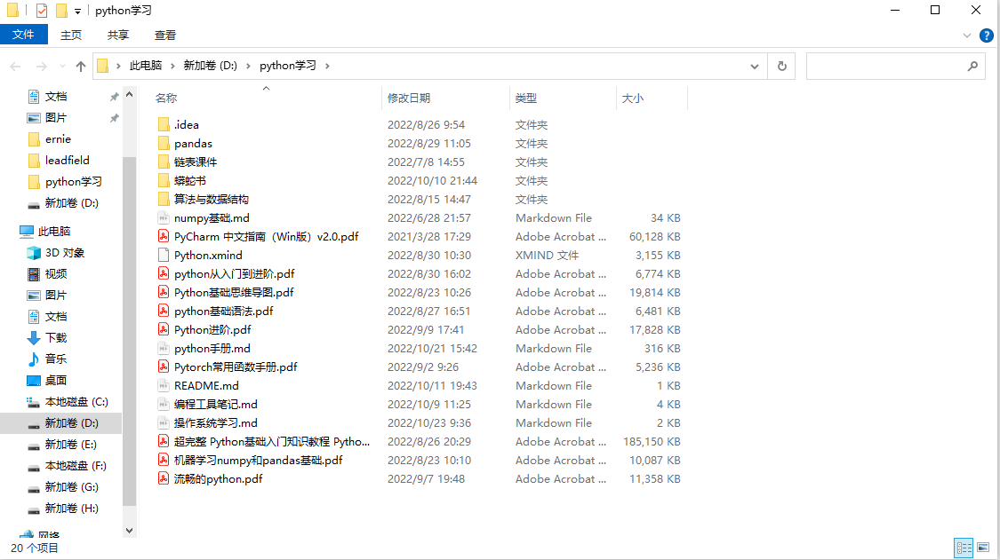
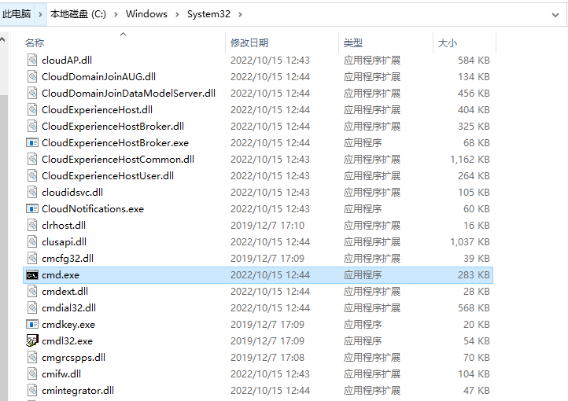
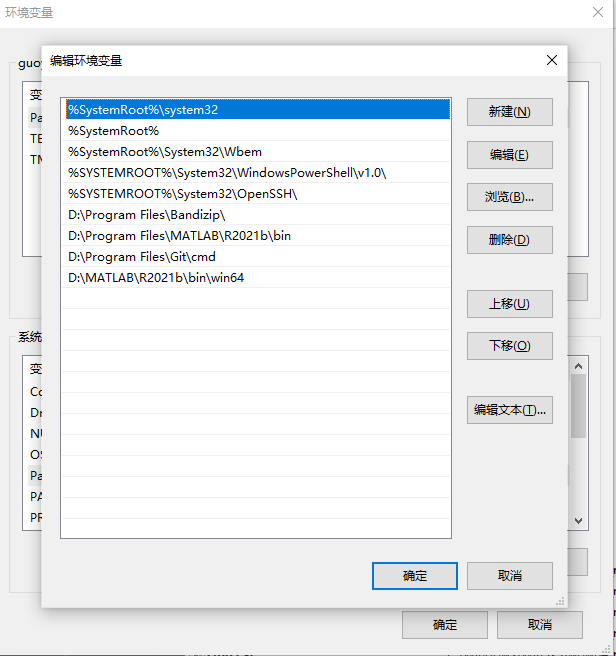
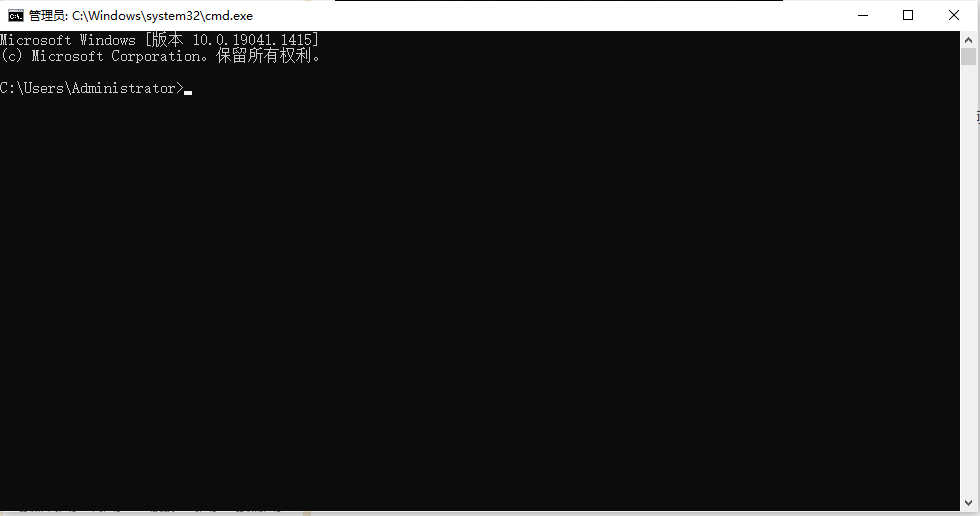

`win + r `打开的是“运行”菜单。

1. “运行”菜单相当于打开“我的电脑”时的地址栏一样，可以在里边输入路径等，例如我要打开在D盘下的python学习的文件夹，只需在“运行”菜单下输入 D:\python学习 就能弹出此文件夹。

2. “运行”菜单能输入命令，是因为它和系统环境变量关联起来的，系统环境变量正好包括了path下的添加的所有目录，因此这些目录下的程序都可以省略路径信息而直接在“运行”中输入程序名称就当命令使用了。

比如CMD.exe，CMD.exe 在 ‪C:\Windows\System32\下，而我的系统变量的path下第一个路径就是system32，所以你在“运行”菜单输入CMD，**并且不用加后缀**就可以运行 CMD.exe 这个可执行文件。

注意：

1. windows不太区分大小写，输入cmd或者CMD都可
2.  **path路径下添加的一定是一个文件夹，而不是可执行程序**

注：%SystemRoot% 指的就是windows系统所在的路径，在这里指的是 C:\Windows

# 命令提示符

## CMD指的是什么：

​		代码的执行一般可以分为两种方式，一种是有图形化操作界面的，一种是没有图形化操作界面的。像Windows系统这样有桌面、有程序图标、有各种功能按钮的就属于有图形化操作界面的。至于没有图形化操作界面的一时间可能不太好解释，简单的说就是没有桌面、也没有各种功能按钮，只有一个命令交互窗口，需要你手动输入命令代码去执行相应的功能。

  因为Windows系统调用命令行窗口的命令为CMD，所以Windows系统的命令行又叫CMD命令行，也叫命令提示符。Windows系统的命令行还有一个别名，就是DOS命令。Windows系统问世之前的计算机操作系统都是纯命令操作的，称为DOS系统，输入的命令被称为DOS命令。后来有了Windows这样带图形化操作界面的系统，DOS命令就转归幕后了，只在用户有需要的时候才被调出使用。

## CMD打开方式

快捷键**windows+R**   然后输入**cmd**打开命令提示符，其实就是打开 ‪C:\Windows\System32\下的CMD.exe，然后目前的路径是 C:\Users\Administrator，可以通过直接输入可执行程序的名字，执行这个目录下和path路径下的可执行程序。

这些路径之外的可执行程序则无法执行，解决办法有两种：

1. 使用cd命令切换到可执行程序所在的文件夹
2. 在path里添加可执行程序所在的文件夹

在命令提示符