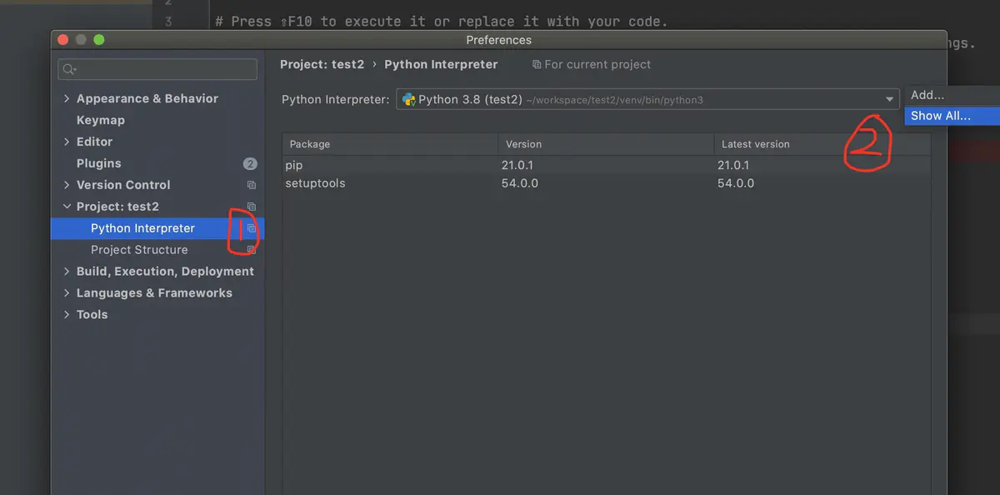
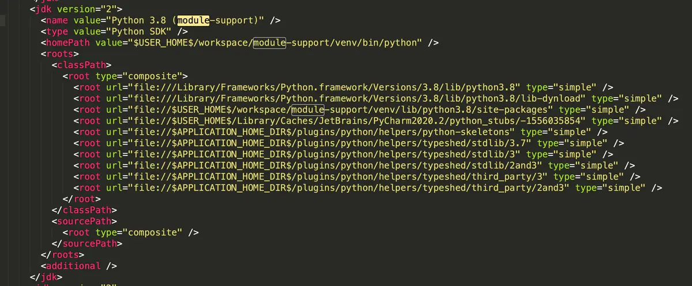
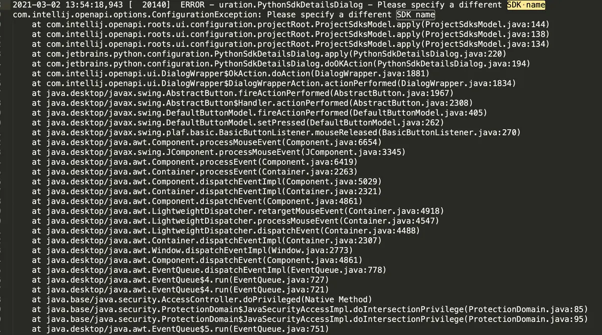

## Anaconda虚拟环境

首先进入进入 anaconda prompt

### 创建虚拟环境

conda create -n xxx(环境的名字）python=3.x  例如conda create -n sleep python=3.8

### 切换到创建的虚拟环境

activate xxx(虚拟环境名字) 或者 conda activate xxx

### 安装常见的机器学习库

pip install numpy

pip install matplotlib

pip install pandas

pip install jupyter

pip install scikit-learn

### 查看所有的虚拟环境

conda info -e 或 conda env list

### 删除虚拟环境

conda env remove -n [环境的名字] 或conda remove --name [环境的名字] --all

### 退出虚拟环境

conda deactivate

### 有时候Anaconda Navigator 会出现打不开的情况，可以尝试以下方法：

以管理员权限打开anaconda prompt
输入conda update conda  #  更新 conda
输入conda update --all  

尝试打开anaconda navigator

如果不行

输入 conda update anaconda-navigator
输入anaconda-navigator --reset
输入conda update anaconda-client
输入conda update -f anaconda-client
执行以上所有命令行，大概率可修复anaconda navigator

### Anaconda源

删除全部源命令  config --remove-key channels

显示目前的源`conda config --show channels`

删除源`conda config --remove channels`

添加清华源`conda config --add channels https://mirrors.tuna.tsinghua.edu.cn/anaconda/cloud/pytorch/`

### 更新anaconda中的所有库

升级conda(升级Anaconda前需要先升级conda)：`conda update conda`

升级anaconda：`conda update anaconda`

更新所有包：`conda update --all`

更新某个具体的包：`conda update package`

### pycharm虚拟环境问题

通常情况下，pycharm可以删除不同虚拟环境的解释器(interpreter)，通过：Preferences->Project->Python Interpreter->show all





然后选中你想要删除的环境，点击减号即可：


但是我发现，点击删除之后，重新打开环境设置，被删除的环境依然存在。
查找了一下资料，jetbrain论坛上也有人碰到这样的问题。
有的人通过删除后重启pycharm,有的人通过清除缓存（File->Invalidate Caches）可以解决。 但是这两个方法对我都不管用。

**找到pycharm存放虚拟环境的文件，jdk.table.xml。**

打开后发现，确实保存了虚拟环境的信息：




直接删除<jdk version="2">......</jdk>的内容，再打开pycharm，确实把内容删掉了。

正常情况下，在pycharm删除的虚拟环境，会在这个xml文件里删除的。
通过打开pycharm的log，发现操作过程中出现了错误。
log在mac的路径：/Users/<username>/Library/Logs/JetBrains/PyCharm2020.2/idea.log

发现出现如下错误：




奇怪的是，错误内容显示的应该是虚拟环境重名的关系，但是我的没有重名。具体的错误原因，目前还没找到。

另外说一点，我将jdk.table.xml文件整个删除之后，重启pycharm,再设置interpreter之后，重新生成了jdk.table.xml文件，这时候我再进行的pycharm删除操作，就完全正常了。

我猜测是这个xml的文件出了什么bug.

总之，出现了无法删除虚拟环境，可以尝试重启，清除缓存，删除jdk.table.xml文件内的内容来解决。

同时，如果出现了虚拟环境同名，也可以通过删除同名的虚拟环境或者删除它来解决。

### pip 的超全使用指南

所有的 Python 开发者都清楚，Python 之所以如此受欢迎，能够在众多高级语言中，脱颖而出，除了语法简单，上手容易之外，更多还要归功于 Python **生态的完备**，有数以万计的 Python 爱好者愿意以 Python 为基础封装出各种有利于开发的第三方工具包。

这才使用我们能够以最快的速度开发出一个满足基本需要的项目，而不是每次都重复造轮子。

Python 从1991年诞生到现在，已经过去28个年头了，这其间产生了数以万计的第三方包，且每个包都会不断更新，会有越来越多的版本。

当你在一个复杂的项目环境中，如果没有一个有效的依赖包管理方案，项目的维护将会是一个大问题。

pip 是官方推荐的包管理工具，在大多数开发者眼里，pip 几乎是 Python 的标配。

#### 查询软件包

查询当前环境安装的所有软件包

```
pip list
```

查询 pypi 上含有某名字的包

```
pip search pkg
```

查询当前环境中可升级的包

```
pip list --outdated
```

查询一个包的详细内容

```
pip show pkg
```

#### 安装软件包

使用 `pip install <pkg>` 可以很方便地从 pypi 上搜索下载并安装 python 包。

如下所示

```
$ pip install requests
```

这是安装包的基本格式，我们也可以为其添加更多参数来实现不同的效果。

#### 限定版本进行软件包安装

以下三种，对单个 python 包的版本进行了约束

```
# 所安装的包的版本为 2.1.2
$ pip install pkg==2.1.2

# 所安装的包必须大于等于 2.1.2
$ pip install pkg>=2.1.2

# 所安装的包必须小于等于 2.1.2
$ pip install pkg<=2.1.2
```

以下命令用于管理/控制整个 python 环境的包版本

```
# 导出依赖包列表
pip freeze >requirements.txt

# 从依赖包列表中安装
pip install -r requirements.txt

# 确保当前环境软件包的版本(并不确保安装)
pip install -c constraints.txt
```

#### 卸载软件包

```
pip uninstall pkg
```

#### 升级软件包

想要对现有的 python 进行升级，其本质上也是先从 pypi 上下载最新版本的包，再对其进行安装。所以升级也是使用 `pip install`，只不过要加一个参数 `--upgrade`。

```
pip install --upgrade xxx # xxx指要升级的包名
```

#### 明确项目依赖

`pip list` 或 `pip freeze` 打印出来的依赖有一个问题，就是并没有明确依赖关系。这样的坏处是，当我们想清理依赖的时候，就不知道到底哪些依赖是能被直接删除的、哪些依赖又是被间接依赖而不能轻易删除的。

例如我们可能在项目中用了 Flask ，但是我们可能不知道 Flask 也引用了 Jinja2 。这是我们如果擅自删除了 Jinja2 ，项目就可能跑不起来。。。

这时就可以使用 **pipdeptree** 工具来管理依赖树：

```
$ pip install pipdeptree
...
$ pipdeptree
certifi==2020.6.20
Flask==1.1.2
  - click [required: >=5.1, installed: 7.1.2]
  - itsdangerous [required: >=0.24, installed: 1.1.0]
  - Jinja2 [required: >=2.10.1, installed: 2.11.3]
    - MarkupSafe [required: >=0.23, installed: 1.1.1]
  - Werkzeug [required: >=0.15, installed: 1.0.1]
pipdeptree==2.0.0
  - pip [required: >=6.0.0, installed: 19.3.1]
setuptools==44.0.0.post20200106
wheel==0.36.2
```

现在我们就知道了，原来 Jinja2 是被 Flask 依赖的，这样我们就不会随便删除了。。。

#### 删除项目及其依赖（pip-autoremove）

那么问题来了，如果我忽然不想依赖 Flask 了，我们需要怎么做呢？

无脑的做法是 `pip uninstall flask -y` 。不那么显然的是，这其实不够优雅：

```
$ pip uninstall flask -y
...
$ pipdeptree
certifi==2020.6.20
click==7.1.2
itsdangerous==1.1.0
Jinja2==2.11.3
  - MarkupSafe [required: >=0.23, installed: 1.1.1]
pipdeptree==2.0.0
  - pip [required: >=6.0.0, installed: 19.3.1]
setuptools==44.0.0.post20200106
Werkzeug==1.0.1
wheel==0.36.2
```

发现没，Flask 虽然被卸载了，但是他的依赖包并没有卸载干净。你可能需要重新一个一个判断你是否需要剩下的包，然后再递归删除。。。

幸运的是，我们就可以用 **pip-autoremove** 工具来做这件事。我们重新安装Flask，再用这个工具删除试试：

```
$ pip install flask
$ pip install pip-autoremove
$ pip-autoremove flask -y
$ pipdeptree
certifi==2020.6.20
pip-autoremove==0.9.1
pipdeptree==2.0.0
  - pip [required: >=6.0.0, installed: 19.3.1]
setuptools==44.0.0.post20200106
wheel==0.36.2
```

这下干净了😊。

#### 配置文件

由于在使用 pip 安装一些包时，默认会使用 pip 的官方源，所以经常会报网络超时失败。

常用的解决办法是，在安装包时，使用 `-i` 参数指定一个国内的镜像源。但是每次指定就很麻烦呀，还要打超长的一串字母。

这时候，其实可以将这个源写进 pip 的配置文件里。以后安装的时候，就默认从你配置的这个 源里安装了。

那怎么配置呢？文件文件在哪？

使用`win+r` 输入 `%APPDATA%` 进入用户资料文件夹，查看有没有一个 pip 的文件夹，若没有则创建之。

然后进入这个 文件夹，新建一个 `pip.ini` 的文件，内容如下

```
[global]
time-out=60
index-url=https://pypi.tuna.tsinghua.edu.cn/simple/
[install]
trusted-host=tsinghua.edu.cn
```

以上几乎包含了 pip 的所有常用使用场景，为了方便，我将其整理成一张表格。

CUDA相关

- 查看CUDA版本: nvidia-smi

- CUDA的version和Drive version需要匹配的才可以

- 验证pytorch是否安装成功:

  ```
  import torch
  print(torch.cuda.is_available())
  ```


# tensorboard

打开tensorboard：tensorboard --logdir="log文件所在路径"

# 命令行常见操作：

查看cuda版本：nvidia-smi

# Pycharm 编程小技巧

使用多个光标进行编辑：alt+点击鼠标左键
跳到下一行的句首：shift+Ctrl

在" " 或者( )内部输入完东西以后，想要跳出双引号或者括号，就是再输入一下双引号或者括号

ctrl + s 是保存，对很多软件都适用

ctrl + alt + L 是格式化代码

shift + F10 是运行代码

shift + tab  减小一级缩进

tab  增加一级缩进

ctrl + 鼠标左键  进入函数的源码

**Shift+Enter**  快速切换到下一行

**Ctrl + P** 使用函数时，快速查看该函数有哪些参数

# python学习

对包/类/函数的学习
dir(xx) 查看工具的内部结构
help(xxx) 使用方法
jupyter notebook 还有一种方法是：xxx??可以查看使用信息

# typora学习

插入代码块: **输入法切换为英文，输入键盘左上角ESc下的按键，连续输入三次 ，再输入对应的编程语言类型，则会出现代码框，即可输入代码**。

插入小代码块：输入法切换为英文，输入键盘左上角ESc下的按键，输入要写的代码，然后再按一次结束输入

## 插入列表

1. 无序列表：‘-’+空格
2. 有序列表：‘1.’+空格

## 插入任务

-  ：‘-’+空格+[‘空格’]+空格
-  ：或者通过工具栏插入

## 缩进（嵌套）

- Tab：缩进/进入下一级嵌套
- Shift+Tab：反缩进/返回上一级嵌套

### 正文内容

### 字形设置

- 加粗：**Ctrl+B**
- 斜体：*Ctrl+I*
- 高亮：无快捷键，使用双等号
- 下划线：Ctrl+U
- 删除线：Alt+Shift+5（或者一对波浪线）
- 超链接：Ctrl+K [百度学术](https://xueshu.baidu.com/)

> 区块引用：>+空格

> 111
>
> > 222

### 缩放图片

- 方式1：在插图图片时/对着图片右击，选择缩放，即更改样式为：`style="zoom: 67%;"`

> 注：某些博客不支持这种缩放方式，以及typora的自动居中方式

- 方式2：将 `style="zoom: 67%;"` 改为 `width="600" align=center` ，图片将按宽度等比例缩放，并居中

> 注：可将这串代码在输入法里设置为自定义短语，快速调用

### 插入代码

- 代码串：Ctrl+Shift+~ 或者反引号：`Hello typora`

- 代码块：Ctrl+Shift+K，然后选择语言

  ```python
  import numpy as np
  1
  ```

### 表格

- 快捷键：Ctrl+T，选择行列数，可根据变化调节
- **表内换行**：Shift+Enter，此操作同微信聊天框换行

超链接

文章内链接格式：` [[链接](#准备链接到的标题)]`
